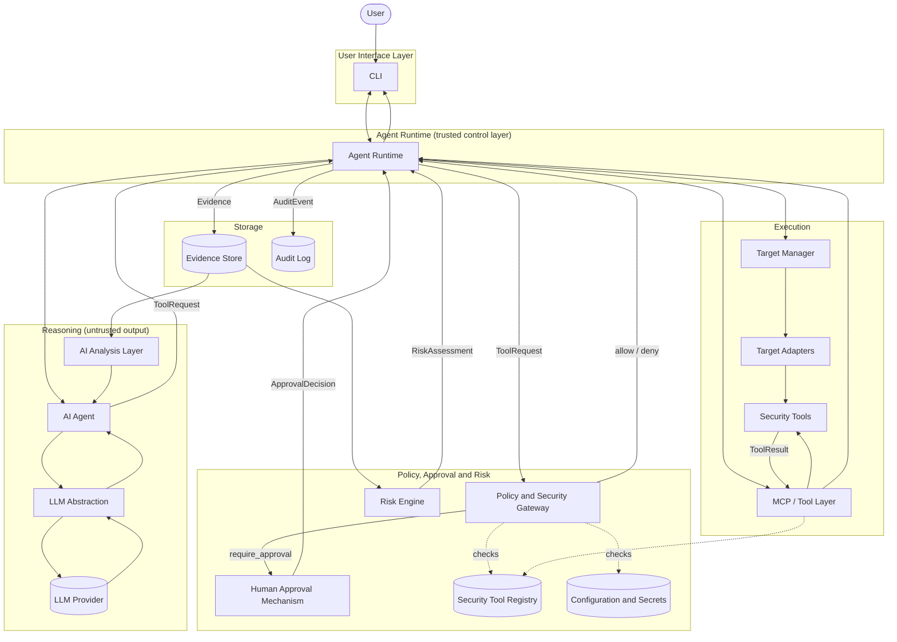

# Chanakya AI — Architecture Specification (Phase 0)

This document is the Phase 0 architecture specification for Chanakya AI.
It defines every layer of the system, the objects that flow between them,
the trust and security boundaries that make safety structural rather than
prompted, and the terminology used consistently across the project. It
contains no implementation code — only design.

Chanakya AI is an AI-assisted security agent for authorized security
research, investigation, and defensive/controlled testing. Phase 1 targets
a single local machine; the architecture is deliberately target-agnostic
so later phases can add VMs, containers, Kubernetes, cloud environments,
web applications, APIs, source-code repositories, and other authorized
remote infrastructure without structural rework.

## Decisions locked in for Phase 1

- **Language/runtime**: Python for the Agent Runtime and backend (Policy
  Gateway, Target Manager, Tool Layer).
- **Interface**: CLI first; the design does not preclude a future Web GUI.
- **LLM integration**: Direct Anthropic API calls through an LLM
  Abstraction layer with a custom agent loop — no SDK-default tool
  dispatch — so every proposed action is intercepted and routed through
  the Policy Gateway.
- **Evidence Store**: Structured filesystem storage, append-only and
  tamper-evident, no external database dependency for the local-machine
  phase.

---

## Terminology

These terms are used precisely and consistently throughout this
document and the codebase. Conflating them is a common source of design
mistakes in agentic systems, so the distinctions matter:

| Term | Definition | Commonly confused with |
|---|---|---|
| **LLM** | The underlying language model (e.g., a Claude model) — a stateless text/structured-output generator. It has no memory, no execution ability, and no identity of its own between calls. | The "AI Agent" — the LLM is only the reasoning engine the Agent calls. |
| **AI Agent** | The reasoning role: takes the current objective and context, decides what to investigate next, and expresses that decision as a proposed action. The Agent is a *behavior*, implemented by calling the LLM through the LLM Abstraction with an investigation-specific prompt/context — it holds no execution authority. | The "Agent Runtime" — the Agent decides *what* it wants; the Runtime decides *whether/how* that happens. |
| **Agent Runtime** | The control/execution layer: owns the loop, state, context assembly, dispatch, timeouts, error handling, and audit emission. It is code, not a model — deterministic and auditable. | The AI Agent — the Runtime never reasons about security findings; it only executes the loop mechanics. |
| **Tool** | A single capability that performs a concrete operation against a target (e.g., "list running processes"), exposed through the MCP/Tool Layer with a declared parameter schema and a read-only/state-changing classification. | "MCP" — a tool is a capability; MCP is one transport/protocol used to expose tools. |
| **MCP** | Model Context Protocol — a standard protocol for exposing tools/capabilities to an agentic system in a uniform way. In this architecture, MCP is an implementation detail of the Tool Layer, not a trust boundary in itself. | "Tool" — MCP is how a tool is exposed; it is not the capability itself. |
| **Target** | A resolved reference to the system being investigated (the local host today; a VM, container, cloud account, web app, etc. later), obtained from the Target Manager via a Target Adapter. | "Tool" — a tool acts *against* a target; a target is not a capability. |
| **Evidence** | A durably stored, provenance-tagged record of a `ToolResult` — the raw factual output of running a tool against a target. Evidence is never interpreted at write time. | "Finding" — evidence is raw fact; a finding is an interpretation of one or more pieces of evidence. |
| **Finding** | An Agent-produced interpretation of one or more `Evidence` records — a candidate observation or issue ("port 3389 is exposed with weak auth"). Findings are opinions grounded in evidence, not evidence themselves. | "Risk assessment" — a finding states *what* was observed; a risk assessment states *how much it matters*. |
| **Risk assessment** | A severity/confidence rating attached to one or more `Finding`s, produced by the Risk Engine using explicit, auditable criteria (not solely LLM judgment). | "Finding" — risk assessment is the prioritization layer on top of findings. |

---

## 1. User Interface Layer

**Phase 1: CLI.** Responsibilities:
- Collect the user's security objective and start/resume investigations.
- Display agent decisions, explanations, and investigation status (never
  raw internal reasoning traces — the Agent's output to the user is a
  curated explanation, not a chain-of-thought dump).
- Render evidence summaries, findings, and risk assessments.
- Surface `ApprovalRequest`s and capture `ApprovalDecision`s (accept/deny
  plus optional justification/comment).

Explicitly not responsible for: policy logic, tool execution, or holding
any credentials. The UI layer talks only to the Agent Runtime through a
defined session interface, so a future Web GUI can be added as an
alternate frontend against the same Runtime without touching any layer
below it.

**Status (Phase 7):** a minimal standard-library CLI exists
(`python -m chanakya.cli "<objective>"`, `chanakya/cli/main.py`). Its
composition root (`build_runtime`) is the one reviewed place that builds
the production Runtime. That covers the Registry, the Gateway, the
ToolExecutor, the Evidence Store, the durable Audit Log with one shared
`AuditEmitter`, and the approval provider. The CLI never evaluates
policy, dispatches or executes tools, or writes Evidence or audit records;
it only calls `create_investigation`, `start`, `cancel` and `run_turn`.
`main()` reads the provider API key from the environment once and hands
it straight to `AnthropicProvider`; nothing displays, logs or stores it.
The Agent's explanation text is not shown yet. See `docs/AGENT-RUNTIME.md`
§13.

## 2. AI Agent

The reasoning role. Given the current investigation state and available
evidence, the Agent:
- Plans investigation steps toward the stated objective.
- Selects which *approved* capability to request next (from the Security
  Tool Registry) and proposes a `ToolRequest`.
- Interprets `ToolResult`/`Evidence` returned by the Runtime.
- Correlates evidence across steps into `Finding`s.
- Recommends next steps or concludes the investigation.

The Agent is implemented as a call pattern against the LLM Abstraction; it
holds no state of its own between turns (the Runtime owns state) and has
no ability to execute anything — its only output artifacts are proposals
(`ToolRequest`), interpretations (`Finding`), and user-facing explanations.

## 3. Agent Runtime

The control and execution layer, and the only stateful, trusted
orchestrator in the system. Responsibilities:
- Run the agent loop: assemble context → call Agent → receive proposal →
  submit to Policy Gateway → (if needed) route through Human Approval →
  dispatch → receive result → update state → repeat or conclude.
- Own investigation/session state and conversation history.
- Enforce per-step and per-investigation timeouts.
- Handle and classify errors (see §16).
- Emit an `AuditEvent` for every state transition, unconditionally.
- Never itself decide security policy — it delegates that to the Policy
  Gateway — and never itself reason about findings — it delegates that to
  the Agent.

## 4. LLM Abstraction

A thin interface between the Agent and any specific model provider.
Responsibilities:
- Construct prompts/context windows from Runtime-provided state.
- Invoke the underlying LLM (Phase 1: direct Anthropic API) and parse its
  output into structured proposals (`ToolRequest`, `Finding`,
  explanations) with schema validation — malformed output is treated as
  an error, never as an implicit action.
- Track token usage and enforce context-size limits.
- Isolate the rest of the system from provider-specific request/response
  formats, so a different model or provider can be substituted later
  without changing Agent or Runtime logic.

This layer is also the natural enforcement point for redacting secrets
from anything sent to the LLM (see §15).

## 5. Policy & Security Gateway

The sole authority on whether a proposed action may run. Responsibilities:
- Evaluate every `ToolRequest` against configured policy: read-only
  default, per-tool allowlist, target-scope restrictions, rate limits.
- Classify the request as a `PolicyDecision`: `allow`, `deny`, or
  `require_approval`.
- Consult the Security Tool Registry to know a tool's declared
  classification (read-only vs. state-changing) and required target type.
- Never execute anything itself — it only ever returns a decision.

This is the layer that structurally enforces "read-only by default" and
"human approval for state-changing operations" — these are policy rules
evaluated in code, not instructions given to the LLM.

## 6. Target Manager

Resolves a target descriptor (e.g., "local host") into a concrete access
handle by selecting and invoking the appropriate Target Adapter.
Responsibilities:
- Maintain the registry of targets authorized for the current
  investigation (which is itself subject to policy — the Gateway
  confirms scope, the Target Manager resolves access).
- Present a uniform target-handle interface to the Tool Layer regardless
  of underlying target type.
- Own target-specific connection/session lifecycle (e.g., opening and
  closing a local execution context).

## 7. Target Adapters

Pluggable backends implementing a common Target interface, one per target
type:
- **Phase 1**: `LocalHostAdapter` — the only adapter implemented.
- **Future**: `VMAdapter`, `ContainerAdapter`, `KubernetesAdapter`,
  `CloudAdapter` (per-provider), `WebAppAdapter`, `APIAdapter`,
  `RepoAdapter`, `RemoteInfraAdapter`.

Each adapter is responsible for establishing an access context for its
target type and declaring which capabilities are meaningful against it.
Adding a new target type means writing a new adapter — no change to the
Agent, Runtime, Gateway, or Tool Layer contracts.

## 8. MCP / Tool Layer

Translates an approved `ToolRequest` plus a resolved target handle into an
actual tool invocation, and normalizes the result. Responsibilities:
- Look up the requested capability in the Security Tool Registry.
- Invoke it (via MCP where the tool is exposed as an MCP server, or via a
  direct adapter for tools not using MCP) against the target handle.
- Normalize output into a `ToolResult` regardless of the underlying
  tool's native output format.
- Never make allow/deny decisions and never speak to the LLM directly.

MCP is treated as a transport/integration detail within this layer, not
as a trust boundary — trust decisions were already made upstream by the
Policy Gateway before dispatch reaches here.

**Status (Phase 8):** two production capabilities, both read-only (P1),
parameterless and `local_host`-only. Both are wired into
`chanakya.tools.bootstrap.build_tool_executor` and
`chanakya.registry.bootstrap.production_registry_entries`:

- `observe_local_host_environment` (Phase 5.1): OS/platform facts.
- `list_listening_ports` (Phase 8): listening TCP/UDP sockets with owning
  PID and executable base name.

Both are implemented with the standard library only. They start no
process, use no shell and send no network traffic. Output is bounded
and fails closed rather than being truncated. No MCP integration exists
yet. See `docs/TOOL-REGISTRY.md` "Production capabilities".

## 9. Security Tool Registry

The catalog of every capability the system knows how to run. Each entry
declares:
- Capability name and description.
- Required target type(s).
- Read-only vs. state-changing classification.
- Parameter schema.
- Default risk category (used by the Gateway and Risk Engine).

The Registry is consulted by the Agent (to know what's available), the
Gateway (to classify requests), and the Tool Layer (to dispatch). No
capability can be invoked unless it is registered here — this is what
prevents the system from ever exposing "arbitrary unrestricted execution"
as a capability.

## 10. Evidence Store

Durable, append-only, tamper-evident storage for every `ToolResult`,
recorded as `Evidence` with full provenance (investigation id, step id,
target, tool name/version, timestamp, parameters, content hash). Evidence
records are never edited or deleted through normal operation. Phase 1
implements this as structured files on the local filesystem, chosen for
being human-inspectable and easy to version; the interface is abstract
enough to later back onto a different storage engine without affecting
callers.

## 11. Risk Engine

Produces `RiskAssessment`s from `Finding`s using explicit, auditable
criteria (severity, confidence, exploitability, exposure context) rather
than relying solely on LLM judgment. This keeps prioritization
reproducible and inspectable: given the same findings and the same rules,
the same risk assessment results. The Risk Engine may take an Agent's
suggested severity as one input but is not required to accept it verbatim.

## 12. AI Analysis Layer

The Agent's evidence-correlation function: reads accumulated `Evidence`
for an investigation and produces `Finding`s. This is conceptually part
of the AI Agent's role (§2) but is called out separately because it
operates over stored evidence rather than driving the next action —
distinguishing "what should I do next" (planning) from "what does this
evidence mean" (analysis) keeps the Agent's prompt/context concerns
separable.

**Status (Phase 9):** evidence-grounded `Finding`s are implemented.
- **How they arrive.** When the Agent concludes, it may report findings
  through a Runtime-reserved, non-dispatchable `report_findings` channel.
  This is not a capability: the provider turns it into a conclude turn,
  so it never reaches Intake, the Policy Gateway, approval or dispatch.
- **Evidence.** Each finding must cite the `tool_result` ids the Agent was
  shown. The Runtime resolves them to Evidence of the same investigation
  and rejects anything it cannot resolve.
- **Storage and display.** Valid findings are stored append-only with a
  content hash (`chanakya.findings.FindingStore`), recorded as
  `finding_created` audit events, and shown escaped by the CLI.
- **Authority.** Findings are opinions: they authorize and trigger
  nothing.

The Risk Engine (§11) and Recommendations are not implemented. See
`docs/AGENT-RUNTIME.md` "Evidence-grounded findings (Phase 9)".

## 13. Human Approval Mechanism

The only mechanism that can convert a `require_approval` `PolicyDecision`
into an executable action. Responsibilities:
- Present an `ApprovalRequest` (what is being asked, and the risk context
  behind it) to the human, via the CLI in Phase 1.
- Block the Runtime's dispatch of that specific step until a decision is
  recorded.
- Capture an `ApprovalDecision`: accept or deny, the approver, a
  timestamp, and an optional justification/comment.
- Hand the decision back to the Runtime; when a comment was provided, it
  is included in the corresponding `AuditEvent`.

No default/implicit approval path exists — absence of a response blocks
progress rather than being treated as consent.

**Status (Phase 7):** `chanakya.approval.TerminalApprovalProvider`
implements this mechanism for the CLI. It only answers `ApprovalRequest`s
the Runtime issues for a `require_approval` verdict; policy stays with the
Gateway. Only the literal word `approve` yields ACCEPT. Invalid input,
EOF and Ctrl+C never do: they fail the investigation closed. No
justification or comment is collected yet.

## 14. Audit Logging

An append-only log of every `AuditEvent` emitted by the Runtime: proposal
made, policy evaluated, approval requested, approval decided (including
any justification comment), dispatch started, dispatch completed or
failed. Distinct from the Evidence Store: Evidence records *what a tool
observed about the target*; the Audit Log records *what the system itself
did*, independent of whether any tool ran.

**Status (Phase 6):** implemented as `chanakya.audit.FilesystemAuditLog`,
a durable sink for the Runtime's existing `AuditEmitter`. Each
investigation (and a separate system stream) is an append-only, SHA-256
hash chain of records on the local filesystem. A record that cannot be
written durably halts the investigation. Tail truncation and a full
rewrite by a local attacker are not detectable without an external
anchor. Design, invariants (AL-INV-1..9) and limitations:
`docs/AGENT-RUNTIME.md` §14.

## 15. Configuration and Secrets Management

- **Configuration** (policy rules, tool registry definitions, target
  definitions, model settings) lives in versionable config files, treated
  as a trusted input (administrator-controlled, not agent-writable).
- **Secrets** (API keys, target credentials) are never included in LLM
  context, never written to Evidence or Audit records in plaintext, and
  are held only by the Runtime/Target Adapter/Tool Layer components that
  need them at execution time — the Agent never sees a credential, only
  the fact that a target is accessible.

## 16. Error Handling

Errors are classified and handled at the layer where they occur, and
always recorded:
- **Tool execution failure** (e.g., a command errors out): captured as a
  failed `ToolResult`, still written to Evidence and Audit, handed back to
  the Agent as information it can reason about (e.g., try a different
  approach).
- **Timeout**: enforced by the Runtime per step and per investigation;
  treated as a failure outcome for that step, not a crash.
- **Policy denial**: not an error — a valid, expected `PolicyDecision`
  outcome, recorded and returned to the Agent as information.
- **LLM output validation failure** (malformed/unparseable proposal):
  treated as an Agent-layer error; the Runtime does not guess at intent,
  it surfaces the failure and may retry with corrective context.
- **Fatal/unrecoverable errors** (e.g., target unreachable, adapter
  misconfiguration): halt the investigation with a clear status, rather
  than silently continuing in a degraded state.

## 17. Security Boundaries

Points where an action's legitimacy is actively checked before it is
allowed to proceed:
1. **Agent → Runtime**: the Agent can only submit a `ToolRequest`; it has
   no execution path that bypasses the Runtime.
2. **Runtime → Policy Gateway**: no dispatch happens without a prior
   `PolicyDecision`.
3. **Gateway → Human Approval**: state-changing or out-of-policy requests
   cannot proceed without an explicit `ApprovalDecision`.
4. **Tool Layer → Security Tools**: only capabilities present in the
   Security Tool Registry can be invoked — there is no generic/arbitrary
   execution path.
5. **Target Adapters**: isolate credentials and access per target type, so
   compromise or misbehavior against one target cannot silently extend to
   another.

## 18. Trust Boundaries

Distinct from security boundaries: this is about which data is trusted
and how much.
- **LLM output is untrusted input** to the Runtime. It is schema-validated
  before being treated as a `ToolRequest` or `Finding`; it is never
  interpreted as a command to execute directly.
- **Tool output is semi-trusted**: it comes from a real system, but if the
  target is (for example) a web app or a compromised host, tool output may
  contain adversarial content. It is stored as Evidence verbatim, but when
  it is later fed back into an LLM prompt (for analysis), it is treated as
  data, not instructions — the Agent's prompt construction must not let
  target-originated content be interpreted as system/operator instructions.
- **Human approval decisions are trusted** — they are the system's
  root of authority for anything beyond read-only/allowlisted actions.
- **Configuration and the Security Tool Registry are trusted** —
  administrator-controlled, not modifiable by the Agent or by target
  content.

## 19. Data Flow

**Example: a read-only investigation step.**
```
User states objective via CLI
  → Runtime starts investigation, calls Agent (via LLM Abstraction)
  → Agent proposes ToolRequest ("enumerate listening ports", target=local host)
  → Runtime submits to Policy Gateway
  → Gateway checks Registry: read-only, target in scope → PolicyDecision=allow
  → Runtime asks Target Manager to resolve "local host" → LocalHostAdapter handle
  → Runtime dispatches via Tool Layer → tool runs → ToolResult
  → Runtime writes Evidence (with provenance) and AuditEvent(s) for every step above
  → Result returned to Agent → Agent produces a Finding and/or proposes next step
  → CLI displays the decision/explanation and status to the user
```

**Example: a state-changing step.**
```
Agent proposes ToolRequest ("kill process X")
  → Gateway classifies via Registry: state-changing → PolicyDecision=require_approval
  → Runtime creates ApprovalRequest, blocks this step, surfaces it via CLI
  → Human reviews risk context, responds: accept/deny + optional comment
  → Runtime records ApprovalDecision as AuditEvent (comment included if given)
  → If accepted: proceed as in the read-only flow above
  → If denied: no dispatch occurs; Agent receives the denial as information
```

## 20. Future Extensibility

The architecture is designed so the following can be added without
restructuring existing layers:
- **New target types**: implement a new Target Adapter (§7); no change to
  Agent, Runtime, Gateway, or Tool Layer.
- **Web GUI**: a new frontend against the same Agent Runtime session
  interface used by the CLI (§1); no change below the UI layer.
- **New tools/capabilities**: register them in the Security Tool Registry
  (§9) with a classification and schema; the Gateway and Tool Layer
  require no code changes to support a well-registered tool.
- **Different/multiple LLM providers**: isolated behind the LLM
  Abstraction (§4).
- **Richer risk scoring** (e.g., CVE/threat-intel feeds): additive to the
  Risk Engine (§11) without changing how Findings are produced.
- **Distributed/remote Runtime deployment**: the Runtime's interfaces to
  the Gateway, Target Manager, and Evidence Store are defined as logical
  contracts, not tied to in-process calls, so they can later be split
  across processes/hosts if needed.

---

## High-level architecture diagram



---

## Proposed module skeleton

Names and responsibilities only — no files created beyond this document.

```
chanakya/
  agent/          # AI Agent — planning, reasoning, ToolRequest proposals, analysis
  llm/            # LLM Abstraction — provider-agnostic model interface
  runtime/        # Agent Runtime — loop, state, dispatch, timeouts, error handling
  policy/         # Policy & Security Gateway — rules, allow/deny/approval classification
  targets/        # Target Manager
  targets/adapters/ # Target Adapters (local_host now; others later)
  tools/          # MCP/Tool Layer
  registry/       # Security Tool Registry
  evidence/       # Evidence Store — append-only, tamper-evident
  risk/           # Risk Engine
  approval/       # Human Approval Mechanism (CLI-rendered for Phase 1)
  audit/          # Audit Logging
  config/         # Configuration and secrets management
  cli/            # CLI entrypoint (User Interface Layer)
```

## Phase 1 implementation scope (not started yet)

Local host only, CLI only, a small set of clearly read-only capabilities
(exact list to be decided when the Tool Layer/Registry is designed),
filesystem evidence store, and a synchronous CLI approval prompt
supporting accept/deny with an optional justification. No state-changing
tools, no multi-target support, no Web GUI in this phase.
