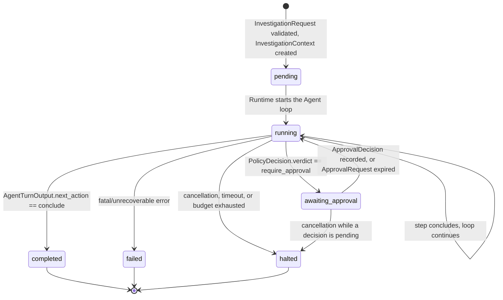
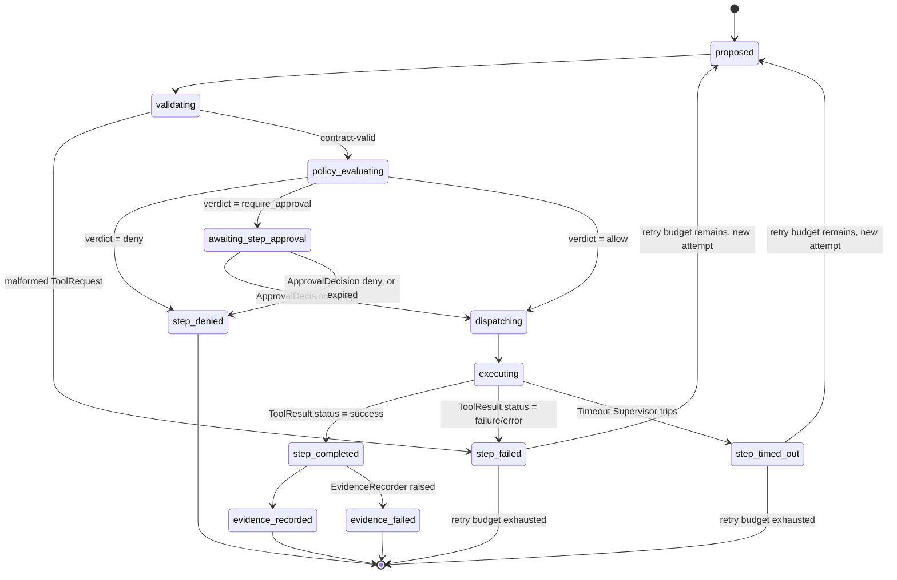
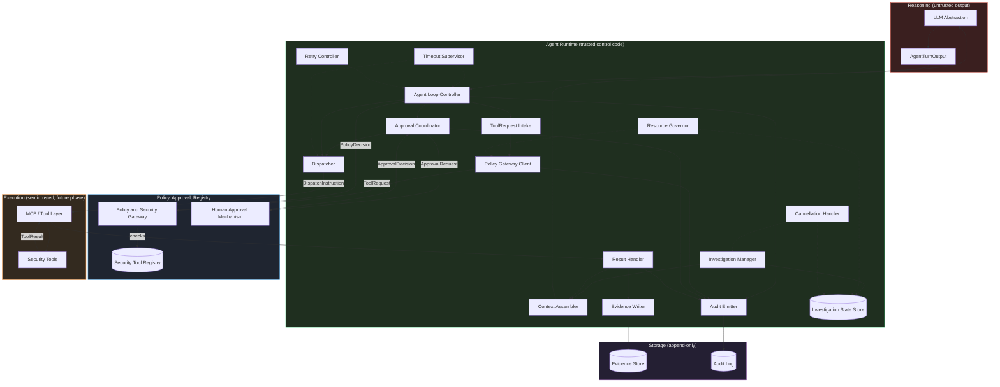

# Chanakya AI — Agent Runtime Design (Phase 3)

This document is the Phase 3 design specification for the **Agent
Runtime** defined in `ARCHITECTURE.md` §3. It builds on, and does not
redesign, `ARCHITECTURE.md`, `docs/CONTRACTS.md`, `docs/THREAT-MODEL.md`,
`docs/POLICY-GATEWAY.md`, `docs/TOOL-REGISTRY.md`, and
`docs/CAPABILITY-PERMISSION-MODEL.md`. No implementation code exists yet
— this is design only.

The Agent Runtime is the **controlled execution and orchestration layer**
between the AI Agent (reasoning) and the security control plane (Policy
Gateway, Security Tool Registry, and — in a later phase — the Tool
Layer). It is code, not a model: deterministic, auditable, and the only
stateful, trusted orchestrator in the system (`ARCHITECTURE.md` §3).

---

## Design principle (non-negotiable)

> **The Agent Runtime executes; it never decides.** Every capability the
> Runtime touches on the Agent's behalf has already been (a) registered
> in the Security Tool Registry, (b) evaluated by the Policy Gateway, and
> — where the verdict requires it — (c) explicitly accepted by a human
> approver. The Runtime's job is to make those three facts true before
> anything ever runs, to make it structurally impossible to skip one of
> them, and to record, unconditionally, that they happened. The Runtime
> holds no opinion of its own about whether an action is safe — that
> opinion belongs entirely to the Policy Gateway and, for state-changing
> actions, to the human approver.

This restates `ARCHITECTURE.md` §3/§17, `docs/THREAT-MODEL.md`
SR-5/SR-6/SR-7/SR-9, and is the organizing constraint behind every
section below.

---

## The Runtime MUST NOT

| # | Prohibition | Structural mechanism | Invariant | Threats addressed |
|---|---|---|---|---|
| 1 | Make security policy decisions itself | The Runtime has no allow/deny/require_approval logic of its own; `PolicyGateway.evaluate()` is the only source of a verdict | RT-INV-1 | T-15, T-19 |
| 2 | Bypass the Policy Gateway | The Dispatcher's only entry point requires a `PolicyDecision` object as a mandatory argument — there is no dispatch call that omits it | RT-INV-1 | T-15 |
| 3 | Allow arbitrary shell execution | The Runtime contains no shell/subprocess/`eval`/`exec` call and constructs no command string from Agent-controlled input; dispatch is a typed call keyed by a Registry capability name | RT-INV-8 | T-11 |
| 4 | Allow the LLM to directly execute tools | The Agent's only output artifact is `AgentTurnOutput`/`ToolRequest` (a proposal); the LLM Abstraction and Agent have no reference to the Dispatcher, the Tool Layer, or any target handle | RT-INV-1, RT-INV-8 | T-02, T-06 |
| 5 | Allow tools to bypass the Tool Registry | The Dispatcher only ever invokes a capability that a `PolicyDecision` was issued for, and a `PolicyDecision` can only be issued for a capability the Gateway found via `registry.get_enabled()` | RT-INV-1, RT-INV-8 | T-04, T-05 |
| 6 | Automatically approve state-changing actions | No default/timeout-accept path exists anywhere in the Approval Coordinator; an expired or unanswered `ApprovalRequest` never becomes an accepted decision | RT-INV-2, RT-INV-3 | T-16, T-19 |
| 7 | Treat tool output as trusted instructions | The Context Assembler is the sole place tool/target output re-enters an LLM prompt, and it always wraps it as delimited, clearly-marked data | RT-INV-7 | T-03, T-12, T-13 |

---

## Runtime invariants (RT-INV)

Referenced throughout this document; each is a structural property of
the implementation, not a convention an implementer is trusted to
remember.

- **RT-INV-1** — No dispatch occurs without a favorable, matching
  `PolicyDecision` (`verdict == allow`, or `verdict == require_approval`
  paired with an accepted `ApprovalDecision`). This is enforced by
  interface design: the Dispatcher's function signature requires a
  `PolicyDecision` (and, where applicable, an `ApprovalDecision`) as
  parameters it cannot be called without.
- **RT-INV-2** — No dispatch of a `require_approval` step proceeds
  without an `ApprovalDecision` with `decision: accept`, bound to that
  specific `approval_request_id`. A decision for one request can never be
  applied to another.
- **RT-INV-3** — No implicit or timeout-default approval exists. An
  `ApprovalRequest` that expires or is never answered resolves to "no
  dispatch," never to "proceed."
- **RT-INV-4** — Retries never reuse a prior `PolicyDecision` or
  `ApprovalDecision`. Every retry attempt is a materially new
  `ToolRequest` (new `tool_request_id`), independently evaluated by the
  Gateway and, if applicable, independently re-approved.
- **RT-INV-5** — The Runtime never rewrites, "fixes," auto-corrects, or
  reinterprets a malformed or denied `ToolRequest` on the Agent's behalf.
  A validation failure or a denial is surfaced to the Agent as
  information for its next turn, unmodified.
- **RT-INV-6** — Every `InvestigationContext` transition and every
  step-level transition emits exactly one `AuditEvent`, unconditionally,
  including internal Runtime errors and fail-closed outcomes. A failure
  to write an `Evidence` or `AuditEvent` record halts the step rather
  than letting the corresponding action be treated as having happened
  without a record.
- **RT-INV-7** — Tool/target output is only ever reintroduced into an
  LLM prompt as clearly delimited, structurally-marked **data**, never as
  an instruction-formatted segment. This is enforced at exactly one
  place: the Context Assembler.
- **RT-INV-8** — The Runtime contains no shell/subprocess/`eval`/`exec`
  call and no code path that assembles one from Agent- or
  target-controlled input. The Dispatcher's only action is a typed call
  into the (future) Tool Layer, keyed by a Registry-registered
  capability name that a `PolicyDecision` was already issued for.
- **RT-INV-9** — Cancellation is cooperative: it prevents the *next* step
  from starting; it never interrupts a dispatch already in flight in a
  way that could leave `Evidence`/`AuditEvent` records inconsistent or
  half-written.
- **RT-INV-10** — At most one `ToolRequest` is in flight (proposed →
  dispatched → resulted) per investigation at any time. Step ordering
  within one investigation is strictly sequential.
- **RT-INV-11** — No credential ever appears in `InvestigationContext`,
  `AgentTurnOutput`, `ToolRequest`, `DispatchInstruction`, a Runtime log,
  or an `AuditEvent`. The Runtime itself never holds a target credential
  — that remains scoped to a future Target Adapter, resolved at dispatch
  time from Configuration & Secrets (`ARCHITECTURE.md` §15).

---

## Lifecycle overview

```
InvestigationRequest
    ↓
InvestigationContext                    (Investigation Manager creates it; status = pending)
    ↓
Agent proposes ToolRequest              (via AgentTurnOutput, inside the Agent loop; status = running)
    ↓
Runtime receives request                (ToolRequest Intake — contract/schema validation only)
    ↓
Policy Gateway evaluates                (Policy Gateway Client — the only call path in)
    ↓
PolicyDecision
    ↓
ALLOW / DENY / REQUIRE_APPROVAL
    ↓
If REQUIRE_APPROVAL → Human Approval    (status = awaiting_approval, blocks this step only)
    ↓
If allowed (directly, or after accept) → controlled dispatch   (Dispatcher; RT-INV-1/RT-INV-2)
    ↓
ToolResult                              (Result Handler)
    ↓
Evidence                                (Evidence Writer — append-only, hashed)
    ↓
Agent continues (next turn) or investigation terminates (completed / halted / failed)
```

Every arrow in this diagram also produces at least one `AuditEvent`
(RT-INV-6); that is omitted above for readability and made explicit in
the per-section detail and in the Tool Execution Flow diagram below.

---

## Runtime component map

The Runtime is decomposed into the following components. None of them
is individually a new trust boundary — collectively they *are* the
trusted control layer (`ARCHITECTURE.md` §3) — but separating them
keeps each one's job (and therefore each one's review surface) small and
singular.

| Component | Responsibility | Inputs | Outputs | Trust level | Security boundary |
|---|---|---|---|---|---|
| **Investigation Manager** | Owns investigation creation and top-level lifecycle transitions | `InvestigationRequest` (human-originated), cancellation signals | `InvestigationContext` (created/updated), lifecycle `AuditEvent`s | Trusted control code | TB-1 (validates human input before trusting it as scope) |
| **Investigation State Store** | Authoritative, single-writer store of `InvestigationContext` and step records for the life of an investigation | State transitions from every other component | Current `InvestigationContext` snapshot on read | Trusted control code | TB-8 (internal; not directly Agent- or tool-writable) |
| **Context Assembler** | Builds the bounded context handed to the LLM Abstraction each turn: objective, Capability Catalog View, recent Evidence, prior Findings | `InvestigationContext`, `Evidence` (semi-trusted), Capability Catalog View (trusted) | A context payload for the LLM Abstraction | Trusted control code; **consumes semi-trusted tool/target output** | TB-3, TB-6 inbound, TB-7 — enforces RT-INV-7 |
| **Agent Loop Controller** | Drives the turn-by-turn loop; parses `AgentTurnOutput`; routes to ToolRequest intake, Finding/Recommendation storage, or conclusion | `AgentTurnOutput` (untrusted) | Routed calls to other components; loop continuation or termination signal | Trusted control code; **consumes untrusted Agent output** | TB-3 — schema-validates before trusting anything |
| **ToolRequest Intake** | Structural/contract validation of the Agent's raw proposal into a trusted `ToolRequest`, or a `MalformedRequestError` | Raw `AgentTurnOutput.tool_request` payload (untrusted) | A validated `ToolRequest`, or a surfaced validation error | Trusted control code; **input is untrusted** | TB-3 |
| **Policy Gateway Client** | The single, structurally-required call path from the Runtime to `PolicyGateway.evaluate()` | `ToolRequest`, `EvaluationContext` (built from `InvestigationContext`) | `PolicyDecision` | Trusted control code, calling trusted code | TB-4 — the only crossing point |
| **Approval Coordinator** | Creates an `ApprovalRequest` for a `require_approval` verdict; blocks that step; awaits and records an `ApprovalDecision` | `PolicyDecision` (verdict = require_approval), human input | `ApprovalRequest`, `ApprovalDecision` | Trusted control code; human decision is the trust anchor | TB-5 |
| **Dispatcher** | The only code path permitted to invoke the (future) Tool Layer | `DispatchInstruction` + a favorable `PolicyDecision` (+ accepted `ApprovalDecision` where applicable) | A call into the Tool Layer; raw `ToolResult` on return | Trusted control code | TB-6 outbound (credentials never present here) |
| **Result Handler** | Normalizes/validates the returned `ToolResult` shape; routes it to Evidence Writer and back into context for the next turn | `ToolResult` (semi-trusted — target-originated) | Normalized `ToolResult`, trigger to Evidence Writer | Trusted control code; **output is semi-trusted** | TB-6 inbound |
| **Evidence Writer** | The only component with write access to the Evidence Store; computes `content_hash`, assigns provenance fields | `ToolResult`, step/request identifiers | `Evidence` record | Trusted control code | TB-8 (write-only, append-only) |
| **Audit Emitter** | The only component with write access to the Audit Log; emits one `AuditEvent` per transition, unconditionally | Every other component's transition notifications | `AuditEvent` record | Trusted control code | TB-8 (write-only, append-only) |
| **Timeout Supervisor** | Enforces per-step (Registry `default_timeout_seconds`) and per-investigation (`RuntimeExecutionLimits`) timeouts | Wall-clock time, in-flight step/investigation state | Timeout signal → treated as a step or investigation failure | Trusted control code | Internal — bounds T-27 |
| **Retry Controller** | Bounded, policy-driven retry for transient tool/LLM failures; never retries a denial | Step/turn failure classification, `RuntimeExecutionLimits.max_retries_per_step` | A new attempt (new `tool_request_id`) or a terminal step failure | Trusted control code | Internal — enforces RT-INV-4 |
| **Resource Governor** | Tracks per-capability call counts (for the Gateway's rate-limit rules), step budgets, and concurrency caps | Step completions, `RuntimeExecutionLimits` | `EvaluationContext.call_counts`; budget-exceeded signals | Trusted control code | Internal — bounds T-08, T-27 |
| **Cancellation Handler** | Accepts an operator-initiated cancellation signal and drives a cooperative, safe shutdown of one investigation | Human cancellation command | Lifecycle transition to `halted`, `AuditEvent` | Trusted control code; human-triggered | TB-1 — enforces RT-INV-9 |

---

## 1. Investigation/session lifecycle

**Owner**: Investigation Manager.

An investigation begins only from a validated `InvestigationRequest`
(`docs/CONTRACTS.md` §1) — the sole contract that originates directly
from a human, outside the agent loop. The Investigation Manager:

1. Validates the request per `CONTRACTS.md` §1's own validation rules
   (`objective` non-empty; every `requested_targets` entry already known
   to the Target Manager/registry; `submitted_by` identifies a human).
   A request that fails this validation **never produces an
   `InvestigationContext`** — it is rejected back to the CLI as an input
   error, not as a `failed` investigation (there is nothing yet to fail).
2. On success, creates the initial `InvestigationContext`
   (`CONTRACTS.md` §2) with `status: pending`, `target_refs` copied from
   the request's resolved targets, empty `step_history`/`evidence_refs`/
   `finding_refs`.
3. Registers the investigation with the Resource Governor (applies
   `RuntimeExecutionLimits.max_concurrent_investigations`, §18 below) —
   an investigation that would exceed the concurrency cap stays queued,
   not silently dropped or force-started.
4. Hands control to the Agent Loop Controller, which transitions
   `status` to `running` and begins the loop (§3).
5. Owns every subsequent lifecycle transition (§15) until a terminal
   state is reached (§16), at which point the `InvestigationContext` is
   retained (never deleted) for audit/review.

A session, in this design, is exactly one investigation's lifetime — the
Runtime does not multiplex several investigations onto one
`InvestigationContext`, and one investigation's context is never shared
or merged with another's (see §19, Concurrency).

---

## 2. InvestigationContext management

**Owner**: Investigation State Store, written to by every other
component through the Investigation Manager.

`InvestigationContext` (`CONTRACTS.md` §2) is the Runtime-owned,
evolving record of one investigation. This phase's design treats it as
the **single source of truth** other components read from and propose
updates to — no component holds a competing copy of `status`,
`step_history`, or the `*_refs` arrays that could drift out of sync.

Rules enforced by the Investigation State Store, restating and making
concrete `CONTRACTS.md` §2's own validation requirements:

- `investigation_id` is assigned once, at creation, and is immutable.
- `status` may only change via the transitions defined in §15 — an
  attempted invalid transition (e.g. `pending → completed`) is a Runtime
  programming error, not a business outcome, and is treated the same as
  any other internal error (fail-closed to `failed`, per §11).
- `step_history` gains exactly one new `StepRecord` (see "Additional
  contracts," below) per proposed `ToolRequest` — never a partial or
  retroactively-edited entry. A retried step is a **new** `StepRecord`
  with its own `step_id`/`tool_request_id` and an `attempt_number`
  linking it to the earlier attempt for readability, not a mutation of
  the earlier record (mirrors `Evidence`/`AuditEvent`'s append-only
  philosophy).
- `evidence_refs`/`finding_refs`/`risk_assessment_refs`/
  `recommendation_refs` only ever gain entries that resolve to records
  that already exist by the time the reference is added — the Runtime
  writes the underlying record first, then appends the reference,
  never the reverse.
- `current_step_id` is set when a step begins and cleared when it
  reaches a terminal step-state (§15's step-level machine); it is never
  left pointing at a step that has already concluded.
- `updated_at` changes on every write; `created_at` never does.

---

## 3. Agent loop

**Owner**: Agent Loop Controller, using the Context Assembler and the
LLM Abstraction (Phase 4+ concern, treated here as an external
dependency with a stable interface).

Each iteration:

1. **Budget check** (Resource Governor / Timeout Supervisor) — if the
   per-investigation step budget or wall-clock timeout is already
   exhausted, the loop does not start another turn; the investigation
   transitions to `halted` (§16).
2. **Context assembly** (Context Assembler) — builds the turn's input:
   the objective, the Capability Catalog View (`docs/TOOL-REGISTRY.md`
   §4 — filtered, field-reduced; the Runtime never hands the Agent the
   raw Registry), recent `Evidence` wrapped as delimited data (RT-INV-7),
   and prior `Finding`s/`Recommendation`s for continuity. Secrets are
   never present here by construction (RT-INV-11) — there is nothing to
   redact because nothing credential-shaped was ever placed in
   `InvestigationContext` in the first place.
3. **Model call** (LLM Abstraction) — produces raw model output, which
   the LLM Abstraction parses into a structured `AgentTurnOutput` (see
   "Additional contracts," below) with schema validation. Malformed
   output is an Agent-layer error (`ARCHITECTURE.md` §16): the Runtime
   does not guess at intent.
4. **Routing** (Agent Loop Controller), based on `AgentTurnOutput`:
   - `next_action: conclude` → investigation transitions to `completed`
     (§16).
   - `next_action: propose_tool_request` → any accompanying `Finding`s/
     `Recommendation`s are stored first (validated per `CONTRACTS.md` §8
     /§10 — a `Finding` with empty `evidence_refs` is rejected outright,
     per SR-17), then the `tool_request` payload is handed to ToolRequest
     Intake (§4) and the full Policy Gateway → (Approval) → Dispatch →
     Evidence pipeline (§§5-9) runs for that one step.
   - Malformed `AgentTurnOutput` → bounded retry via the Retry Controller
     (§12), with corrective context (the validation error) added to the
     *next* context assembly — never silently repaired by the Runtime.
5. **Loop continuation** — once the step reaches a terminal step-state
   (§15), control returns to step 1 for the next turn.


---

## 4. ToolRequest intake

**Owner**: ToolRequest Intake.

This is the first point the Agent's untrusted output is treated as a
candidate `ToolRequest` at all. It performs exactly the structural
validation `ToolRequest.from_dict()` already implements (Phase 2,
`chanakya/contracts/tool_request.py`) — required fields present,
`contract_version` supported, `proposed_by == "agent"`, `parameters` is
an object. It does **not** validate `parameters` against a capability's
schema (that is the Gateway's job, using the Registry's declared schema
— `docs/POLICY-GATEWAY.md` §10 step 3) and does **not** consult the
Registry or any policy rule itself. A validation failure here never
reaches the Gateway; it is recorded and surfaced to the Agent as
information (RT-INV-5), consistent with `docs/POLICY-GATEWAY.md` §14's
own `malformed-request` path.

**Inputs**: raw `tool_request` payload from `AgentTurnOutput` (untrusted).
**Outputs**: a valid `ToolRequest`, or a `MalformedRequestError` handed
back to the Agent Loop Controller.
**Trust level**: trusted control code; input is untrusted.
**Security boundary**: TB-3 (`docs/THREAT-MODEL.md`).

---

## 5. Policy Gateway integration

**Owner**: Policy Gateway Client.

The Runtime's relationship to the Policy Gateway is intentionally
narrow: build an `EvaluationContext` from the current
`InvestigationContext` (authorized target refs = `target_refs`; call
counts = the Resource Governor's per-capability counters for this
investigation) and call `PolicyGateway.evaluate(tool_request,
evaluation_context)`. That is the **entire** interface — the Runtime
never inspects Registry entries or policy rules directly, never
second-guesses a `PolicyDecision`, and never calls `evaluate()` more than
once for the same `ToolRequest` (a materially new decision requires a
materially new `ToolRequest`, per `docs/POLICY-GATEWAY.md` §15 point 5).

`PolicyGateway.evaluate()` is documented to never raise and to always
return a `PolicyDecision` (fail-closed by construction, Phase 2). The
Runtime's Policy Gateway Client still wraps the call defensively — if a
future Gateway implementation ever violates its own contract and raises,
that exception is caught here and converted to the same effect as a
`deny`/`fail-closed-error` decision, never allowed to propagate into a
dispatch decision (defense in depth, mirroring the Gateway's own
internal `try/except`).

Every `PolicyDecision` received — `allow`, `deny`, or
`require_approval` — immediately produces one `AuditEvent`
(`event_type: policy_evaluated`), per `docs/POLICY-GATEWAY.md` §12,
**before** the Runtime acts on the verdict.

**Inputs**: `ToolRequest`, `EvaluationContext`.
**Outputs**: `PolicyDecision`; one `AuditEvent`.
**Trust level**: trusted code calling trusted code.
**Security boundary**: TB-4 — RT-INV-1.

---

## 6. Tool Registry integration

**Owner**: indirectly, via the Policy Gateway. The Runtime **never**
queries the Security Tool Registry directly for authorization purposes —
that would create a second path to a classification decision, which is
exactly what `docs/TOOL-REGISTRY.md` REG-INV-2 forbids ("wherever the
Policy Gateway, Tool Layer, or Risk Engine need to know a capability's
classification... they read it from the Registry's authoritative
fields... via the Gateway/Tool Layer, not a second independent lookup").

The Runtime's only direct Registry touchpoint is **read-only and
non-authorizing**: calling `registry.catalog_view()` (via the Context
Assembler) to build the filtered Capability Catalog View shown to the
Agent (`docs/TOOL-REGISTRY.md` §4). This call:

- Filters to `status == enabled`, non-`quarantined` entries whose
  `supported_target_types` intersect the investigation's target types.
- Returns only the six Agent-visible fields (`capability`,
  `display_name`, `description`, `parameters_schema`, `classification`,
  `supported_target_types`) — never privileges, resource limits,
  provenance, trust level, owner, risk category, approval requirement,
  or `operations`.
- Additionally applies the investigation-scoped optimization named in
  `docs/TOOL-REGISTRY.md` §4 point 4: if `InvestigationRequest.constraints`
  includes something like `"read-only only"`, `state_changing` entries
  are excluded from the view the Runtime shows the Agent, purely so the
  Agent doesn't spend a turn on something structurally unreachable — the
  Policy Gateway would deny/require-approval it either way, so this is a
  UX optimization, never a security control in itself.

If the Agent names a capability that isn't in the view it was shown
(hallucination, injection, or a stale view), the Runtime forwards the
`ToolRequest` to the Gateway **unmodified** — it never rewrites it toward
something valid (RT-INV-5) — and the Gateway's own Registry lookup
(`registry.get_enabled()`) returns the same `unknown-capability` denial
it would for a truly nonexistent capability (REG-INV-3).

**Inputs**: `InvestigationContext.target_refs`,
`InvestigationRequest.constraints`.
**Outputs**: Capability Catalog View (a list of reduced entries) handed
to the Context Assembler.
**Trust level**: trusted code reading trusted (admin-vetted)
configuration.
**Security boundary**: none crossed here for authorization purposes —
this is visibility shaping, not a decision point.

---

## 7. Approved tool dispatch

**Owner**: Dispatcher.

The Dispatcher is the single, narrow choke point through which anything
ever actually runs. Its calling convention is the concrete
implementation of RT-INV-1/RT-INV-2:

```
dispatch(instruction: DispatchInstruction,
         policy_decision: PolicyDecision,          # required, verdict must be ALLOW
         approval_decision: ApprovalDecision | None # required (and must be ACCEPT) iff
                                                      # policy_decision.verdict was
                                                      # REQUIRE_APPROVAL
        ) -> ToolResult
```

There is no overload, default parameter, or alternate entry point that
allows omitting `policy_decision`, and no way to pass a
`policy_decision` whose `verdict` is anything but `ALLOW` at the moment
of the call — a `require_approval` verdict must first be converted into
an `ALLOW`-shaped dispatch precondition by an accepted
`ApprovalDecision`; the Dispatcher itself does not re-derive "approved"
from the `PolicyDecision` alone. This means the Dispatcher's contract
makes T-15 (policy bypass) and T-16 (approval bypass) a compile-time/
interface-level impossibility, not merely a runtime check.

The Dispatcher resolves the effective execution parameters from the
Registry entry (via the `PolicyDecision`'s originating evaluation, not a
fresh Registry query — the entry used for dispatch must be the same one
the Gateway evaluated against) into a `DispatchInstruction`: capability,
target reference, parameters, the Registry's `default_timeout_seconds`
and `resource_limits`, and the identifiers needed for audit
traceability. It then calls into the (Phase 4+) Tool Layer.

Because the Tool Layer does not exist yet, Phase 3 defines this
boundary as a stable interface (`DispatchInstruction` in, `ToolResult`
out) that a future Tool Layer implements against, without depending on
any Tool Layer internals here.

**Inputs**: `DispatchInstruction`, `PolicyDecision` (verdict = allow),
optional `ApprovalDecision` (decision = accept).
**Outputs**: a call into the Tool Layer; raw `ToolResult` on return; one
`AuditEvent` (`dispatch_started`, then `dispatch_completed` or
`dispatch_failed`).
**Trust level**: trusted control code.
**Security boundary**: TB-6 outbound — no credential is ever passed
through this call; credentials are resolved inside the future Target
Adapter, not here (RT-INV-11).

---

## 8. ToolResult handling

**Owner**: Result Handler.

On return from the Dispatcher, the Result Handler:

1. Validates the `ToolResult`'s **shape** against `CONTRACTS.md` §4
   (status is one of the closed enum values, `completed_at >=
   started_at`, `output` present iff `status == success`) — this is
   shape validation, not truth validation; the Runtime never assumes
   tool output is factually correct, only that it parses.
2. Treats `output`/`raw_output` as **semi-trusted data** for the
   remainder of its life in the system (`ARCHITECTURE.md` §18) — it is
   stored verbatim as `Evidence` (§9) but is never itself executed,
   never used to construct a further `ToolRequest` automatically, and
   is only ever handed back into an LLM prompt as delimited data
   (RT-INV-7, enforced downstream by the Context Assembler).
3. Applies any redaction the capability's classification calls for
   (`CONTRACTS.md` §4 security considerations — capabilities known to
   surface secrets, e.g. environment dumps or file contents, are
   redacted before persistence) and records whether redaction occurred
   (`Evidence.redactions_applied`) rather than silently altering the
   record without a trace.
4. Classifies the outcome for the step-level state machine (§15):
   `success` → proceeds to Evidence write; `failure`/`error` → Retry
   Controller decision (§12); `timeout` → handled by the Timeout
   Supervisor's own path (§10), which constructs a synthetic `ToolResult`
   with `status: timeout` if the Tool Layer itself doesn't return one in
   time.

**Inputs**: raw `ToolResult` from the Dispatcher.
**Outputs**: a normalized `ToolResult`; a redaction decision; a
step-outcome classification.
**Trust level**: trusted control code; **input is semi-trusted**.
**Security boundary**: TB-6 inbound.

---

## 9. Evidence handoff

**Owner**: Evidence Writer.

For every `ToolResult` (success or failure — a failed execution is still
recorded, per `ARCHITECTURE.md` §16: "captured as a failed `ToolResult`,
still written to Evidence and Audit"), the Evidence Writer constructs an
`Evidence` record (`CONTRACTS.md` §7):

- Copies `investigation_id`, `step_id`, `tool_request_id`,
  `tool_result_id`, `target_id`, `capability` — all four traceability
  fields are populated from data the Runtime already holds, never
  re-derived or guessed.
- Copies `classification` from the Registry entry **as it was at
  dispatch time** (per `CONTRACTS.md` §7: "so history remains accurate
  even if the Registry entry later changes").
- Computes `content_hash` over the stored payload (tamper-evidence,
  SR-11) and assigns `storage_ref`.
- Sets `redactions_applied` per the Result Handler's redaction decision.
- Writes the record through the append-only Evidence Store interface —
  there is no update/delete path exposed to any Runtime component
  (SR-10).

**Ordering guarantee**: the `Evidence` record is written, and its write
confirmed, **before** the corresponding `evidence_id` is appended to
`InvestigationContext.evidence_refs` and **before** the result is handed
back into the Agent loop's next context assembly. If the Evidence write
itself fails, the step is treated as failed and the investigation is
halted rather than continuing with an unrecorded action (RT-INV-6,
mirroring `docs/THREAT-MODEL.md` §13's failure-modes table entry for
Evidence Store write failure).

**Inputs**: normalized `ToolResult`, step/request identifiers, Registry
classification snapshot.
**Outputs**: `Evidence` record; `evidence_id` appended to
`InvestigationContext`.
**Trust level**: trusted control code.
**Security boundary**: TB-8 — write-only, append-only.

### Tool execution flow (Diagram: intake → dispatch → evidence → audit)

```mermaid
sequenceDiagram
    participant Agent as AI Agent (untrusted output)
    participant Loop as Agent Loop Controller
    participant Intake as ToolRequest Intake
    participant GW as Policy Gateway
    participant Appr as Human Approval
    participant Disp as Dispatcher
    participant Tool as Tool Layer / Security Tool
    participant Res as Result Handler
    participant Ev as Evidence Store
    participant Aud as Audit Log

    Agent->>Loop: AgentTurnOutput (ToolRequest proposal)
    Loop->>Intake: raw ToolRequest payload
    Intake->>Intake: schema/contract validation
    alt malformed
        Intake-->>Loop: MalformedRequestError
        Loop->>Aud: AuditEvent (error)
        Loop-->>Agent: surfaced as information, next turn
    else contract-valid
        Intake->>GW: ToolRequest
        GW-->>Loop: PolicyDecision
        Loop->>Aud: AuditEvent (policy_evaluated)
        alt verdict = deny
            Loop-->>Agent: denial surfaced as information, next turn
        else verdict = require_approval
            Loop->>Appr: ApprovalRequest
            Appr-->>Loop: ApprovalDecision
            Loop->>Aud: AuditEvent (approval_decided)
            alt decision = deny or expired
                Loop-->>Agent: denial surfaced as information, next turn
            else decision = accept
                Loop->>Disp: DispatchInstruction + PolicyDecision + ApprovalDecision
                Disp->>Tool: invoke capability
                Tool-->>Disp: ToolResult
                Disp->>Res: ToolResult
                Res->>Ev: write Evidence
                Ev-->>Res: evidence_id, content_hash
                Res->>Aud: AuditEvent (dispatch_completed, evidence_recorded)
                Res-->>Agent: Evidence reference, next turn, as data
            end
        else verdict = allow
            Loop->>Disp: DispatchInstruction + PolicyDecision
            Disp->>Tool: invoke capability
            Tool-->>Disp: ToolResult
            Disp->>Res: ToolResult
            Res->>Ev: write Evidence
            Ev-->>Res: evidence_id, content_hash
            Res->>Aud: AuditEvent (dispatch_completed, evidence_recorded)
            Res-->>Agent: Evidence reference, next turn, as data
        end
    end
```

---

## 10. Timeout handling

**Owner**: Timeout Supervisor.

Two independent timeout scopes (`ARCHITECTURE.md` §3: "Enforce per-step
and per-investigation timeouts"), both sourced from trusted
configuration, never from the Agent:

- **Per-step timeout**: the Registry's `default_timeout_seconds` for the
  capability being dispatched (`docs/TOOL-REGISTRY.md` §1 item 13). If
  the Tool Layer has not returned by then, the Timeout Supervisor
  constructs a synthetic `ToolResult` with `status: timeout` (per
  `CONTRACTS.md` §4's closed status enum) and hands it to the Result
  Handler exactly as if the Tool Layer had returned it — timeout is a
  first-class outcome, not an exception path.
- **Per-investigation timeout**: `RuntimeExecutionLimits.
  max_investigation_duration_seconds` (a new, Runtime-owned
  configuration value — see "Additional contracts," below). Exceeding it
  transitions the investigation to `halted`, not `failed` — a timeout is
  an expected governance outcome, not an internal defect
  (`docs/THREAT-MODEL.md` §16's treatment of timeout as "a failure
  outcome for that step, not a crash").

A timed-out step is eligible for the same bounded retry policy as any
other transient failure (§12), subject to the same budget.

**Inputs**: wall-clock time; Registry `default_timeout_seconds`;
`RuntimeExecutionLimits`.
**Outputs**: a synthetic `ToolResult(status=timeout)`, or an
investigation-level `halted` transition.
**Trust level**: trusted control code.
**Security boundary**: internal — bounds T-27 (resource exhaustion).

---

## 11. Error handling

**Owner**: distributed — each component classifies and surfaces its own
errors per `ARCHITECTURE.md` §16; the Investigation Manager owns the
investigation-level consequence.

| Error class | Where caught | Runtime behavior |
|---|---|---|
| Malformed `AgentTurnOutput`/`ToolRequest` | ToolRequest Intake / Agent Loop Controller | Surfaced to the Agent as information for the next turn; bounded retry (§12); never auto-corrected (RT-INV-5) |
| `PolicyDecision.verdict == deny` | Agent Loop Controller | Not an error — a valid, expected outcome (`ARCHITECTURE.md` §16); recorded, surfaced as information; the investigation continues |
| `ApprovalDecision.decision == deny`, or `ApprovalRequest` expiry | Approval Coordinator | Same treatment as a policy denial — step fails, investigation continues, no auto-escalation to `halted` by default (see the `RuntimeExecutionLimits.p4_approval_expiry_action` option, §18) |
| Tool execution failure (`ToolResult.status in {failure, error}`) | Result Handler | Captured as a failed `ToolResult`, written to Evidence and Audit, handed to the Agent as information it can reason about; eligible for retry (§12) |
| Timeout (step or investigation) | Timeout Supervisor | Per §10 |
| Evidence Store write failure | Evidence Writer | The corresponding action is treated as not having durably happened; the step — and, if it recurs, the investigation — halts rather than proceeding without provenance (RT-INV-6) |
| Audit Log write failure | Audit Emitter | Same severity as an Evidence write failure — halts rather than allowing an unaudited action to proceed (RT-INV-6) |
| Human Approval Mechanism unresponsive | Approval Coordinator | `ApprovalRequest` remains `pending` (or transitions to `expired` per configured policy) — never defaults to `accept` (RT-INV-3) |
| Target unreachable / adapter misconfiguration (future Target Manager) | Dispatcher / Result Handler | `ToolResult.status = failure`; recorded; Agent informed to adjust plan; repeated occurrences count toward the retry/fatal-error budget |
| Unhandled/unexpected exception anywhere in the loop | Agent Loop Controller (outermost guard) | Caught, classified as a fatal Runtime error, `AuditEvent(severity: error)` emitted, investigation transitions to `failed` — **never** silently swallowed and **never** treated as permission to proceed |

This table is the Runtime-side elaboration of `docs/THREAT-MODEL.md`
§13's failure-modes table; nothing here contradicts it — it only adds
the concrete Runtime component responsible for each row.

---

## 12. Retry behavior

**Owner**: Retry Controller.

Retries exist only for **transient** failure classes: malformed
`AgentTurnOutput` (model-side hiccup), tool execution failure classified
as retryable by the capability's own semantics (future Tool Layer
concern — out of scope to specify further here), and timeouts. Retries
are governed by `RuntimeExecutionLimits.max_retries_per_step` and
`retry_backoff_seconds` (new, Runtime-owned configuration — see
"Additional contracts").

**What is never retried**:
- A `deny` `PolicyDecision` — per `docs/POLICY-GATEWAY.md` §15 point 5,
  a denial is not appealable by resubmission; the Agent may propose a
  *materially different* `ToolRequest` on its own initiative, but that
  is ordinary loop continuation, not a Runtime-initiated retry.
- A `deny` `ApprovalDecision` — the same principle extends to human
  denials; re-asking the same human the same question is not a Runtime
  retry policy, it would be a UX/process choice made by a human, not
  automated.
- Anything after `max_retries_per_step` is exhausted — the step reaches
  a terminal failed state (§15) and the loop continues to the *next*
  Agent turn with that failure as information, or the investigation
  fails/halts if the failure recurs across the per-investigation error
  budget (`RuntimeExecutionLimits`, §18).

**What a retry actually is**: a brand-new `ToolRequest` (new
`tool_request_id`), independently submitted to the Policy Gateway and,
if required, independently re-approved (RT-INV-4). No cached
`PolicyDecision` or `ApprovalDecision` is ever reused across attempts —
this is what prevents a single stale approval from silently covering
multiple executions of a state-changing action.

**Inputs**: step-outcome classification (from Result Handler / Timeout
Supervisor), `RuntimeExecutionLimits`.
**Outputs**: either a new attempt fed back into §4, or a terminal step
failure.
**Trust level**: trusted control code.
**Security boundary**: internal — enforces RT-INV-4.

---

## 13. Human approval integration point

**Owner**: Approval Coordinator.

This is the Runtime's implementation of `ARCHITECTURE.md` §13 (Human
Approval Mechanism) and the concrete home of SR-7/SR-8. On receiving a
`PolicyDecision` with `verdict: require_approval`:

1. Constructs an `ApprovalRequest` (`CONTRACTS.md` §11) with
   `risk_context` populated from the **actual** `ToolRequest` fields
   (`capability`, `target_ref`, `parameters`) and any linked
   `RiskAssessment` — never from `rationale` alone
   (`docs/POLICY-GATEWAY.md` §7). If `PolicyDecision.notes ==
   "justification_required"` (the P4 signal from `docs/POLICY-GATEWAY.md`
   §7/§5), the Approval Coordinator surfaces that to the UI layer as a
   requirement, though enforcing a non-empty `justification` remains a
   UI/Runtime-layer policy choice, per the same open item
   `docs/POLICY-GATEWAY.md` already flagged (`ApprovalDecision.
   justification` stays optional at the contract level).
2. Transitions the investigation to `awaiting_approval` and **blocks
   only this step** — this is deliberately scoped to the step, not a
   global lock on the Runtime process; a future multi-investigation
   Runtime (§19) must not stall unrelated investigations while one
   awaits a decision.
3. Awaits an `ApprovalDecision` from the UI layer (Phase 1: CLI). No
   polling loop treats the absence of a decision as anything other than
   "still pending" (RT-INV-3).
4. On `expires_at` (if configured) with no decision, transitions the
   `ApprovalRequest.status` to `expired` — treated identically to a
   `deny` for dispatch purposes (§11), unless
   `RuntimeExecutionLimits.p4_approval_expiry_action` is configured to
   `halt_investigation` for Permission-Level-4 requests specifically
   (an operator-chosen stricter default for the highest-risk tier, never
   the other direction).
5. On a recorded `ApprovalDecision`, emits the corresponding
   `AuditEvent` (`event_type: approval_decided`, including
   `justification` if given) and hands control back to the Agent Loop
   Controller/Dispatcher as appropriate.

**Inputs**: `PolicyDecision` (require_approval), human input via the UI
layer.
**Outputs**: `ApprovalRequest`, `ApprovalDecision`, `AuditEvent`.
**Trust level**: trusted control code; the human decision itself is the
system's trust anchor for anything beyond read-only (`ARCHITECTURE.md`
§18).
**Security boundary**: TB-5.

---

## 14. Audit event generation

**Owner**: Audit Emitter, called by every other component.

Per `ARCHITECTURE.md` §14 and `docs/POLICY-GATEWAY.md` §12, the Runtime
is the sole producer of `AuditEvent`s (the Gateway, Approval mechanism,
and Tool Layer never write to the Audit Log directly — they hand the
Runtime what it needs). This phase's design requires **one `AuditEvent`
per meaningful transition**, unconditionally — including denials,
failures, and fail-closed outcomes, since those are exactly the events
`docs/THREAT-MODEL.md` T-15/T-16/T-19's detective controls depend on.

Runtime-triggered `event_type` values (all already defined in
`CONTRACTS.md` §13's closed enum — no extension needed for the
happy-path flow):

| Trigger | `event_type` |
|---|---|
| Investigation created / starts running | `investigation_started` |
| `ToolRequest` accepted by Intake | `request_proposed` |
| `PolicyDecision` received | `policy_evaluated` |
| `require_approval` verdict | `approval_requested` |
| `ApprovalDecision` recorded (or expiry) | `approval_decided` |
| Dispatcher begins/ends a call | `dispatch_started` / `dispatch_completed` / `dispatch_failed` |
| `Evidence` written | `evidence_recorded` |
| `Finding` stored | `finding_created` |
| `RiskAssessment` stored (Risk Engine — future phase) | `risk_assessed` |
| `Recommendation` stored | `recommendation_created` |
| Investigation reaches `completed` | `investigation_completed` |
| Investigation reaches `halted` (including cancellation, timeout, budget exhaustion) | `investigation_halted` |
| Internal Runtime error, fail-closed outcome | `error` |

`related_ids` is populated with every contract id relevant to the event
(never large payloads — `CONTRACTS.md` §13); `details` echoes small,
already-redaction-safe fields (e.g. `verdict`, `matched_rule`,
`justification`) and never re-introduces a secret a prior redaction
step removed (RT-INV-11).

**Inputs**: transition notifications from every component.
**Outputs**: `AuditEvent` records, written append-only.
**Trust level**: trusted control code.
**Security boundary**: TB-8 — write-only, append-only.

### Durable Audit Log (Phase 6)

`chanakya.audit.FilesystemAuditLog(root)` implements the existing
`AuditSink` protocol, so a composition root passes it to
`AuditEmitter(sink=...)` and shares that one emitter between
`InvestigationManager` and `AgentLoopController`. No Runtime code changed.
`NullAuditSink` remains the default, and `InMemoryAuditSink` remains the
test double.

**Storage.** `<root>/<investigation_id>/<sequence>.json` with 8-digit,
zero-padded sequence numbers (`00000001.json`, ...). Events with
`investigation_id=None` go to `<root>/system.stream/`; the `.` in that
name keeps it from ever colliding with an investigation id.
Investigation ids go through the same strict path-safety rule as the
Evidence Store (`[A-Za-z0-9_-]{1,128}`, Windows device names refused),
plus a check that the resolved stream directory is a direct child of
`root`.

**Hash chain.** Each record is
`{sequence, previous_record_hash, recorded_at, event, record_hash}`. The
store owns the four integrity fields: `AuditEvent` has no field for any
of them. `record_hash` is SHA-256 over the canonical JSON of the other
four (`chanakya.evidence.hashing`), and `previous_record_hash` is the
previous record's `record_hash` (`null` for sequence 1). The chain head
is re-read and re-hashed from disk on every append, so a restarted
process continues the chain. An append refuses to extend a stream whose
head fails its hash or whose sequence numbers have a gap.

**Atomicity.** Temp file in the stream directory → flush → `fsync` →
`os.link` to the final name, which fails if the name exists, so an
existing sequence is never overwritten → remove the temp name. On POSIX
the directory is also fsynced. Any failure leaves no final record and no
temp file.

**Write failure.** Anything `emit` raises reaches the Runtime as
`AuditSinkError`. This covers an invalid id, a record over
`MAX_RECORD_BYTES` (65,536 canonical bytes, rejected rather than
truncated), a credential-shaped `details` key or value, a broken chain
head, a sequence collision, or an I/O error. The Agent Loop Controller
then halts the investigation (`audit_sink_failure`), and the backstop
records `error` and `investigation_halted` if the sink still accepts
writes. `dispatch_started` is emitted, and therefore on disk, before the
ToolExecutor is called, so a failure there means the tool never runs.
Two existing behaviors are unchanged and recorded in
`tests/test_audit_log_runtime.py`:

- If the sink keeps failing, the halt record cannot be written either.
  The investigation still ends `halted` with nothing executed, but the
  turn is reported as `FAILED`.
- `InvestigationManager.complete/halt/fail` transition before they emit.
  A failed `investigation_completed` write therefore leaves a terminal
  `completed` investigation without a completion record (the turn is not
  reported as `CONCLUDED`).

**Review API.** `list_by_investigation(id)` returns verified records
(`AuditRecord`), or raises `CorruptAuditLogError` instead of returning
a partial list. `verify(id)` returns `False` on any integrity problem.
Both are for out-of-band human review; nothing in the Runtime, Policy
Gateway or providers imports `chanakya.audit`.

| ID | Invariant | Enforcement | Tests |
|---|---|---|---|
| AL-INV-1 | The Audit Log is append-only. | No update/delete/replace/overwrite method; exclusive `os.link`; collision fails. | `test_no_mutation_api_exists`, `test_existing_record_is_never_overwritten`, `test_sequence_collision_during_append_fails_closed` |
| AL-INV-2 | Integrity fields are generated by the store. | `emit` computes `sequence`, `previous_record_hash`, `recorded_at`, `record_hash`; `AuditEvent` has no such fields. | `test_store_owned_fields_are_present_and_computed`, `test_caller_values_in_details_or_ids_never_become_envelope_fields` |
| AL-INV-3 | The hash chain detects modification, middle deletion, reordering and insertion. | `record_hash` re-check, `previous_record_hash` links, contiguous sequence names, exact record shape, stream ownership. | `test_modified_middle_record_is_detected`, `test_deleted_middle_record_is_detected`, `test_reordered_records_are_detected`, `test_inserted_middle_record_is_detected` |
| AL-INV-4 | Every record is durable before `emit()` returns. | `fsync` before link; `dispatch_started` precedes execution. | `test_record_is_on_disk_and_fsynced_before_emit_returns`, `test_dispatch_started_is_durable_before_the_executor_runs` |
| AL-INV-5 | Any write failure fails closed through `AuditSinkError` → `HALTED`. | `AuditEmitter` wrapping + existing Runtime backstop. | `test_audit_failure_at_each_step_emission_point_halts`, `test_real_write_failure_at_dispatch_started_halts_before_execution` |
| AL-INV-6 | Investigation identifiers are isolated and path-safe. | Evidence Store identifier rule; direct-child check; one directory and chain per investigation. | `test_unsafe_investigation_ids_are_rejected_before_any_io`, `test_investigations_have_isolated_chains` |
| AL-INV-7 | The Audit Log is never model input or authorization input. | No production package imports `chanakya.audit`; the log is only a sink. | `test_no_production_package_reads_the_audit_log`, `test_audit_data_never_reaches_the_policy_gateway`, `test_anthropic_provider_flow_with_durable_audit` |
| AL-INV-8 | Size and credential controls fail closed. | `MAX_RECORD_BYTES`; best-effort credential screen of `details`. | `test_record_at_the_size_limit_is_accepted_and_one_over_is_rejected`, `test_credential_shaped_details_are_rejected_and_not_persisted` |
| AL-INV-9 | The hash chain survives a process restart. | Head re-read from disk on every append; no in-memory head. | `test_chain_continues_across_a_process_restart`, `test_restarted_log_continues_the_existing_chain` |

**Limitations.**

- **Tail truncation is not detectable**, and neither is a rewritten
  last record: nothing outside the files commits to the chain head.
  External anchoring or export is deferred.
- **The hash is unkeyed.** A local attacker who can write the files can
  recompute the whole chain; the chain detects partial edits, not a full
  rewrite (THREAT-MODEL T-18 residual; TB-9).
- **Single-process writer.** A lock serializes appends within one
  process; exclusive linking makes a concurrent collision fail closed, but
  multiple writing processes are not supported.
- **Local filesystem trust.** Durability and confidentiality depend on
  the host and its file permissions (TB-9).
- **Credential screening is best-effort.** It uses the `TargetLocator`
  patterns (URL userinfo, `password=`/`token=`-style pairs) on `details`
  keys and string values only; it is not a secret scanner. A rejected
  record halts the investigation.
- An append re-verifies only the head record; full-chain checks are
  `verify`'s job.

---

## 15. Runtime state management

Two nested state machines: an **investigation-level** machine (using
`InvestigationContext.status` exactly as defined in `CONTRACTS.md` §2 —
no new status value is introduced) and a **step-level** machine (a
Runtime-internal elaboration of one `step_history` entry's lifecycle,
new in this phase — see "Additional contracts").

### Investigation-level state machine

**States**: `pending`, `running`, `awaiting_approval`, `completed`,
`failed`, `halted`.

**Terminal states**: `completed`, `failed`, `halted`. None of the three
has an outbound transition in this phase's design — a terminated
investigation is not resumed; a fresh investigation (new
`InvestigationRequest`) is required for further work on the same
objective, deliberately keeping "what happened during investigation X"
unambiguous. (Adding a `resume` path is flagged as future work, not a
Phase 3 gap — see "Open items.")

**Valid transitions**:

| From | To | Trigger |
|---|---|---|
| *(none)* | `pending` | `InvestigationRequest` validated; `InvestigationContext` created |
| `pending` | `running` | Runtime starts the Agent loop |
| `running` | `running` | A step reaches a terminal step-state; loop continues to the next turn |
| `running` | `awaiting_approval` | A step's `PolicyDecision.verdict == require_approval` |
| `awaiting_approval` | `running` | `ApprovalDecision` recorded (accept **or** deny) or `ApprovalRequest` expired — the step concluded one way or another; the investigation itself continues |
| `running` | `completed` | `AgentTurnOutput.next_action == conclude` |
| `running` | `halted` | Operator cancellation; per-investigation timeout exceeded; step budget exhausted |
| `awaiting_approval` | `halted` | Operator cancellation while a decision is pending |
| `running` | `failed` | Fatal/unrecoverable error: Evidence/Audit write failure, retry budget exhausted on a fatal error class, or an unhandled internal exception |

**Explicitly invalid transitions** (rejected as Runtime programming
errors if ever attempted, never silently allowed):

- `pending → awaiting_approval`, `pending → completed`, `pending →
  failed`, `pending → halted` — nothing can conclude, fail, need
  approval, or halt before the loop has ever run a turn.
- `completed → *`, `failed → *`, `halted → *` — terminal states have no
  outbound edges.
- `awaiting_approval → completed` / `awaiting_approval → failed`
  directly — a pending approval must resolve to `running` (accept/deny/
  expiry) or `halted` (cancellation) first; the Agent cannot "conclude
  around" a step it is still waiting on, and an approval pending by
  itself is never a fatal error.



### Step-level state machine (new — elaborates one `StepRecord`)



A step's terminal state (`evidence_recorded`, `evidence_failed`,
`step_denied`, exhausted-`step_failed`, or exhausted-`step_timed_out`) is
what allows the investigation-level machine's `running → running`
self-transition to fire, i.e. what lets the Agent loop move to its next
turn.

> **Implementation note (Phase 3 Step 3.6):** `evidence_failed` was
> added after integration testing showed the original diagram had no
> representable outcome for "dispatch genuinely succeeded, but recording
> Evidence for it then failed" — §9's own text already specified the
> correct behavior ("the investigation halts rather than continuing
> without provenance"), but the step-level machine had no terminal state
> to express it without either retracting the true `step_completed` fact
> or attempting an invalid transition. `evidence_failed` preserves
> `step_completed` as a real, prior fact while still halting the
> investigation and never adding the (unrecorded) result to
> `evidence_refs`. See `chanakya/runtime/step_record.py` and the
> `_execute_once` evidence-recording block in
> `chanakya/runtime/agent_loop.py`.

---

## 16. Investigation termination

Three, and only three, ways an investigation ends (its terminal
states, §15):

- **`completed`** — the Agent explicitly signals it has nothing further
  to propose (`next_action: conclude`), *or* the Investigation Manager
  determines the stated objective's step budget was reached with a clean
  final turn (an operator-configurable "graceful stop" rather than an
  abrupt `halted`, if `RuntimeExecutionLimits` is configured that way —
  otherwise budget exhaustion is `halted`, see below). On completion,
  any pending `Recommendation`s remain visible to the human but are
  never auto-executed (`CONTRACTS.md` §10 — a `Recommendation` has no
  path to becoming a dispatch without a brand-new, independently
  evaluated `ToolRequest`, per SR-19).
- **`halted`** — an external/governance stop: operator cancellation
  (§17), per-investigation timeout, or step-budget exhaustion (default
  behavior, §18). A halted investigation's `error_state`
  (`CONTRACTS.md` §2) records which of these occurred.
- **`failed`** — an internal/unrecoverable Runtime condition: repeated
  fatal errors beyond the retry budget, an Evidence/Audit write failure,
  or an unhandled exception. `error_state` records the failure class.

In every case, the final `InvestigationContext` — including full
`step_history`, `evidence_refs`, `finding_refs`, and any
`risk_assessment_refs`/`recommendation_refs` — is retained, never
deleted, for post-hoc human review (`ARCHITECTURE.md` §14).

---

## 17. Cancellation

**Owner**: Cancellation Handler.

Cancellation is an operator-initiated, human-in-the-loop control
action, distinct from any Agent-side decision — the Agent has no way to
cancel its own investigation (that would be indistinguishable from
`conclude` in intent but must remain audibly distinct: a human chose to
stop this, the Agent did not choose to stop).

Behavior (RT-INV-9 — cooperative, never mid-flight-destructive):

1. The Cancellation Handler accepts a cancel command scoped to one
   `investigation_id`.
2. If the investigation is `awaiting_approval`, the outstanding
   `ApprovalRequest` is treated as moot: the Runtime does not deliver it
   to a human approver further, and (absent a dedicated contract value —
   see "Open items") marks it `expired` with an `AuditEvent` detail
   explaining the request was withdrawn due to cancellation rather than
   timing out naturally.
3. If a step is mid-`dispatching`/`executing`, the Runtime does **not**
   attempt to forcibly kill the in-flight tool invocation — doing so
   could leave the target or the Evidence/Audit trail in an inconsistent
   state. It lets that one step run to its own natural
   completion/failure/timeout, records it normally (§8-9), and then
   halts before starting a next step.
4. The investigation transitions `running`/`awaiting_approval` →
   `halted`, with `error_state` recording `cancelled_by_operator` and
   the approver/operator identity, and an `AuditEvent`
   (`event_type: investigation_halted`) is emitted.

**Inputs**: an operator cancel command (human-originated, via the UI
layer).
**Outputs**: `halted` transition; `AuditEvent`.
**Trust level**: trusted control code, human-triggered.
**Security boundary**: TB-1 (human input) — enforces RT-INV-9.

---

## 18. Resource limits

Governed by the Resource Governor, reading from `RuntimeExecutionLimits`
(admin-controlled configuration — trusted, versioned, not
Agent-writable, following the same pattern as `PolicySet` and the
Security Tool Registry's own configuration):

- **Per-investigation step budget** (`max_steps_per_investigation`) —
  bounds T-08 (excessive agent autonomy / step-chaining) at the Runtime
  level, complementing the Gateway's own per-capability
  `max_calls_per_investigation` rules (`docs/POLICY-GATEWAY.md` §2).
- **Per-investigation wall-clock timeout**
  (`max_investigation_duration_seconds`) — bounds T-27.
- **Per-step timeout fallback** (`default_step_timeout_seconds`) — used
  only if a Registry entry were somehow missing its own
  `default_timeout_seconds`; defensive, since the Registry schema
  requires this field (`docs/TOOL-REGISTRY.md` §1 item 13), so this path
  should not normally trigger.
- **Retry budget** (`max_retries_per_step`, `retry_backoff_seconds`) —
  bounds runaway retry loops, a variant of T-27.
- **Concurrency cap** (`max_concurrent_investigations`) — see §19.
- **Approval expiry** (`approval_expiry_seconds_default`,
  `p4_approval_expiry_action`) — bounds how long a single pending
  decision can hold up (or, for P4, escalate) an investigation.

Resource limits are **never** relaxed by anything in the Agent's output
— they are read once from trusted configuration per investigation and
are not a field any `ToolRequest`, `AgentTurnOutput`, or `rationale` can
influence (mirrors `docs/POLICY-GATEWAY.md` §15's "no override channel"
principle, applied to the Runtime's own governance surface, not just the
Gateway's).

Evidence Store disk-quota monitoring remains an Evidence Store
responsibility per `ARCHITECTURE.md` §10/§16 (disk-full → halt with a
clear `error_state`, not silent evidence loss) — the Runtime's role is
limited to reacting correctly to that failure mode (§11), not
implementing the quota check itself.

---

## 19. Concurrency considerations

Two separate concurrency questions:

**Within one investigation**: strictly sequential (RT-INV-10). At most
one `ToolRequest` is proposed, evaluated, (approved,) dispatched, and
resulted at a time. This is a deliberate simplification, not an
oversight — it keeps:
- Audit/Evidence ordering trivially correct (no interleaved
  `step_history` entries to reconcile).
- The Gateway's `EvaluationContext.call_counts` (used for rate-limit
  rules, `docs/POLICY-GATEWAY.md` §2) a simple, race-free counter per
  investigation.
- Approval blocking behavior (§13) unambiguous — "this step is waiting"
  never has to be reconciled against "that other step also updated
  state in the meantime" within the same investigation.

**Across investigations**: the Runtime **may** run multiple independent
investigations concurrently, each with its own `InvestigationContext`,
own Resource Governor counters, and own Agent loop — up to
`RuntimeExecutionLimits.max_concurrent_investigations`. This requires:
- The `SecurityToolRegistry` and `PolicyGateway` to be safe for
  concurrent read access from multiple investigations simultaneously.
  Phase 2's `SecurityToolRegistry.set_status()` mutates shared
  dictionaries in place; concurrent admin lifecycle changes racing
  concurrent Gateway evaluations is an implementation-level concern
  flagged here for Phase 4 (Tool Layer) or a Phase 3 implementation
  step to address (e.g. a lock around registry mutation, or
  copy-on-write snapshots) — **not** a Runtime design gap, since the
  Runtime itself never mutates the Registry.
- The Evidence Store and Audit Log to support concurrent
  (investigation-scoped) append operations without cross-investigation
  interleaving corrupting either log — a storage-layer requirement,
  consistent with `ARCHITECTURE.md` §10's abstract-enough interface.
- No shared mutable state between two `InvestigationContext`s — each is
  independently owned by its own Investigation State Store instance;
  cross-investigation correlation (if ever needed) is a read-only,
  audit-side concern, never a Runtime execution-path one.

Phase 1's CLI is single-session, so this concurrency support is
forward-looking design, not a Phase 3 implementation requirement — but
the interfaces above are specified now so a Phase 4+ multi-session
Runtime doesn't require a redesign of the single-investigation pieces.

---

## 20. Runtime security boundaries

Restating `ARCHITECTURE.md` §17/§18 and `docs/THREAT-MODEL.md` §3's
trust boundaries (TB-1 through TB-10), specifically as they cross the
Runtime:

| Boundary | Crossing | Runtime control |
|---|---|---|
| TB-1 (User ↔ CLI) | `InvestigationRequest`, `ApprovalDecision`, cancellation commands enter | Validated per `CONTRACTS.md` before any state changes (Investigation Manager, Approval Coordinator, Cancellation Handler) |
| TB-3 (LLM output ↔ Runtime) | `AgentTurnOutput`/`ToolRequest` enters | Schema-validated before being treated as anything but text (ToolRequest Intake, Agent Loop Controller); never trusted as authorization (RT-INV-1) |
| TB-4 (Runtime ↔ Policy Gateway) | Every `ToolRequest` | Single call path (Policy Gateway Client); unbypassable (RT-INV-1) |
| TB-5 (Gateway ↔ Human Approval) | `require_approval` verdicts only | Approval Coordinator; no implicit accept (RT-INV-2/3) |
| TB-6 (Runtime/Tool Layer ↔ Targets) | `DispatchInstruction` out, `ToolResult` in | Dispatcher (outbound, no credentials — RT-INV-11); Result Handler (inbound, treated as semi-trusted) |
| TB-7 (Tool Layer ↔ MCP servers) | Not a Runtime-owned boundary in this phase (Tool Layer is Phase 4+); the Runtime only ever sees the Tool Layer's normalized `ToolResult`, never raw MCP traffic | N/A at this layer — inherited from `docs/TOOL-REGISTRY.md`'s admission-time vetting |
| TB-8 (Runtime ↔ Evidence Store / Audit Log) | `Evidence`/`AuditEvent` written | Evidence Writer / Audit Emitter; write-only, append-only, no read-modify path exposed to any other component |
| TB-9 (Chanakya process ↔ local OS/filesystem) | Where `InvestigationContext`/logs live in this phase (in-memory per Phase 2 pattern; persistence is future work) | Out of Runtime's direct control; inherits host-level assumptions from `docs/THREAT-MODEL.md` §6 |

**What never crosses a Runtime boundary, by construction**: a
credential (RT-INV-11); an unvalidated `ToolRequest` reaching the
Gateway (RT-INV-1 requires Intake first); a dispatch without a
`PolicyDecision` (RT-INV-1); a `require_approval` dispatch without an
accepted `ApprovalDecision` (RT-INV-2); tool/target output reaching an
LLM prompt as anything other than delimited data (RT-INV-7).

---

## Runtime interfaces / contracts

### Reused, unchanged, from `docs/CONTRACTS.md`

No field is added, removed, or reinterpreted on any of these — the
Runtime implements them exactly as specified:

| Contract | Runtime's relationship to it |
|---|---|
| `InvestigationRequest` | Intake only (Investigation Manager); never modified |
| `InvestigationContext` | Runtime-owned, evolving; the central state object (Investigation State Store) |
| `ToolRequest` | Produced by the Agent, validated by ToolRequest Intake, evaluated by the Gateway |
| `ToolResult` | Produced by the Tool Layer (future), normalized by Result Handler |
| `PolicyDecision` | Produced by the Gateway, acted on by the Runtime, never edited |
| `Target` | Read (not resolved — that's a future Target Manager job) for scope checks |
| `Evidence` | Written by Evidence Writer; append-only |
| `Finding` / `RiskAssessment` / `Recommendation` | Stored by reference in `InvestigationContext`; content never interpreted by the Runtime, only routed and persisted |
| `ApprovalRequest` / `ApprovalDecision` | Created/awaited by the Approval Coordinator |
| `AuditEvent` | Written by the Audit Emitter for every transition |

### New — Runtime-scoped additions

Following the same pattern `docs/POLICY-GATEWAY.md` used for
`PolicyRule`/`PolicySet` and `docs/TOOL-REGISTRY.md` used for
`RegistryEntry`: these are **not** additions to `CONTRACTS.md`'s 13
cross-component contracts. They are Runtime-internal objects that never
reach the Agent, the Gateway, or the Registry as authorization inputs,
introduced here because the existing contracts leave them
under-specified for a concrete Runtime to be built against. They follow
`CONTRACTS.md`'s own conventions (semver `contract_version`, opaque ids,
ISO timestamps) for consistency and future portability.

**`AgentTurnOutput`** — the schema-validated envelope for one Agent
turn's output, produced by the LLM Abstraction (not the raw model call)
and consumed only by the Agent Loop Controller. Never seen by the
Gateway, Registry, or Tool Layer.

| Field | Type | Required | Notes |
|---|---|---|---|
| `turn_id` | string (uuid) | required | Unique per turn |
| `contract_version` | string (semver) | required | |
| `investigation_id` | string | required | |
| `next_action` | enum(`propose_tool_request`, `conclude`) | required | Exactly one value; no third option |
| `tool_request` | object shaped like `ToolRequest` | required iff `next_action == propose_tool_request`; forbidden otherwise | Raw, not-yet-validated — ToolRequest Intake performs the real validation |
| `findings` | array\<`Finding`\> | optional | Validated per `CONTRACTS.md` §8 (non-empty `evidence_refs`) before storage |
| `recommendations` | array\<`Recommendation`\> | optional | Validated per `CONTRACTS.md` §10 (no `target_ref`/`parameters` shape) |
| `explanation` | string | optional | For CLI display; rendered as inert text, never executed (same rule as `ToolRequest.rationale`) |
| `produced_at` | string (timestamp) | required | |

A payload violating the `next_action`/`tool_request` pairing, or with an
unrecognized `contract_version`, is malformed — treated exactly like a
malformed `ToolRequest` (§4, §11): surfaced, never repaired by the
Runtime.

**`RuntimeExecutionLimits`** — admin-controlled configuration (trusted,
versioned, not Agent-writable), analogous to `PolicySet`.

| Field | Type | Required |
|---|---|---|
| `config_version` | string (semver) | required |
| `max_steps_per_investigation` | integer | required |
| `max_investigation_duration_seconds` | integer | required |
| `default_step_timeout_seconds` | integer | required (fallback only) |
| `max_retries_per_step` | integer | required |
| `retry_backoff_seconds` | integer | required |
| `max_concurrent_investigations` | integer | required |
| `approval_expiry_seconds_default` | integer | optional |
| `p4_approval_expiry_action` | enum(`fail_step`, `halt_investigation`) | required, default `fail_step` |

**`StepRecord`** — the concrete shape of one
`InvestigationContext.step_history[]` entry, clarifying (not
contradicting) `CONTRACTS.md` §2's loosely-typed "array\<object\>".

| Field | Type | Required |
|---|---|---|
| `step_id` | string | required |
| `tool_request_id` | string | required |
| `policy_decision_id` | string | required |
| `approval_request_id` | string | optional |
| `approval_decision_id` | string | optional |
| `tool_result_id` | string | optional (absent until dispatch occurs) |
| `evidence_id` | string | optional (absent until Evidence is written) |
| `status` | enum — the step-level state machine value (§15) | required |
| `attempt_number` | integer | required (1 for the first attempt; increments on retry) |
| `started_at` / `ended_at` | string (timestamp) | required / optional |

**`DispatchInstruction`** — the Runtime → Tool Layer internal call
shape. The Tool Layer does not exist yet (Phase 4+); this is the
contract a future Tool Layer implementation must accept, defined now so
the Dispatcher's interface (§7) is concrete.

| Field | Type | Required |
|---|---|---|
| `investigation_id` | string | required |
| `tool_request_id` | string | required |
| `capability` | string | required |
| `target_ref` | string | required |
| `parameters` | object | required |
| `resolved_timeout_seconds` | integer | required (copied from the Registry entry at dispatch time) |
| `resolved_resource_limits` | object | required (copied from the Registry entry at dispatch time) |
| `policy_decision_id` | string | required |
| `approval_decision_id` | string | optional |
| `attempt_number` | integer | required |

Never includes a credential (RT-INV-11); never visible to the Agent.

> **Implementation note (Phase 3 Step 3.6, closing a genuine gap found
> during integration testing):** `investigation_id` was added to this
> shape after `dispatch()`'s binding check was found to verify
> `ApprovalRequest.tool_request_id`/`policy_decision_id`/
> `approval_request_id` but never `ApprovalRequest.investigation_id`
> itself — meaning an approval genuinely issued for one investigation
> could, in principle, authorize a dispatch under a different one whose
> request happened to carry the same `tool_request_id`/
> `policy_decision_id` (never reachable via the normal Agent Loop
> Controller flow, which always constructs these for the current
> investigation, but not something the precondition gate itself was
> independently verifying). `dispatch()` now additionally checks
> `approval_request.investigation_id == instruction.investigation_id`
> for any `require_approval` verdict. See
> `chanakya/runtime/dispatch.py`.

---

## Traceability to `docs/THREAT-MODEL.md`

| Requirement | Runtime mechanism |
|---|---|
| SR-5, SR-6 | Dispatcher's mandatory-`PolicyDecision` calling convention (RT-INV-1) |
| SR-7, SR-8 | Approval Coordinator + Dispatcher's mandatory-`ApprovalDecision` parameter (RT-INV-2); decisions bound to one `approval_request_id`, never reused (RT-INV-4) |
| SR-9 | Policy Gateway Client's defensive wrapper around `evaluate()` (§5) — belt-and-suspenders on top of the Gateway's own fail-closed guarantee |
| SR-10, SR-11 | Evidence Writer / Audit Emitter — append-only, hashed, fully traceable (§9, §14) |
| SR-12 | Audit Emitter — one `AuditEvent` per transition, unconditionally (RT-INV-6) |
| SR-13, SR-14 | No credential ever placed on any Runtime-internal object (RT-INV-11); the Runtime itself never resolves one |
| SR-15, SR-16 | Context Assembler wraps tool/target output as data (RT-INV-7); `AgentTurnOutput`/`ToolRequest` always schema-validated before use |
| SR-17 | `Finding` storage rejects empty `evidence_refs` before it ever reaches `InvestigationContext` |
| SR-18 | `RiskAssessment` handling is pass-through/storage only — the Runtime never computes or overrides one itself (Risk Engine's job, future phase) |
| SR-19 | `Recommendation`s are stored, displayed, and never auto-dispatched — a new `ToolRequest` always re-enters the full pipeline |
| SR-20 | Timeout Supervisor + Resource Governor (§10, §18) |
| SR-21 | Runtime does not alter or escalate `required_privileges`; it only observes the Gateway's existing SR-21 check |

---

## Security controls summary

- **Structural, not conventional, enforcement of the two critical
  boundaries** — dispatch requires a `PolicyDecision` object as a
  mandatory function parameter (RT-INV-1), and a `require_approval`
  dispatch additionally requires an accepted `ApprovalDecision` object
  as a mandatory parameter (RT-INV-2) — closing T-15/T-16 at the
  interface level, not merely by convention.
- **No default/implicit approval anywhere** — expiry and non-response
  both resolve to "no dispatch," never "proceed" (RT-INV-3).
- **Retries never launder a stale decision** — every attempt is a fresh,
  independently-evaluated `ToolRequest` (RT-INV-4).
- **The Runtime never repairs Agent output** — malformed or denied
  requests are surfaced, not corrected, preserving the Agent's actual
  (possibly hijacked or hallucinating) behavior in the audit trail
  rather than papering over it (RT-INV-5).
- **Fully audited, fail-closed on write failure** — an unrecorded action
  is treated as not having durably happened; the Runtime halts rather
  than proceed silently (RT-INV-6).
- **Untrusted/semi-trusted data never becomes instructions** — the
  Context Assembler is the single enforcement point for treating
  tool/target output as data on re-entry into an LLM prompt (RT-INV-7).
- **No execution surface beyond the Registry** — no shell/subprocess/
  `eval` anywhere in the Runtime; the Dispatcher's only action is a
  typed call keyed by an already-Gateway-approved capability (RT-INV-8).
- **Cancellation is safe, not abrupt** — it never leaves a half-recorded
  action (RT-INV-9).
- **Sequential-by-default execution within an investigation** — removes
  an entire class of ordering/race bugs from the audit trail (RT-INV-10).
- **No credential ever reachable from the Runtime's own data structures**
  (RT-INV-11).

---

## Phase 3 Step 3.6 — Integration hardening addenda

Step 3.6 ("Runtime Integration & Hardening") exercised every component
built in Steps 3.4–3.5 together, end-to-end, against the real Phase 2
Policy Gateway. It found and fixed five genuine gaps — none of them a
redesign, all additive or corrective within the existing component
boundaries. Two are documented inline above, next to the diagrams they
affect (`DispatchInstruction.investigation_id`; the step-level
`evidence_failed` state). The remaining three, consolidated here:

1. **Cancellation during the approval wait now transitions the step to
   `step_denied`, not `step_failed`.** `AWAITING_STEP_APPROVAL`'s only
   valid exits are `dispatching` and `step_denied` (§15's own diagram);
   the original implementation of the cancellation race-guard in
   §13 (Human approval integration point) tried `step_failed`, an
   invalid transition. A cancelled wait is denial-shaped ("dispatch will
   never happen for this step"), the same as an expired or rejected
   approval, so `step_denied` is both valid and the more accurate label.
2. **The retry loop (§12) now re-checks investigation status after the
   backoff sleep, not only before it.** The original implementation
   checked once, before calling `self._sleep(...)`, then proceeded
   unconditionally to the next attempt. A cancellation delivered entirely
   inside the backoff window was previously not observed until *after*
   the next attempt had already dispatched. The check is now repeated
   immediately after the sleep, closing that race.
3. **An Audit Log write failure now halts the investigation, distinctly
   from other unexpected errors, which still fail it.** §11's error
   table already specified this ("treated as equivalent in severity to
   an Evidence write failure — the Runtime halts"); the original
   `run_turn` fail-closed backstop always resolved every unexpected
   exception to `failed` regardless of source. `AuditEmitter` now wraps
   any `AuditSink.emit` failure in a dedicated `AuditSinkError`, and the
   backstop routes that specific type to `halted` instead. A related,
   narrower fix: `run_turn` now recognizes an investigation already
   `awaiting_approval` (e.g. because no `ApprovalProvider` is configured
   yet and a prior turn never resolved) and returns `awaiting_approval`
   again immediately, rather than attempting a second, structurally
   disallowed step and reaching the backstop by a confusing path.

All five were found by, and are regression-tested in, Step 3.6's
integration test suite (`tests/test_cancellation_integration.py`,
`tests/test_resource_and_error_integration.py`,
`tests/test_state_machine_integration.py`,
`tests/test_adversarial_integration.py`). None weakened an existing
security control; each closes a gap toward the already-documented
behavior.

---

## Open items (non-blocking, for a future `CONTRACTS.md`/`ARCHITECTURE.md` revision)

Following the same pattern used by `docs/THREAT-MODEL.md`,
`docs/POLICY-GATEWAY.md`, and `docs/TOOL-REGISTRY.md`. None of these
block Phase 3's design or a subsequent implementation phase.

1. **A dedicated `ApprovalRequest.status` value for "withdrawn due to
   cancellation"** — currently reuses `expired` (§17), which is accurate
   in effect (no dispatch will ever occur for it) but conflates "timed
   out naturally" with "moot because the investigation was cancelled."
   A future `CONTRACTS.md` revision could add `withdrawn` alongside
   `pending`/`decided`/`expired`.
2. **A dedicated `AuditEvent.event_type` value for cancellation** —
   currently reuses `investigation_halted` with a `details.reason:
   cancelled_by_operator` field (§14, §17), consistent with
   `CONTRACTS.md` §13's rule against inventing ad hoc `event_type`
   strings, but a dedicated `investigation_cancelled` value would make
   this queryable without inspecting `details`.
3. **A formal `InvestigationContext.status` value or sub-field for
   graceful budget-based completion** vs. operator/timeout `halted` (§16)
   — currently both resolve to `halted` with different `error_state`
   contents; a future revision could distinguish "ended because the
   configured step budget was reached without incident" from "ended
   because someone/something stopped it," if that distinction proves
   useful for reporting.
4. **`InvestigationContext.step_history`'s loose `array<object>` typing**
   — this document's `StepRecord` (above) is a concrete proposal for
   what that object should contain; adopting it formally into
   `CONTRACTS.md` is additive and non-breaking.
5. **Resuming a `halted`/`failed` investigation** — explicitly out of
   scope for this design (§15); if a future phase wants this, it needs
   its own state-machine and audit-trail design (what carries over, what
   re-validates) rather than an ad hoc addition here.

None of these require touching `ARCHITECTURE.md`, `docs/CONTRACTS.md`,
`docs/THREAT-MODEL.md`, `docs/POLICY-GATEWAY.md`,
`docs/TOOL-REGISTRY.md`, or `docs/CAPABILITY-PERMISSION-MODEL.md` for
Phase 3 to proceed; they are queued for whenever those documents are
next revisited.

---

## Runtime architecture diagram


