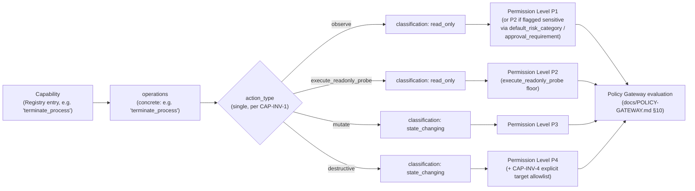
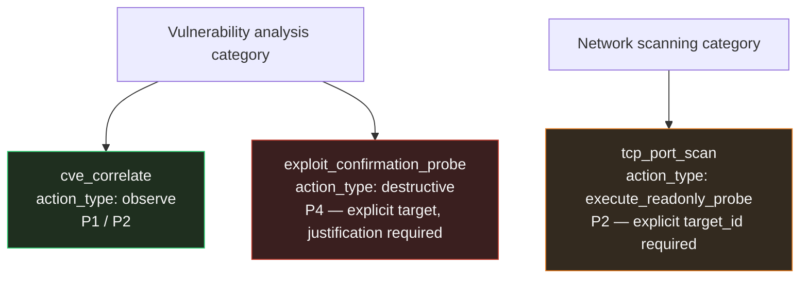

# Chanakya AI — Capability & Permission Model (Phase 2)

This document defines the capability taxonomy and permission-level model
that answers, for every registered tool: **"what is this tool allowed to
do?"** It is the synthesis layer between `docs/TOOL-REGISTRY.md` (what a
capability *is*) and `docs/POLICY-GATEWAY.md` (how a request *is
enforced*), and builds on, without redesigning, `ARCHITECTURE.md` and
`docs/CONTRACTS.md`. No implementation code exists yet.

This model makes two small, purely additive extensions to the two
sibling Phase 2 documents already written this session (not to any
Phase 0 document): a `category` and `action_type` field on
`RegistryEntry` (`TOOL-REGISTRY.md`), and a `match.category`/
`match.action_type` matching option on `PolicyRule`
(`POLICY-GATEWAY.md`). Both are called out explicitly below and have
been applied to those two files for consistency.

## Design principle (non-negotiable)

> **Least privilege, deny-by-default, explicit allowlisting, target
> restrictions, and mandatory human approval for anything state-changing
> are not policy-author discipline — they are properties this model
> makes structurally true, the same way `POLICY-GATEWAY.md` INV-1 and
> `TOOL-REGISTRY.md` REG-INV-1..3 make the Gateway and Registry
> structurally safe.**

---

## 1. Capability vs. Action — the formal separation

Two different questions get conflated in most agentic-tool designs. This
model keeps them separate on purpose:

- **Capability** — *what can be asked for.* A named, registered unit
  (`RegistryEntry.capability`, exactly the string used in
  `ToolRequest.capability`). Answers "what exists in the menu."
- **Action** — *what actually happens to the target when it runs.* Every
  capability's declared `operations` (`TOOL-REGISTRY.md` §"Terminology
  note") are concrete primitive operations (`read_file`,
  `terminate_process`, ...). This model adds one level of abstraction
  above that: a small, closed **`action_type`** taxonomy that groups
  those concrete operations by *effect*, and is what actually drives
  permission-level assignment:

| `action_type` | Effect on target | Maps to `Evidence.classification` |
|---|---|---|
| `observe` | Reads/enumerates/inspects; no target mutation, no side effect beyond normal read access | `read_only` |
| `execute_readonly_probe` | Actively sends traffic/requests to elicit a response (e.g. a port scan); no persistent target mutation, but a real, observable interaction that can trigger alerts or consume target resources | `read_only` |
| `mutate` | Changes target state in a contained, generally reversible way (kill a process, quarantine a file) | `state_changing` |
| `destructive` | Changes target state irreversibly or with broad blast radius (delete data, disable a security control, confirm an exploit by triggering it) | `state_changing` |

`action_type` is a Registry-level refinement *underneath* the two-value
`classification` enum already fixed in `CONTRACTS.md` §7 — it never
introduces a third value into that contract; `observe`/
`execute_readonly_probe` always collapse to `read_only`, `mutate`/
`destructive` always collapse to `state_changing`. It exists because
"read-only vs. state-changing" alone is too coarse to distinguish, say,
`list_listening_ports` (inert) from `tcp_port_scan` (active, semi-intrusive,
still non-mutating) — a distinction this model needs for the permission
levels in §3.

### CAP-INV-1 — One action type per capability (capability decomposition rule)

Every operation declared in a capability's `operations` list must belong
to the **same** `action_type`. A capability whose implementation mixes,
say, `observe` and `mutate` operations (a hypothetical "process manager"
that both lists and kills processes under one registrable unit) is
**rejected at Registry admission** and must be decomposed into separate
capabilities — exactly as `TOOL-REGISTRY.md`'s two examples already do
(`list_processes`/`get_process_details` as `observe`, `terminate_process`
as `mutate`, registered separately). This is what prevents "one tool to
rule them all" designs from smuggling a high-privilege action in under a
low-privilege capability's name.

### CAP-INV-2 — `action_type` and `classification` must agree

Registry admission rejects any entry where `action_type` implies a
`classification` other than the one declared (e.g. `action_type: mutate`
with `classification: read_only` is an admission error, not something
resolved by trusting one field over the other).

---

## 2. Capability categories

Categories are an **organizational and default-inheritance** axis,
answering "what investigative domain is this," independent of
`action_type`/`classification`, which answer "what does it do." A
category can — and often does — contain capabilities at different
action types (e.g. "Process information" contains both an `observe`
capability and a `mutate` one).

### CAP-INV-3 — Category is descriptive only, never a grant

A category name, by itself, never authorizes anything. It cannot appear
in a `PolicyRule` with `effect: allow` unless combined with an explicit
`classification`/`action_type` filter narrow enough to guarantee only
`read_only`/`observe`-tier capabilities can match (this extends
`POLICY-GATEWAY.md` INV-1's load-time rejection rule — see the note in
§6 below). This is the category-level analogue of `TOOL-REGISTRY.md`
REG-INV-1: nothing you can call "belonging to" ever substitutes for
individual, admin-vetted authorization.

| Category | Domain | Typical `action_type`(s) | Typical permission level(s) | Example capabilities |
|---|---|---|---|---|
| **Host information** | OS/hardware/version/uptime/environment facts | `observe` | P1 (P2 if the fact could be a secret, e.g. env vars) | `get_os_info`, `get_uptime`, `dump_environment_variables` (P2) |
| **Process information** | Running processes and their metadata | `observe` (list/inspect); `mutate` (kill/suspend) | P1 for list/inspect; P3 for terminate/suspend | `list_processes` (P1), `get_process_details` (P1), `terminate_process` (P3) |
| **Network information** | Local network state: ports, interfaces, routes, active connections | `observe` | P1 | `list_listening_ports` (P1), `list_network_interfaces` (P1) |
| **Filesystem observation** | Directory/file metadata and content on the target | `observe` | P1 for listing/metadata; P2 for reading file *contents* (secret-exposure risk) | `list_directory` (P1), `get_file_metadata` (P1), `read_file_contents` (P2) |
| **Log observation** | Reading/querying system or application logs | `observe` | P1 typically; P2 if logs may carry sensitive/PII content | `read_system_log` (P1), `query_application_log` (P2) |
| **Network scanning** | Active probing of network services (own host or an explicitly authorized remote target) | `execute_readonly_probe` | **P2 minimum**, even though non-mutating — see §5 | `tcp_port_scan` (P2), `service_banner_grab` (P2) |
| **Source-code analysis** | Static analysis of an authorized source repository | `observe` | **P2 by default** — static analysis routinely surfaces hardcoded secrets (T-20/T-22) | `static_code_scan` (P2), `dependency_vulnerability_match` (P1/P2) |
| **Vulnerability analysis** | Correlating findings against known vulnerabilities, *or* actively testing for one | `observe` (correlation); `destructive` (active exploit-confirmation) | **Split — see §5**: P1/P2 for correlation, **P4** for active probing | `cve_correlate` (P1), `exploit_confirmation_probe` (P4) |

This list is intentionally the eight categories requested; the taxonomy
is open (a future phase adds categories the same way `target_type` is
open in `CONTRACTS.md`), but adding one never bypasses CAP-INV-3.

---

## 3. Permission levels (P0–P4)

Each level is a **derived** classification — never itself an
independently-settable field — computed from `action_type` +
`classification` + `default_risk_category`/`approval_requirement`
(`TOOL-REGISTRY.md` §1). It exists purely as the shared vocabulary this
document, the Registry, and the Gateway use to reason about "how locked
down."

| Level | Name | Meaning | Human approval | Targets | What the Agent Runtime may request | What the Policy Gateway must enforce |
|---|---|---|---|---|---|---|
| **P0** | Not permitted | Capability not `enabled`, or explicitly blocked by an admin `deny` rule | N/A — not a question of approval, it's not invocable | N/A | **Never presented** in the Capability Catalog View (`TOOL-REGISTRY.md` §4). If the Agent names it anyway (hallucination or injection), the Runtime forwards the `ToolRequest` unmodified — it never rewrites or "helps" the Agent toward a valid alternative | `deny`, `matched_rule: "unknown-capability"` — identical wording whether the capability never existed, is disabled, or is explicitly blocked (REG-INV-3) |
| **P1** | Observational, unrestricted within scope | `action_type: observe`, `classification: read_only`, `default_risk_category` informational/low | None required | Any target within investigation scope + Registry's `supported_target_types`; target-*type*-level allowlisting is sufficient | May propose freely, subject to per-investigation rate limits (`POLICY-GATEWAY.md` §2 `conditions.max_calls_per_investigation`) | `allow` if in scope and under rate limit, via `read-only-default` or an explicit `allow` rule; `require_approval`/`deny` if a limit is exceeded |
| **P2** | Observational, sensitive | `observe` or `execute_readonly_probe`, still `read_only`, but `default_risk_category` medium/high **or** `approval_requirement: required` set at the Registry or Policy layer | **Always required** — this floor pre-empts the read-only default (most-restrictive-wins, `TOOL-REGISTRY.md` §3) | Same scope checks as P1; `execute_readonly_probe` capabilities (scanning) should use explicit `target_id` allowlists, not wildcard `target_type` (recommended at this tier, mandatory at P4) | May propose freely, but the Runtime must **block dispatch** and create an `ApprovalRequest` before any evidence is collected | `require_approval` — never `allow`, regardless of the read-only classification default, because a Registry/Policy floor overrides it |
| **P3** | State-changing, supervised | `action_type: mutate`, `classification: state_changing` | **Always required** — structurally unreachable as `allow` (`POLICY-GATEWAY.md` INV-1) | Investigation/registration scope checks; explicit `target_id` recommended | May propose; must block dispatch pending an **accepted** `ApprovalDecision` bound to the specific `approval_request_id`; no default/timeout-accept | `require_approval` or `deny` only |
| **P4** | State-changing, high-risk/destructive | `action_type: destructive`, `classification: state_changing`, `default_risk_category: critical` | **Always required, with mandatory-justification signal** — `PolicyDecision.notes` flags that the approver should require a non-empty `ApprovalDecision.justification` (`POLICY-GATEWAY.md` §7) | **CAP-INV-4 (below): explicit `target_id` allowlist mandatory** — wildcard `target_type` rules are rejected at policy load time for any P4 capability | May propose; must block dispatch pending accepted approval; Registry `resource_limits.max_concurrent_invocations` should be `1` so one approval can't be leveraged into a batch of destructive actions | `require_approval` or `deny` only, **plus** the CAP-INV-4 target-restriction floor applied independent of whichever rule matched |

### CAP-INV-4 — P4 requires explicit target allowlisting

At the `destructive` tier, a `PolicyRule` (or the absence of one, falling
to classification default) may never resolve against a wildcard
`target_type` match. Any rule whose matched capabilities include a P4
capability must specify `match.target_id` explicitly; a rule that
doesn't is rejected at `PolicySet` load time, the same way an `allow`
rule against a `state_changing` capability is rejected under
`POLICY-GATEWAY.md` INV-1. This bounds the blast radius of a single
approval decision to a named, specific target — never "any host of this
type."

---

## 4. Principles → concrete mechanisms

| Principle | How this model makes it structural |
|---|---|
| **Least privilege** | `required_privileges` (`TOOL-REGISTRY.md` §1, item 11) is a declared ceiling per capability, not per category — a P1 capability in "Process information" gets exactly the privilege *it* needs, unaffected by a P3 capability sharing its category (SR-2). CAP-INV-1 prevents a low-privilege capability from smuggling a high-privilege operation in under one registration. |
| **Deny by default** | Unregistered, disabled, or unmatched capabilities terminate at `deny` (`POLICY-GATEWAY.md` §8; `TOOL-REGISTRY.md` §6) — P0 by construction, not by an admin remembering to write a blocking rule. |
| **Explicit allowlisting** | `allow` is only reachable via an explicit Registry classification (`read_only`) plus either the classification default or a named `PolicyRule` — never via a category-wide grant (CAP-INV-3) or a wildcard capability match without a classification/action-type filter. |
| **Target restrictions** | Layered scope checks (investigation scope ∩ registration scope ∩ Registry `supported_target_types` ∩ any rule-level `target_id`, `POLICY-GATEWAY.md` §4) apply at every permission level, tightening to a mandatory explicit allowlist at P4 (CAP-INV-4). |
| **Human approval for state-changing actions** | `mutate`/`destructive` action types always collapse to `classification: state_changing`, which can never resolve to `allow` (`POLICY-GATEWAY.md` INV-1) — approval is a floor derived from the action's effect, not from how the capability is phrased or categorized. |

---

## 5. Worked examples — the two cases that don't fit a single tier

**Network scanning.** Reading your *own* host's network state
(`list_listening_ports`) is inert and P1. Actively probing — even just
to check whether a port is open — sends real traffic, can trigger an
IDS/IPS, and consumes target-side resources. It is `execute_readonly_probe`,
never merely `observe`, and is **P2 at minimum** regardless of how
"read-only" the eventual data feels — and per §3, its target scope should
be an explicit allowlist even at P2, since a scan capability with a
wildcard target is one of the more plausible paths to Abuse-Case-style
scope creep (`THREAT-MODEL.md` T-08).

**Vulnerability analysis.** This category must be split into two
distinct capabilities, never one:
- `cve_correlate` — matches already-collected inventory evidence against
  a CVE feed. Pure `observe`, no interaction with the target at all. P1
  (or P2 if the correlation could reveal something sensitive about
  unpatched exposure that the operator wants gated).
- `exploit_confirmation_probe` — actually sends a payload to confirm a
  vulnerability is exploitable. This is `destructive` (it can crash a
  service, corrupt state, or have side effects indistinguishable from a
  real attack) and is **P4**: explicit target allowlist, mandatory
  approval with justification, single-concurrency. This is also exactly
  the class of capability this project's authorized-testing framing
  (`README.md`) exists to support *safely* — "vulnerability analysis" as
  a category name must never be read as license to skip the P4 floor
  just because it sounds like read-only "analysis."

**Source-code analysis.** Purely `observe` against a `source_repo`
target type, but defaults to **P2** because static analysis of real
repositories routinely surfaces hardcoded credentials — this ties
directly to the redaction requirements already in place for `Evidence`
(SR-13, T-20/T-22): a `static_code_scan` capability's `ToolResult.output`
must pass through redaction scanning before persistence, same as an
environment-variable dump.

---

## Permission-level derivation flow

## Category split — the two ambiguous categories

---

## 6. Extensions applied to the sibling Phase 2 documents

Both changes are additive (new optional/required fields only); nothing
in either document was removed or contradicted.

**`docs/TOOL-REGISTRY.md`** — `RegistryEntry` gains two fields:
- `category` (string, one of §2's taxonomy) — organizational only,
  subject to CAP-INV-3.
- `action_type` (enum `observe`\|`execute_readonly_probe`\|`mutate`\|
  `destructive`) — subject to CAP-INV-1/CAP-INV-2 at admission.

**`docs/POLICY-GATEWAY.md`** — `PolicyRule.match` gains two optional
fields, `category` and `action_type`, so a rule can target a whole
category (e.g. "require approval for everything in `network_scanning`")
without enumerating every capability by name. Load-time validation is
extended accordingly: **a rule with `effect: allow` that matches by
`category` or `action_type` (rather than an explicit capability list) is
rejected unless it also constrains `classification: read_only` — the
same protection INV-1 already gives individual capabilities, now
extended to category/action-type-scoped rules so a broad `allow` can
never accidentally sweep in a `state_changing` capability that happens
to share a category with a benign one.**

---

## Security controls summary

- **Capability/action separation** stops a capability's *name* or
  *category* from ever standing in for what it actually does (§1).
- **One action type per capability** (CAP-INV-1) forecloses
  low-privilege-looking tools smuggling a high-privilege operation.
- **Category is never a grant** (CAP-INV-3) — organizational structure
  cannot substitute for per-capability, admin-vetted authorization.
- **Permission levels are derived, not settable** — P0–P4 fall out of
  `action_type`/`classification`/risk fields already owned by the
  Registry and Gateway; there is no separate "level" field an admin
  could set inconsistently with the underlying facts.
- **P4 gets a dedicated, load-time-enforced target-scope floor**
  (CAP-INV-4), on top of every lower level's ordinary scope checks.
- **Ambiguous categories are forced to decompose** (§5) — "network
  scanning" and "vulnerability analysis" cannot be registered as a
  single capability spanning passive and active/destructive behavior;
  CAP-INV-1 makes that a load-time rejection, not a review judgment call.

---

## Open items (non-blocking)

Consistent with the pattern in the prior three documents:

1. A dedicated `probation_until`-style field (flagged already in
   `TOOL-REGISTRY.md`'s open items) could also usefully gate P2+
   capabilities from a newly-vetted `vetted_third_party` source at a
   stricter default than an established `core` capability at the same
   permission level — currently a deployment choice using existing
   fields, not a schema-level distinction.
2. As more target types arrive (VM, container, cloud, web app —
   `ARCHITECTURE.md` §7), some categories (e.g. "network scanning") will
   need per-target-type default permission levels (scanning a
   deliberately-owned lab VM vs. an ambiguously-scoped cloud account are
   not equally risky) — flagged for whenever remote target adapters are
   designed, per `THREAT-MODEL.md` T-26/SR-24.

Neither blocks Phase 2 implementation.
