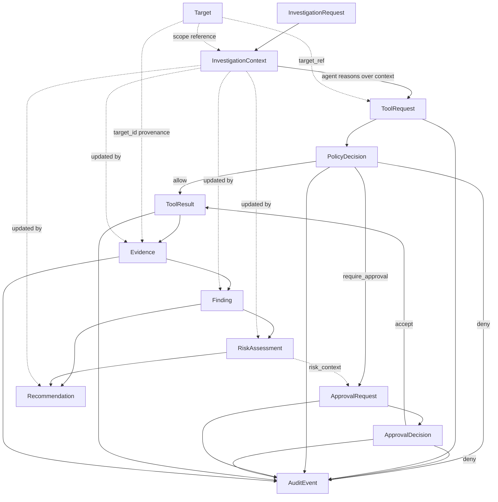

# Chanakya AI — Contract Specification

This document defines the core contract objects that connect the
architecture components described in `ARCHITECTURE.md`. These are
**design specifications only** — no implementation code exists yet. Once
agreed, they become the basis for the data models implemented in a later
phase.

## Conventions used by every contract

- **`contract_version`** (string, semver, e.g. `"1.0.0"`) is a required
  field on every contract defined here. A consumer must reject or
  explicitly handle a version it does not recognize rather than guessing
  at an unfamiliar shape. This is what makes the contracts versionable.
- **IDs** are opaque strings (UUIDv4 recommended) unique within their
  contract type. They are used for cross-referencing instead of embedding
  full nested objects, so records stay small and stored data isn't
  duplicated across the Evidence Store, Audit Log, and in-memory context.
- **Timestamps** are ISO 8601 UTC strings (e.g. `"2026-09-13T18:22:04Z"`).
- **`target_type`** is an open, registry-backed string (not a hard-coded
  enum limited to `local_host`) so the contracts support multiple target
  types (VM, container, Kubernetes, cloud, web app, API, source repo,
  remote infra) without a breaking change — this is what makes the
  contracts target-agnostic.
- No contract below carries a model/provider-specific field in its
  required set — anything about which LLM produced agent output is
  optional, free-form metadata confined to audit/debug fields, never a
  structural dependency. This is what makes the contracts provider-agnostic.
- **No contract defined here has a field intended to carry a credential,
  secret, or token.** This is enforced structurally, not just by
  convention — see "Sensitive data rules" at the end of this document.

---

## 1. InvestigationRequest

**Purpose**: Captures the user's stated objective and starts an
investigation. It is the only contract that originates directly from a
human, outside the agent loop.

- **Producer**: User Interface Layer (CLI), on behalf of the User.
- **Consumer**: Agent Runtime — validates it and creates the initial
  `InvestigationContext` from it.

| Field | Type | Required | Description |
|---|---|---|---|
| `investigation_request_id` | string (uuid) | required | Unique id for this request |
| `contract_version` | string (semver) | required | Contract schema version |
| `objective` | string | required | The user's stated goal, in natural language |
| `requested_targets` | array\<string\> | required | Target ids/descriptors the user wants in scope (must resolve against the Target Manager's registry — this request does not itself grant access) |
| `submitted_by` | string | required | Human identity of the requester (for accountability) |
| `submitted_at` | string (timestamp) | required | Submission time |
| `constraints` | array\<string\> | optional | Natural-language constraints, e.g. "read-only only", "business hours only" |
| `scope_notes` | string | optional | Free-text scoping clarification |
| `priority` | string (enum: `low`\|`normal`\|`high`) | optional | Investigation priority |
| `tags` | array\<string\> | optional | Free-form labels |

**Validation requirements**
- `objective` must be non-empty.
- `requested_targets` must be non-empty and every entry must correspond to
  a target already known to the Target Manager — this contract cannot
  introduce a new, unregistered target.
- `submitted_by` must identify a human account, never a system/agent id.

**Security considerations**
- `submitted_by` is an identity string (e.g. username), never a
  credential.
- `requested_targets` are descriptors/ids only; actual authorization is
  re-checked downstream by the Policy Gateway for every individual
  `ToolRequest` — this contract does not bypass per-action policy checks.

**Example**
```json
{
  "investigation_request_id": "inv-req-3f9a1c2e",
  "contract_version": "1.0.0",
  "objective": "Assess this machine for common local misconfigurations",
  "requested_targets": ["target-local-host-01"],
  "submitted_by": "krish",
  "submitted_at": "2026-09-13T18:00:00Z",
  "constraints": ["read-only only"],
  "priority": "normal"
}
```

---

## 2. InvestigationContext

**Purpose**: The Runtime-owned, evolving state for one investigation. It
is what the Agent Runtime assembles context from on every loop iteration,
and what the UI reads to show status. It does not embed large payloads —
it references other contracts by id.

- **Producer**: Agent Runtime (created from an `InvestigationRequest`,
  updated after every step).
- **Consumer**: AI Agent (reads a relevant slice each turn), CLI (status
  display), Risk Engine, AI Analysis Layer.

| Field | Type | Required | Description |
|---|---|---|---|
| `investigation_id` | string (uuid) | required | Unique, immutable investigation id |
| `contract_version` | string (semver) | required | Contract schema version |
| `investigation_request_id` | string | required | Link back to the originating request |
| `objective` | string | required | Copied from the request for convenient access |
| `status` | string (enum: `pending`\|`running`\|`awaiting_approval`\|`completed`\|`failed`\|`halted`) | required | Current lifecycle state |
| `target_refs` | array\<string\> | required | Target ids in scope for this investigation |
| `created_at` | string (timestamp) | required | Creation time |
| `updated_at` | string (timestamp) | required | Last state update time |
| `step_history` | array\<object\> | required (may be empty) | Ordered summaries of steps taken; each entry references a `tool_request_id`/`tool_result_id`, not the full payload |
| `evidence_refs` | array\<string\> | required (may be empty) | `evidence_id`s produced so far |
| `finding_refs` | array\<string\> | required (may be empty) | `finding_id`s produced so far |
| `risk_assessment_refs` | array\<string\> | optional | `risk_assessment_id`s produced so far |
| `recommendation_refs` | array\<string\> | optional | `recommendation_id`s produced so far |
| `current_step_id` | string | optional | The step currently in flight, if any |
| `error_state` | object | optional | Present only when `status` is `failed`/`halted`; describes cause |

**Validation requirements**
- `investigation_id` is immutable once assigned.
- `status` transitions must follow the defined state machine (e.g.
  `awaiting_approval` can only be entered while a step's `PolicyDecision`
  is `require_approval`, and must resolve to `running`, `completed`,
  `failed`, or `halted`).
- Referenced ids (`evidence_refs`, `finding_refs`, etc.) must resolve to
  existing records — no dangling references.

**Security considerations**
- Must reference evidence/findings by id rather than embedding full
  payloads, so the Context object never becomes a second, less-controlled
  copy of potentially sensitive tool output.
- Must not carry credentials for any of the referenced targets.

**Example**
```json
{
  "investigation_id": "inv-8b2e0a77",
  "contract_version": "1.0.0",
  "investigation_request_id": "inv-req-3f9a1c2e",
  "objective": "Assess this machine for common local misconfigurations",
  "status": "running",
  "target_refs": ["target-local-host-01"],
  "created_at": "2026-09-13T18:00:01Z",
  "updated_at": "2026-09-13T18:04:12Z",
  "step_history": [
    {"step_id": "step-1", "tool_request_id": "tr-001", "tool_result_id": "res-001"}
  ],
  "evidence_refs": ["ev-001"],
  "finding_refs": [],
  "current_step_id": "step-2"
}
```

---

## 3. ToolRequest

**Purpose**: The AI Agent's structured proposal to run a single
capability against a target. **This is the only artifact the Agent is
allowed to produce that expresses an intent to act — it is never itself
an execution, and the Agent has no path to execute it directly.** It must
always pass through the Agent Runtime and Policy Gateway before anything
runs.

- **Producer**: AI Agent (via the LLM Abstraction, schema-validated by the
  Runtime before being treated as valid).
- **Consumer**: Agent Runtime (routes it), Policy & Security Gateway
  (evaluates it), MCP/Tool Layer (executes it only after an `allow` or an
  accepted approval).

| Field | Type | Required | Description |
|---|---|---|---|
| `tool_request_id` | string (uuid) | required | Unique id for this request |
| `contract_version` | string (semver) | required | Contract schema version |
| `investigation_id` | string | required | Owning investigation |
| `step_id` | string | required | Step id within the investigation |
| `capability` | string | required | Name of a capability registered in the Security Tool Registry |
| `target_ref` | string | required | `target_id` this request applies to |
| `parameters` | object | required (may be `{}`) | Capability-specific parameters, validated against the Registry's declared schema for `capability` |
| `proposed_by` | string (enum: `agent`) | required | Always `"agent"` — this field exists to make the origin explicit and auditable |
| `proposed_at` | string (timestamp) | required | Proposal time |
| `rationale` | string | optional | Agent's explanation of why this step was chosen (for display/audit, not for execution) |
| `expected_output_description` | string | optional | What the Agent expects to learn |

**Validation requirements**
- `capability` must exist in the Security Tool Registry; unknown
  capabilities are rejected before reaching the Policy Gateway.
- `parameters` must validate against that capability's declared schema.
- `target_ref` must resolve to a target within the owning investigation's
  `target_refs`.
- `investigation_id`/`step_id` must reference a valid, active
  `InvestigationContext`.

**Security considerations**
- `parameters` must never contain credentials — any authentication needed
  to reach the target is resolved by the Target Manager/Adapter from
  Configuration & Secrets, not passed through the Agent or this object.
- `rationale` is Agent-generated text and must be treated as untrusted
  display content by every consumer (rendered as text, never evaluated or
  executed).
- This object carries no execution authority by itself — a `ToolRequest`
  existing does not imply anything ran; the Policy Gateway's
  `PolicyDecision` is what determines that.

**Example**
```json
{
  "tool_request_id": "tr-001",
  "contract_version": "1.0.0",
  "investigation_id": "inv-8b2e0a77",
  "step_id": "step-1",
  "capability": "list_listening_ports",
  "target_ref": "target-local-host-01",
  "parameters": {},
  "proposed_by": "agent",
  "proposed_at": "2026-09-13T18:01:00Z",
  "rationale": "Establish a baseline of exposed network services before deeper analysis."
}
```

---

## 4. ToolResult

**Purpose**: The normalized outcome of actually executing a `ToolRequest`.
This is an execution-layer artifact — it becomes durable, provenance-
tagged `Evidence` when the Runtime records it, but is not itself the
long-term store.

- **Producer**: MCP/Tool Layer.
- **Consumer**: Agent Runtime (writes `Evidence` from it, hands the
  outcome back to the Agent for interpretation).

| Field | Type | Required | Description |
|---|---|---|---|
| `tool_result_id` | string (uuid) | required | Unique id for this result |
| `contract_version` | string (semver) | required | Contract schema version |
| `tool_request_id` | string | required | The request this result answers |
| `capability` | string | required | Copied from the request for convenience |
| `status` | string (enum: `success`\|`failure`\|`timeout`\|`error`) | required | Execution outcome |
| `started_at` | string (timestamp) | required | Execution start |
| `completed_at` | string (timestamp) | required | Execution end (must be ≥ `started_at`) |
| `output` | object | required if `status` = `success` | Normalized structured output, shape defined per capability |
| `error_message` | string | optional | Present when `status` ≠ `success` |
| `exit_code` | integer | optional | Present for tools with a process exit code |
| `raw_output` | string | optional | Original, unmodified tool output kept for forensic completeness, subject to redaction (see Security considerations) |
| `warnings` | array\<string\> | optional | Non-fatal issues encountered during execution |

**Validation requirements**
- `tool_request_id` must reference an existing `ToolRequest`.
- `completed_at` must not precede `started_at`.
- `status` values are limited to the defined enum — no free-form status
  strings.

**Security considerations**
- `output` and `raw_output` must be passed through a redaction step before
  being persisted if a capability is known to be able to surface secrets
  (e.g., environment variable dumps); when redaction occurs it must be
  noted (see `Evidence.redactions_applied`) rather than silently altering
  the record.
- Per the architecture's trust boundaries, tool output — including
  `raw_output` — is **semi-trusted**: it originates from a real target but
  must never be reinterpreted as instructions when later included in an
  LLM prompt for analysis; it is data, not commands.

**Example**
```json
{
  "tool_result_id": "res-001",
  "contract_version": "1.0.0",
  "tool_request_id": "tr-001",
  "capability": "list_listening_ports",
  "status": "success",
  "started_at": "2026-09-13T18:01:01Z",
  "completed_at": "2026-09-13T18:01:02Z",
  "output": {
    "ports": [
      {"port": 3389, "protocol": "tcp", "process": "svchost.exe"}
    ]
  }
}
```

---

## 5. PolicyDecision

**Purpose**: The Policy & Security Gateway's explicit, auditable verdict
on a `ToolRequest`. No dispatch occurs without one of these existing
first — this is what makes policy decisions explicit rather than implicit.

- **Producer**: Policy & Security Gateway.
- **Consumer**: Agent Runtime (acts on the verdict), Human Approval
  Mechanism (if `require_approval`), Audit Log.

| Field | Type | Required | Description |
|---|---|---|---|
| `policy_decision_id` | string (uuid) | required | Unique id for this decision |
| `contract_version` | string (semver) | required | Contract schema version |
| `tool_request_id` | string | required | The request being evaluated |
| `verdict` | string (enum: `allow`\|`deny`\|`require_approval`) | required | The decision — no other value is valid |
| `matched_rule` | string | required | Identifier of the policy rule that produced this verdict — a decision must always be traceable to a specific rule |
| `reason` | string | required | Human-readable explanation of the verdict |
| `evaluated_at` | string (timestamp) | required | Evaluation time |
| `risk_category` | string | optional | Copied from the Security Tool Registry's classification for this capability |
| `notes` | string | optional | Additional context |
| `classification` | string | optional | Implementation addition (Phase 5.2.1): snapshot of the Registry `classification` at decision time, copied into `Evidence` |
| `capability_envelope` | object | optional | Implementation addition (Phase 11): `{capability, output_schema, max_output_bytes, timeout_seconds}`, derived by the Gateway from the same Registry entry it decided on. Execution is constrained by it (timeout capped by the Runtime ceiling; output size and schema enforced by the Tool Layer). It is never an authorization signal and never comes from the model, target, handler or parameters |

**Validation requirements**
- `verdict` is restricted to exactly the three defined values.
- `matched_rule` must reference a real, currently configured policy rule
  — a decision cannot be issued without an identifiable basis.

**Security considerations**
- Immutable once issued — never edited; a changed mind requires a new
  `ToolRequest` and a new `PolicyDecision`, preserving a clean audit trail.
- A `deny` must never be silently bypassed or retried without a materially
  different, newly evaluated `ToolRequest`.

**Example**
```json
{
  "policy_decision_id": "pd-001",
  "contract_version": "1.0.0",
  "tool_request_id": "tr-001",
  "verdict": "allow",
  "matched_rule": "read-only-default",
  "reason": "Capability is classified read-only and target is in scope.",
  "evaluated_at": "2026-09-13T18:01:00.500Z",
  "risk_category": "informational"
}
```

---

## 6. Target

**Purpose**: Metadata describing a resolvable target — **not** the live
connection/credential handle used internally by a Target Adapter, which
is never serialized into this or any other contract. This object is what
lets the rest of the system refer to "what is being investigated" without
knowing target-type-specific details.

- **Producer**: Target Manager (registered from Configuration; resolved on
  request).
- **Consumer**: Policy Gateway (scope checks), Target Adapters (resolve
  live access), Tool Layer, Evidence (provenance references `target_id`).

| Field | Type | Required | Description |
|---|---|---|---|
| `target_id` | string | required | Unique id for this target |
| `contract_version` | string (semver) | required | Contract schema version |
| `target_type` | string | required | Open, registry-backed type, e.g. `local_host`, `vm`, `container`, `kubernetes`, `cloud`, `web_app`, `api`, `source_repo`, `remote_infra` |
| `display_name` | string | required | Human-readable name |
| `authorized_scope` | string | required | Explicit description of what is in scope for this target (never an unbounded wildcard by default) |
| `registered_at` | string (timestamp) | required | Registration time |
| `metadata` | object | optional | Free-form descriptive key/values (e.g. OS, environment label) |
| `owner_contact` | string | optional | Who to contact regarding this target |

**Validation requirements**
- `target_type` must match a type for which a Target Adapter is actually
  registered.
- `authorized_scope` is required and must be specific — a target record
  with an empty or wildcard scope must be rejected at registration.

**Security considerations**
- **This contract must never contain connection credentials, API keys, SSH
  keys, cloud access keys, or any secret material.** Those are resolved
  exclusively inside the Target Adapter at execution time from
  Configuration & Secrets Management, and are never written into a
  `Target` record, never logged, and never sent to the LLM.
- `metadata` is free-form but must not be used as a place to stash
  connection details — enforced by review/validation, since it's the one
  open-ended field on this contract.

**Example**
```json
{
  "target_id": "target-local-host-01",
  "contract_version": "1.0.0",
  "target_type": "local_host",
  "display_name": "Primary workstation",
  "authorized_scope": "This machine only, read-only capabilities",
  "registered_at": "2026-09-13T17:00:00Z",
  "metadata": {"os": "windows", "environment": "personal-lab"}
}
```

---

## 7. Evidence

**Purpose**: The durable, append-only, tamper-evident record of a
`ToolResult`, forming the factual basis findings are built on. Every
`Evidence` record is traceable back to the exact request, target, and
step that produced it.

- **Producer**: Agent Runtime (writes to the Evidence Store immediately
  after receiving a `ToolResult`).
- **Consumer**: AI Analysis Layer (produces `Finding`s), CLI (display),
  Audit Log (cross-reference).

| Field | Type | Required | Description |
|---|---|---|---|
| `evidence_id` | string (uuid) | required | Unique, immutable id |
| `contract_version` | string (semver) | required | Contract schema version |
| `investigation_id` | string | required | Owning investigation |
| `step_id` | string | required | Step that produced this evidence |
| `tool_request_id` | string | required | Originating request |
| `tool_result_id` | string | required | Originating result |
| `target_id` | string | required | Target the evidence was collected from |
| `capability` | string | required | Capability used to collect this evidence |
| `recorded_at` | string (timestamp) | required | Time written to the store |
| `content_hash` | string | required | Integrity hash of the stored payload (tamper-evidence) |
| `storage_ref` | string | required | Pointer to the actual stored payload location |
| `classification` | string (enum: `read_only`\|`state_changing`) | required | Copied from the Registry at capture time, so history remains accurate even if the Registry entry later changes |
| `tags` | array\<string\> | optional | Free-form labels |
| `redactions_applied` | boolean | optional | `true` if sensitive content was redacted before storage |

**Validation requirements**
- `content_hash` must match the stored payload — verified on read to
  detect tampering.
- Append-only: no update/delete operation is defined for this contract;
  correcting an error requires a new record plus an `AuditEvent`
  explaining the correction, never an edit in place.
- All four traceability fields (`tool_request_id`, `tool_result_id`,
  `target_id`, `step_id`) are required — an `Evidence` record can always
  be traced back to exactly what produced it.

**Security considerations**
- Must never duplicate secrets from the underlying tool output; where
  redaction occurred, `redactions_applied` records the fact without
  exposing what was removed.
- Tamper-evidence (`content_hash`) detects modification after the fact —
  it is paired with append-only storage permissions, not a substitute for
  them.

**Example**
```json
{
  "evidence_id": "ev-001",
  "contract_version": "1.0.0",
  "investigation_id": "inv-8b2e0a77",
  "step_id": "step-1",
  "tool_request_id": "tr-001",
  "tool_result_id": "res-001",
  "target_id": "target-local-host-01",
  "capability": "list_listening_ports",
  "recorded_at": "2026-09-13T18:01:02.200Z",
  "content_hash": "sha256:9f86d081...",
  "storage_ref": "evidence/inv-8b2e0a77/step-1/res-001.json",
  "classification": "read_only"
}
```

---

## 8. Finding

**Purpose**: An Agent-produced interpretation of one or more pieces of
evidence. A finding is an opinion grounded in fact, never fact itself —
it must always be traceable to the evidence that supports it.

- **Producer**: AI Agent / AI Analysis Layer.
- **Consumer**: Risk Engine (produces `RiskAssessment`), CLI, Recommendation
  generation.

| Field | Type | Required | Description |
|---|---|---|---|
| `finding_id` | string (uuid) | required | Unique id |
| `contract_version` | string (semver) | required | Contract schema version |
| `investigation_id` | string | required | Owning investigation |
| `title` | string | required | Short summary |
| `description` | string | required | Full explanation |
| `evidence_refs` | array\<string\> | required, **non-empty** | `evidence_id`s this finding is based on |
| `created_at` | string (timestamp) | required | Creation time |
| `created_by` | string (enum: `agent`) | required | Origin marker |
| `category` | string | optional | e.g. `misconfiguration`, `exposure`, `outdated_software` |
| `confidence` | string (enum: `low`\|`medium`\|`high`) | optional | Agent's self-reported confidence — distinct from the Risk Engine's independently computed confidence |

**Validation requirements**
- `evidence_refs` must be non-empty and every id must resolve to an
  existing `Evidence` record — **a finding with no supporting evidence is
  invalid and must be rejected.**

**Implementation (Phase 9):** `chanakya/contracts/finding.py`.
- **Fields.** As specified above. The Runtime sets `finding_id`,
  `investigation_id`, `created_at` and `created_by` (`agent`); the model
  supplies only `title`, `description`, `category`, `confidence` and its
  evidence citations.
- **Evidence.** `evidence_refs` holds the resolved `evidence_id`s: the
  model cites `tool_result_id`s, and the Runtime maps them through this
  investigation's own steps.
- **Additional limits.** Title: one line, at most 200 characters.
  Description: at most 4000 characters, no control characters except
  newline and tab. `category` matches `[a-z0-9_]{1,64}`. At most 20
  distinct `evidence_refs`.
- **Credential screen.** Best-effort; it rejects rather than redacts.

**Security considerations**
- `title`/`description` are Agent-generated text; every consumer must
  render them as inert text, never execute or interpret them as
  instructions.
- Must not copy raw secrets from evidence into the description without
  redaction.

**Example**
```json
{
  "finding_id": "find-001",
  "contract_version": "1.0.0",
  "investigation_id": "inv-8b2e0a77",
  "title": "RDP exposed with default configuration",
  "description": "Port 3389 (RDP) is listening. No evidence of restricted access was found.",
  "evidence_refs": ["ev-001"],
  "created_at": "2026-09-13T18:02:00Z",
  "created_by": "agent",
  "category": "exposure",
  "confidence": "medium"
}
```

---

## 9. RiskAssessment

**Purpose**: A severity/confidence rating computed from one or more
findings using explicit, reproducible criteria — deliberately
**distinguishable from raw evidence** (which is fact) and from the finding
itself (which is interpretation): a risk assessment is prioritization.

- **Producer**: Risk Engine.
- **Consumer**: CLI display, Recommendation generation, Human Approval
  Mechanism (shown as risk context).

| Field | Type | Required | Description |
|---|---|---|---|
| `risk_assessment_id` | string (uuid) | required | Unique id |
| `contract_version` | string (semver) | required | Contract schema version |
| `finding_refs` | array\<string\> | required, **non-empty** | `finding_id`s this assessment covers |
| `severity` | string (enum: `informational`\|`low`\|`medium`\|`high`\|`critical`) | required | |
| `confidence` | string (enum: `low`\|`medium`\|`high`) | required | The Risk Engine's own confidence, computed independently of any Agent-reported confidence |
| `scoring_method` | string | required | Identifier/version of the rule set used, for reproducibility |
| `assessed_at` | string (timestamp) | required | |
| `rationale` | string | optional | Explanation of the score |
| `mitigations_suggested` | array\<string\> | optional | Non-binding text suggestions (not actions — see `Recommendation`) |

**Validation requirements**
- `finding_refs` non-empty and resolvable.
- `severity`/`confidence` restricted to their enums.
- `scoring_method` required — a score without a named method is invalid,
  since reproducibility is a stated architectural requirement.

**Implementation (Phase 10):** `chanakya/contracts/risk_assessment.py`,
rule-set data in `chanakya/contracts/risk_taxonomy.py`, engine in
`chanakya/risk/`.

- **Amendments to the fields above.**
  - Added, all required: `investigation_id` (the owning investigation),
    `evidence_refs` (exactly the Finding's `evidence_refs`, same order),
    `rule_ids` (the rules applied, from a closed vocabulary) and
    `assessed_by` (always `risk_engine`).
  - `rationale` is now required. It is engine-template text built only
    from rule ids, the taxonomy category id and Registry capability ids:
    one line, at most 1000 characters, no control characters, and it
    passes the Finding credential screen.
  - `finding_refs` holds exactly one `finding_id` in v1.
  - `mitigations_suggested` is not supported (deferred to
    Recommendations); a record carrying it is rejected.
- **Who sets what.** No field comes from the model.
  - The engine derives `risk_assessment_id`, `severity`, `confidence`,
    `rule_ids`, `rationale` and `assessed_by`.
  - The Runtime supplies `assessed_at`.
  - `investigation_id`, `finding_refs` and `evidence_refs` are copied
    from the stored Finding and re-checked by the Runtime.
- **Deterministic id.** `risk_assessment_id` is
  `uuid5(0f8d4a4c-89ad-5e05-b0d1-4b1023a25e9c, "<investigation_id>:<finding_id>:<scoring_method>")`.
  A second assessment of the same finding under the same rule set has the
  same id, and the append-only store refuses it.
- **Rule set `chanakya-risk-rules/1.0.0`.** It is the only supported
  `scoring_method`; an unknown one is invalid, including in a stored
  record.

  | Category | Base severity | Compatible capability |
  |---|---|---|
  | `network_exposure` | medium | `list_listening_ports` |
  | `unexpected_listener` | low | `list_listening_ports` |
  | `service_inventory` | informational | `list_listening_ports` |
  | `platform_configuration` | low | `observe_local_host_environment` |
  | `unsupported_platform_version` | medium | `observe_local_host_environment` |
  | `observation` | informational | any registered capability |

  1. A Finding with no category, or one outside this table, is **not
     assessed** (`category_unrated`). No default severity is guessed.
  2. Every cited Evidence must verify inside the Finding's own
     investigation (record hash and payload hash). A failure raises; it
     is never "not assessed".
  3. If no cited Evidence comes from a compatible capability, the Finding
     is **not assessed** (`evidence_incompatible`).
  4. Severity is the category's base severity.
  5. If every cited Evidence is `read_only`, severity is capped at `high`,
     so `critical` is unreachable under 1.0.0.
  6. Confidence describes the evidentiary basis only and ignores
     `Finding.confidence`:
     - `high`: all cited Evidence is compatible and comes from at least
       two distinct capabilities;
     - `medium`: all cited Evidence is compatible;
     - `low`: only some is.

  `rule_ids` has the canonical shape `evidence.verified`,
  `category.<id>`, `compat.all|compat.partial`, optional
  `ceiling.read_only`, `confidence.<level>`. The contract rejects any
  record whose severity, confidence and rules are inconsistent with the
  rule set.
- **Not a claim of truth, not authority.**
  - The rating describes the kind of claim and the provenance of the
    evidence behind it. It does not verify that the Finding is correct,
    and a low or absent rating does not mean there is no risk.
  - Nothing in the Policy Gateway, Intake, approval, dispatch, the
    Registry or the Tool Layer reads a RiskAssessment.
  - `ApprovalRequest.risk_assessment_ref` stays unset.

**Implementation (Phase 13): versioned rule sets.** `scoring_method` is the
authoritative identity of the rule set a result was produced under.
- **Registry.** A `RiskRuleSet` (`chanakya/contracts/risk_taxonomy.py`)
  holds the taxonomy, the closed rule-id vocabulary, the read-only ceiling
  and the maximum severity. Rule sets are resolved only through an
  immutable, code-defined registry. It contains v1 only, and v1's data and
  outputs are unchanged, verified by a golden fixture captured before
  Phase 13.
- **Validation.** A RiskAssessment is validated under the rule set it
  names. An unknown `scoring_method` is rejected on write and on read,
  with no fallback.
- **Required provenance.** `NotAssessedFinding` and `RiskEngineResult`
  gained a required `scoring_method`. A batch may not mix rule sets.
- **Stable ids.** The deterministic `risk_assessment_id` already includes
  `scoring_method`, so v1 ids are unchanged. A future rule set produces
  distinct ids, i.e. new artifacts rather than rewritten ones.

**Security considerations**
- Must be rendered by every consumer as an assessment/opinion label,
  visually and structurally distinct from `Evidence`.
- Is informational input to prioritization and to the Human Approval
  Mechanism's risk context — it does **not** replace or override the
  Policy Gateway's `PolicyDecision` as the authorization mechanism.

**Example**
```json
{
  "risk_assessment_id": "risk-001",
  "contract_version": "1.0.0",
  "finding_refs": ["find-001"],
  "severity": "medium",
  "confidence": "medium",
  "scoring_method": "rule-set-v1",
  "assessed_at": "2026-09-13T18:02:30Z",
  "rationale": "Exposed remote-access service with no confirmed compensating control observed."
}
```

---

## 10. Recommendation

**Purpose**: A suggested next step or remediation — **structurally
distinct from an action**. A `Recommendation` has no `target_ref` and no
executable `parameters`; it cannot be dispatched. Turning a recommendation
into an actual action always requires a brand-new `ToolRequest` that goes
through the full policy/approval flow — a recommendation never
auto-executes.

- **Producer**: AI Agent.
- **Consumer**: CLI (display to the human), who may choose to ask the
  Agent to act on it — which produces a new, independently evaluated
  `ToolRequest`.

| Field | Type | Required | Description |
|---|---|---|---|
| `recommendation_id` | string (uuid) | required | Unique id |
| `contract_version` | string (semver) | required | Contract schema version |
| `investigation_id` | string | required | Owning investigation |
| `summary` | string | required | Short statement of the suggestion |
| `rationale` | string | required | Why this is suggested |
| `created_at` | string (timestamp) | required | |
| `related_finding_refs` | array\<string\> | optional | `finding_id`s this relates to |
| `related_risk_assessment_refs` | array\<string\> | optional | `risk_assessment_id`s this relates to |
| `suggested_capability` | string | optional | A **non-binding** hint naming a Registry capability that could address this; carries no `parameters`/`target_ref` and cannot be dispatched as-is |
| `priority` | string (enum: `low`\|`normal`\|`high`) | optional | |

**Validation requirements**
- Must **not** contain a `target_ref` or a `parameters` object shaped like
  a `ToolRequest` — this is enforced by the schema itself, not just by
  convention, so a recommendation can never be mistaken for, or silently
  converted into, an executable request.

**Security considerations**
- The system must never auto-execute a `Recommendation`. There is no
  runtime path that consumes a `Recommendation` and produces a dispatch —
  only a human-initiated new `ToolRequest` can do that.

**Example**
```json
{
  "recommendation_id": "rec-001",
  "contract_version": "1.0.0",
  "investigation_id": "inv-8b2e0a77",
  "summary": "Consider restricting or disabling RDP if not required.",
  "rationale": "No compensating access control was observed for the exposed RDP service.",
  "created_at": "2026-09-13T18:02:45Z",
  "related_finding_refs": ["find-001"],
  "related_risk_assessment_refs": ["risk-001"],
  "priority": "normal"
}
```

---

## 11. ApprovalRequest

**Purpose**: Presents a `require_approval` decision to a human for an
explicit accept/deny. Only created when a `PolicyDecision.verdict` is
`require_approval` — this is what makes state-changing action support
mandatory human approval.

- **Producer**: Human Approval Mechanism (created by the Agent Runtime
  upon receiving a `require_approval` verdict).
- **Consumer**: UI Layer (renders to the human), Human Approval Mechanism
  (awaits and records the decision).

| Field | Type | Required | Description |
|---|---|---|---|
| `approval_request_id` | string (uuid) | required | Unique id |
| `contract_version` | string (semver) | required | Contract schema version |
| `investigation_id` | string | required | Owning investigation |
| `tool_request_id` | string | required | The request awaiting approval |
| `policy_decision_id` | string | required | The decision that triggered this request |
| `risk_context` | object | required | Factual summary shown to the approver: capability, target, parameters, and (if available) linked risk assessment — grounded in fact, not only the Agent's rationale |
| `status` | string (enum: `pending`\|`decided`\|`expired`) | required | |
| `requested_at` | string (timestamp) | required | |
| `expires_at` | string (timestamp) | optional | Optional timeout policy |
| `risk_assessment_ref` | string | optional | Linked `risk_assessment_id`, if one exists yet |

**Validation requirements**
- Can only be created for a `PolicyDecision` whose `verdict` is
  `require_approval`.
- `tool_request_id`/`policy_decision_id` must resolve to existing records.
- `status` transitions only `pending → decided` or `pending → expired`.

**Security considerations**
- `risk_context` must include the actual, factual request details
  (capability/target/parameters) — not solely the Agent's free-text
  rationale — so the approver is deciding based on ground truth.
- No default/implicit approval path exists: an expired or unanswered
  request blocks progress, it is never treated as consent.

**Example**
```json
{
  "approval_request_id": "appr-req-001",
  "contract_version": "1.0.0",
  "investigation_id": "inv-8b2e0a77",
  "tool_request_id": "tr-014",
  "policy_decision_id": "pd-014",
  "risk_context": {
    "capability": "terminate_process",
    "target_id": "target-local-host-01",
    "parameters": {"pid": 4821}
  },
  "status": "pending",
  "requested_at": "2026-09-13T18:10:00Z"
}
```

---

## 12. ApprovalDecision

**Purpose**: The human's binding accept/deny decision, with an optional
justification. This is the explicit human-in-the-loop boundary — the only
contract that can authorize a `require_approval` step to proceed.

- **Producer**: Human Approval Mechanism, capturing input from a human via
  the UI layer.
- **Consumer**: Agent Runtime (dispatches or blocks accordingly), Audit
  Log.

| Field | Type | Required | Description |
|---|---|---|---|
| `approval_decision_id` | string (uuid) | required | Unique id |
| `contract_version` | string (semver) | required | Contract schema version |
| `approval_request_id` | string | required | The request being decided |
| `decision` | string (enum: `accept`\|`deny`) | required | No partial/conditional values |
| `decided_by` | string | required | Human approver identity |
| `decided_at` | string (timestamp) | required | |
| `justification` | string | optional | Free-text comment from the approver; when present, it is included in the corresponding `AuditEvent` |

**Validation requirements**
- `approval_request_id` must reference a `pending` `ApprovalRequest`.
- `decision` restricted to exactly `accept`/`deny`.
- `decided_by` must identify a human, never a system or agent identity.

**Security considerations**
- `decided_by` is the accountability anchor for every state-changing
  action in the system — it must never be defaultable or spoofable by the
  Agent.
- `justification` is human-entered free text; approvers should be
  instructed not to paste secrets into it, but the field is still treated
  as potentially sensitive and handled the same as any other free-text
  field (see "Sensitive data rules" below).

**Example**
```json
{
  "approval_decision_id": "appr-dec-001",
  "contract_version": "1.0.0",
  "approval_request_id": "appr-req-001",
  "decision": "deny",
  "decided_by": "krish",
  "decided_at": "2026-09-13T18:11:30Z",
  "justification": "Process looks like a legitimate service; not terminating without more evidence."
}
```

---

## 13. AuditEvent

**Purpose**: The append-only record of every security-relevant operation
or state transition in the system, independent of whether any tool
actually ran. This is what makes the system's behavior fully
reconstructable after the fact.

- **Producer**: Agent Runtime (the central emitter, recording events
  sourced from itself, the Policy Gateway, the Human Approval Mechanism,
  and the Tool Layer).
- **Consumer**: Audit Log store (persisted, append-only), human
  audit/compliance review, CLI (history display).

| Field | Type | Required | Description |
|---|---|---|---|
| `audit_event_id` | string (uuid) | required | Unique id |
| `contract_version` | string (semver) | required | Contract schema version |
| `event_type` | string (enum — see below) | required | The kind of event |
| `occurred_at` | string (timestamp) | required | |
| `actor` | string | required | `"agent"`, `"system"`, or a human identity, depending on what caused the event |
| `investigation_id` | string | optional | Null only for system-level events not tied to an investigation |
| `related_ids` | object | required (may be `{}`) | Map of contract name → id relevant to this event, e.g. `{"tool_request_id": "tr-001", "policy_decision_id": "pd-001"}` |
| `details` | object | optional | Event-specific structured context (e.g. an `ApprovalDecision.justification`, echoed here rather than requiring a join) |
| `severity` | string (enum: `info`\|`warning`\|`error`) | optional | |

`event_type` enum (extensible only via a `contract_version` bump, never
by inventing ad hoc strings): `investigation_started`, `request_proposed`,
`policy_evaluated`, `approval_requested`, `approval_decided`,
`dispatch_started`, `dispatch_completed`, `dispatch_failed`,
`evidence_recorded`, `finding_created`, `risk_assessed`,
`recommendation_created`, `investigation_completed`, `investigation_halted`,
`error`.

**Validation requirements**
- `event_type` must be one of the defined values.
- Append-only — no update/delete operation is defined; a correction is a
  new event, never an edit.
- `related_ids` should reference, not duplicate, the underlying contract
  records — large or sensitive payloads (e.g. full `Evidence` content) are
  never inlined here.

**Implementation (Phase 12): durable authorization facts.** `details` of
five existing event types carry additive, bounded facts, defined in
`chanakya/contracts/audit_details.py`: `investigation_started`,
`request_proposed`, `policy_evaluated`, `approval_requested` and
`dispatch_started`. The terminal `error` of a failed investigation carries
`investigation_status: "failed"`.
- **What is recorded:** objective and requester, proposed capability,
  target and parameters, decision facts and an envelope summary, approval
  risk context, and the resolved execution limits.
- **Schema.** No `event_type` was added and `contract_version` is
  unchanged.
- **Objective.** Bounded text (2000 characters), credential-screened.
- **Parameters.** Canonical JSON plus integrity hash, 4096 bytes maximum,
  credential-screened.
- **Envelopes.** Summarized with an output-schema hash rather than copied.
- **Fail closed.** A fact that cannot be recorded safely fails the write
  and halts the investigation; nothing is truncated or redacted.
- **Review.** The read-only Investigation Review (`chanakya/review/`)
  validates these facts against closed shapes. They are a durable record,
  never an authorization input.

**Security considerations**
- Must never include raw secrets. When echoing something like an
  `ApprovalDecision.justification`, that string is subject to the same
  redaction expectations as its source field.
- Is the primary forensic record — its append-only property and
  completeness (one event per meaningful transition) are treated as a
  hard requirement, not a best-effort log.

**Example**
```json
{
  "audit_event_id": "audit-001",
  "contract_version": "1.0.0",
  "event_type": "approval_decided",
  "occurred_at": "2026-09-13T18:11:30Z",
  "actor": "krish",
  "investigation_id": "inv-8b2e0a77",
  "related_ids": {
    "approval_request_id": "appr-req-001",
    "approval_decision_id": "appr-dec-001",
    "tool_request_id": "tr-014"
  },
  "details": {
    "decision": "deny",
    "justification": "Process looks like a legitimate service; not terminating without more evidence."
  }
}
```

---

## Sensitive data rules

These rules apply across **every** contract above, not just the ones
where it's called out inline. No contract defined in this document has a
field intended to hold a credential — the rule is structural: if a field
isn't listed below as an allowed carrier of arbitrary text, it must never
contain one.

**Fields that must NEVER contain passwords, API keys, access tokens,
private keys, or other credential material:**

| Contract | Field(s) | Rule |
|---|---|---|
| `Target` | `metadata`, `authorized_scope`, `display_name` | No connection credentials of any kind — those live only inside the Target Adapter's runtime object, resolved from Configuration & Secrets at execution time, and are never serialized into a `Target` record |
| `ToolRequest` | `parameters`, `rationale` | Parameters must be pure operation arguments; authentication to the target is never passed through the Agent |
| `ToolResult` | `output`, `raw_output` | Must be redacted before persistence if the underlying capability could surface secrets (e.g., environment dumps, config files with embedded keys) |
| `Evidence` | (mirrors `ToolResult.output`/`raw_output`) | Same redaction expectation; `redactions_applied` records that redaction occurred |
| `Finding` | `description` | Must not copy unredacted secrets forward from evidence |
| `Recommendation` | `summary`, `rationale` | Text-only by design; must not embed operational secrets |
| `ApprovalRequest` | `risk_context` | Must show enough factual detail to decide, without needing to include a target credential to do so |
| `ApprovalDecision` | `justification` | Human free text — approvers should be told not to paste secrets here; still subject to the same redaction/handling as any other free-text field |
| `AuditEvent` | `details` | Must not become a place where a redacted field's original secret leaks back in via echoing |

**General rule for "unnecessary sensitive information"**: every contract
above is deliberately scoped to what its consumer needs. None of them
carry full system dumps, unrelated personal data, or broader payloads
than the specific capability/decision/approval they represent. Where a
field is free text (`rationale`, `description`, `justification`,
`summary`), it is treated as a potential leakage point and is exactly why
those fields — and only those — are the ones called out for redaction
handling.

---

## Contract dependency / data-flow diagram



**How to read this diagram**: solid arrows are "produces/feeds into";
dotted arrows are "referenced by, without being embedded." Every contract
except `AuditEvent` itself also feeds `AuditEvent` (omitted individually
above where already implied) — the Audit Log is the one sink every other
contract's lifecycle events flow into, which is what keeps the whole
investigation reconstructable after the fact.
