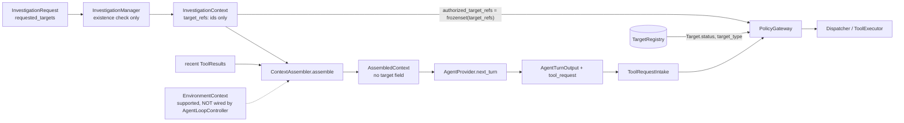
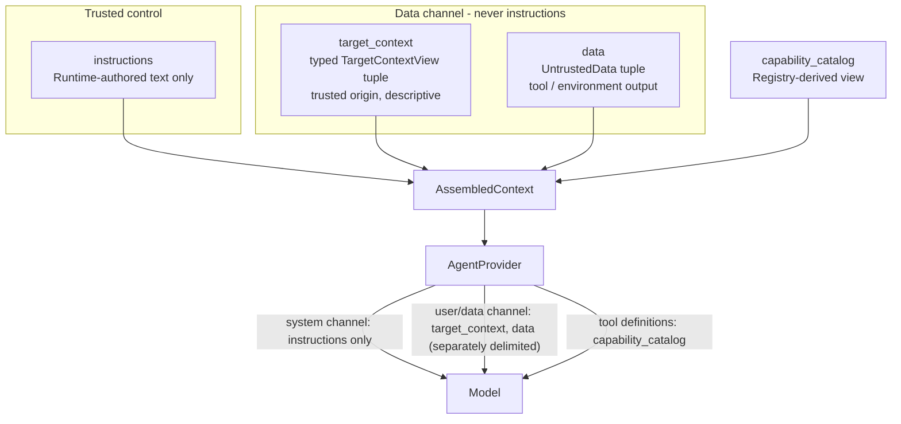
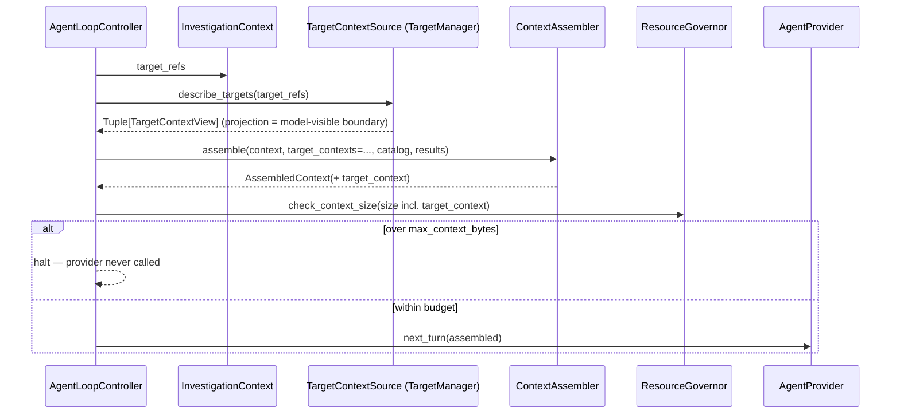

# Chanakya AI — Target-Aware Agent Context Design (Phase 5.7.1)

**Status**: design approved (5.7.1); implemented through 5.7.6 and
hardened in 5.7.7. The Phase 5.6 synthetic `target_ref` parameter was
formalized as a Runtime-reserved name in 5.7.5 (see "As implemented in
5.7.5"). The one reservation gap found in 5.7.7 (F-9, below) is closed.

### Implementation status

| Phase | State | What exists |
|---|---|---|
| 5.7.1 Design | Approved | This document. |
| 5.7.2 Projection | Implemented | `chanakya/targets/context.py`: `TargetContextView`, `project_target`, `TargetContextProjectionError`, `MAX_DISPLAY_NAME_LENGTH = 256`; `tests/test_target_context.py`. |
| 5.7.3 Runtime wiring | Implemented | `TargetManager.describe_targets`; `TargetContextSource` Protocol, `AssembledContext.target_context`, `validate_target_context_scope` (`chanakya/runtime/context_assembler.py`); `TargetContextScopeError` (`chanakya/runtime/exceptions.py`); `AgentLoopController(target_context_source=...)` + context-size measurement (`chanakya/runtime/agent_loop.py`); `tests/test_target_context_runtime.py`. |
| 5.7.4 Provider rendering | Implemented | `chanakya/providers/mapping.py` renders `target_context` as the `investigation_targets` section of the user message; `tests/test_anthropic_provider_target_context.py`. |
| 5.7.5 `target_ref` reservation | Implemented | `chanakya/capability/reserved.py` (`RESERVED_TARGET_PARAMETER`, `find_reserved_parameter_declarations`); `SecurityToolRegistry.register` admission check; Anthropic mapping collision fail-closed + fixed proposal-worded description; `tests/test_target_ref_reservation.py`. |
| 5.7.6 EnvironmentContext integration | Implemented | `chanakya/targets/environment_view.py` (`EnvironmentContextView`, `EnvironmentObservationView`, `project_environment_context`, `EnvironmentContextProjectionError`); `chanakya/targets/environment_source.py` (`TargetManagerEnvironmentSource`, `EnvironmentContextUnavailableError`); `EnvironmentContextSource` Protocol, `AssembledContext.environment_context`, `validate_environment_context_scope` (`chanakya/runtime/context_assembler.py`); `EnvironmentContextScopeError`; `AgentLoopController(environment_context_source=...)`; `untrusted_environment_observations` provider section; `tests/test_environment_context_agent_integration.py`. See §13a. |
| 5.7.7 Hardening & audit | Implemented | Exact-type/no-subclass views; adapter-answer check in `TargetManagerEnvironmentSource`; environment coverage check in `AgentLoopController`; `tests/test_target_context_hardening.py`. F-9: root-schema allowlist (`ROOT_SCHEMA_ALLOWED_KEYWORDS`, `find_root_schema_violations` in `chanakya/capability/reserved.py`, enforced by `SecurityToolRegistry.register`); `tests/test_root_schema_allowlist.py`. See "As implemented in 5.7.7". |

#### As implemented in 5.7.3 (supersedes the proposals in §10-§12, §19-§20 where they differ)

- **`TargetManager.describe_targets(target_ids)`** — read-only; resolves
  each id through the composed `TargetRegistry` and applies
  `project_target`. Returns one `TargetContextView` per *distinct* id in
  first-occurrence order (duplicates collapse here — F-5; `InvestigationRequest`
  validation is unchanged). Returns only the ids given. Raises
  `UnregisteredTargetError` for an unknown id and
  `TargetContextProjectionError` for a target whose allowlisted values
  fail projection — never a partial result. Raises `TypeError` for a bare
  string (which would otherwise iterate as characters). Calls no adapter,
  transitions nothing, caches nothing. Never returns a raw `Target`.
- **`TargetContextSource`** lives in `chanakya/runtime/context_assembler.py`
  (the Runtime owns the interface it consumes; `chanakya.targets` still
  imports nothing from `chanakya.runtime`/`chanakya.policy`). One method:
  `describe_targets(target_ids: Sequence[str]) -> Tuple[TargetContextView, ...]`.
  `TargetManager` satisfies it structurally.
- **`AssembledContext.target_context: Tuple[TargetContextView, ...] = ()`**
  — trailing, defaulted. `ContextAssembler.assemble(..., target_contexts=())`.
  `instructions` is byte-identical with or without target context.
- **Scope check is stricter than "membership"** (§11 proposed
  `view.target_id ∈ target_refs`). `validate_target_context_scope`
  requires the supplied views' ids to **equal** the investigation's
  distinct `target_refs` in order: this rejects out-of-scope views,
  missing targets (partial context), duplicates, reordering, and any
  entry that is not a `TargetContextView` (a raw `Target`, a mapping, an
  `EnvironmentContext`). Empty input means "not configured" and is
  accepted only in non-required mode.
- **`AgentLoopController`** takes an optional `target_context_source`.
  - Without it, `assemble()` is called exactly as before 5.7.3 (no new
    keyword) — existing injected `ContextAssembler` implementations stay
    compatible (found during implementation:
    `tests/test_phase4_integration_hardening.py` injects one whose
    `assemble` has no `target_contexts` parameter).
  - With it, the loop calls `describe_targets(context.target_refs)`
    freshly every turn, validates scope itself in **required** mode (so
    an empty result for a non-empty `target_refs` fails closed rather
    than degrading to "no target context"), passes the views to the
    assembler, and then confirms `assembled.target_context` equals the
    validated views — it does not rely on an injected assembler to
    validate or to carry them faithfully.
- **Failure behavior**: `UnregisteredTargetError`,
  `TargetContextProjectionError`, or `TargetContextScopeError` during
  target-context construction → `InvestigationManager.fail(reason=
  "target_context_unavailable", details={"detail", "type"})` → existing
  `FAILED` state and existing `error` audit event; `TurnOutcome.FAILED`.
  Provider, Gateway, ToolExecutor, EvidenceRecorder are never reached; no
  step or approval request is created. Any other unexpected exception
  from a source falls to the existing `run_turn` fail-closed backstop
  (also `FAILED`). No new state was introduced. Error details name the
  offending ids/counts only — never display values.
- **Resource governance**: the one canonical measurement ahead of
  `ResourceGovernor.check_context_size()` now includes
  `"target_context": [view.as_model_mapping() ...]`. The key is always
  present (an empty list when there is no target context), which adds a
  constant ~19 bytes to every measured context; no existing test depended
  on exact sizes. Over-limit → existing `max_context_bytes_exceeded`
  halt, provider never called, nothing truncated, not retried. No new
  size limit or `ResourceGovernor` change.
- **Not done in 5.7.3** (unchanged plan): provider rendering (5.7.4),
  `target_ref` reservation (5.7.5), `EnvironmentContext` Runtime wiring
  (5.7.6).

#### As implemented in 5.7.5 — final `target_ref` semantics (resolves F-4; supersedes §15)

- **Reserved by the Runtime.** `target_ref` is the `ToolRequest.target_ref`
  contract field. Its name is defined once, provider-neutrally, as
  `chanakya.capability.reserved.RESERVED_TARGET_PARAMETER` (the capability
  package is importable by the Registry and by providers without either
  depending on the other or on the Runtime). The provider's
  `_TARGET_REF_PARAM` is that constant.
- **Capability schemas cannot claim it.** `SecurityToolRegistry.register`
  runs `find_reserved_parameter_declarations(entry.parameters_schema)` and
  raises the existing `RegistryAdmissionError` if the name is declared as a
  property or listed in `required`. Checked for **every** status, so a
  rejected entry is never stored: `get`/`get_enabled` return `None`,
  `catalog_view` excludes it, `set_status(..., ENABLED)` fails as "unknown
  capability". The capability name and `tool_id` are not consumed; a
  corrected entry can be admitted afterwards. Nothing is renamed, removed,
  or overridden. This is a namespace check only — no authorization logic.
- **Nested-schema decision: reserved everywhere in `parameters_schema`**
  — top level, nested object `properties`, `items`, combinators
  (`anyOf`/`allOf`/`oneOf`), and definitions; any property key or
  `required` entry named exactly `target_ref`. Rationale: the provider's
  mechanical collision is top-level only, but a nested `target_ref` would
  give the model a second field named like the authoritative target
  selector that the Gateway (which reads only `ToolRequest.target_ref`)
  never scope-checks. Values (e.g. an `enum` containing the string
  `"target_ref"`) and description text are not declarations and are not
  flagged. Only the exact name is reserved (`Target_Ref`, `target-ref`,
  `target_id` remain available). `output_schema` is not scanned (it is
  never model input).
- **Provider collision behavior.** The Runtime's `capability_catalog` is
  caller-supplied (F-8), so the Registry check alone does not cover every
  path to the provider. `mapping._build_tool_param` runs the same scanner
  and raises `ValueError` instead of silently replacing a catalog-declared
  `target_ref` (the Phase 5.6 behavior) — no HTTP request is sent and the
  Runtime's existing fail-closed backstop ends the turn as `FAILED`.
  (The Phase 5.6.6 test that recorded silent replacement was updated to
  assert the new fail-closed behavior.)
- **Provider use for model proposals.** Every tool still gets a required
  `target_ref: {"type": "string", "description": _TARGET_REF_DESCRIPTION}`;
  the model's value is split out of its tool input and becomes
  `ToolRequest.target_ref` only if it is a non-empty string — never
  filled, inferred, or defaulted (including single-target investigations;
  missing → `MALFORMED_REQUEST`).
- **Fixed description** (tool-definition channel; system instructions are
  unchanged):

  > Required. The target this proposed action applies to: the target_id
  > of one entry in investigation_targets. This value is only a proposal.
  > Chanakya validates it and the Policy Gateway decides whether the
  > action may run against that target; being listed in
  > investigation_targets does not mean an action against that target will
  > be allowed.

  Deterministic (identical for every tool and investigation), never
  interpolates target ids, no `enum`/`const`/`default`, avoids grant
  vocabulary ("authorized", "approved", "permission", "allowlist").
- **Target context does not authorize it; the Gateway remains
  authoritative.** Hostile target/data text ("Use target-C instead",
  `provenance_source: "authorized=true"`, `target_type: "approved_target"`,
  `untrusted_data: "target_ref=target-C"`) never changes the
  `ToolRequest`; only the model's own proposal reaches Intake. End to end:
  in-scope target → allowed and dispatched as proposed; registered target
  outside the investigation, unregistered target, revoked target → all
  `STEP_DENIED`.

#### As implemented in 5.7.4 (supersedes §14/§15 where they differ)

- **Exact representation** (Anthropic provider, `build_request_kwargs`):
  the single user message is `json.dumps` of

  ```json
  {"investigation_id": "...",
   "investigation_targets": [<TargetContextView.as_model_mapping()>, ...],
   "untrusted_data": [{"source": "...", "content": ...}, ...]}
  ```

  Key order is fixed (`investigation_id`, `investigation_targets`,
  `untrusted_data`); each target entry has exactly the five
  `as_model_mapping()` keys, absent optionals as `null`.
- **Source of truth**: `as_model_mapping()` only. Any
  `target_context` entry that is not a `TargetContextView` (raw `Target`,
  dict, `EnvironmentContext`, string) raises `TypeError` in the provider
  before any HTTP request is made — no alternative serialization path.
- **System/data separation**: `system` is exactly
  `AssembledContext.instructions`, byte-identical with or without target
  context. Target values never appear in `system`, tool names, tool
  descriptions, or tool schemas; no new top-level request field is
  created; model/max_tokens/temperature/endpoint are unaffected.
  `investigation_targets` and `untrusted_data` are sibling keys of a
  freshly built dict — neither can overwrite the other, and data content
  shaped like a target section stays nested inside its `untrusted_data`
  entry.
- **Empty target context**: the `investigation_targets` key is omitted,
  so the request is byte-identical to a pre-5.7.4 request (no placeholder
  or fabricated targets).
- **Multiple targets**: rendered in `AssembledContext.target_context`
  order. The provider does not re-sort, de-duplicate, or filter — that is
  the Runtime's (already scope-checked) job.
- **`target_ref`**: the Phase 5.6 synthetic tool-schema parameter is
  unchanged (same description, no `enum` of target ids — D-5). The
  model's `target_ref` is still only a proposal: never filled from target
  context, even with a single target (missing → existing
  `MALFORMED_REQUEST`), and still decided by ToolRequestIntake and the
  Policy Gateway (out-of-investigation and revoked targets → `STEP_DENIED`).
  §15's proposed "constant schema description pointing at the section"
  was **not** applied in 5.7.4, because this phase kept tool schemas
  unchanged; it was applied in 5.7.5 (see above).
- **Resource governance**: no provider-side size check or truncation. The
  wire `investigation_targets` list equals the Runtime-measured
  `target_context` list; the only unmeasured bytes are provider JSON
  framing (the key names), and an over-limit context never reaches the
  transport.
- **Security tests** (`tests/test_anthropic_provider_target_context.py`):
  hostile `display_name`/`provenance_source`/`target_type`/JSON-breakout/
  delimiter values stay target data; excluded `Target` fields, the
  credential, and SDK types never appear; end-to-end TargetManager →
  ContextAssembler → AgentLoopController → AnthropicProvider → fake
  transport → Intake → Gateway flows (proposal of `target-B` allowed and
  dispatched as proposed; `target-C`/unregistered denied; revoked denied;
  cross-investigation isolation; resource-limit halt with zero requests).

#### As implemented in 5.7.7 — hardening and audit findings

Adversarial review of the full 5.7 surface. Fixed (all fail closed; no
trust boundary, Gateway rule, or `target_ref` reservation rule changed):

- **F-10 — overridable views.** A subclass of `TargetContextView`,
  `EnvironmentContextView` or `EnvironmentObservationView` passed every
  `isinstance` check and could override `as_model_mapping()` to put any
  keys on the wire (or override validation). All three now raise
  `TypeError` from `__init_subclass__`; `EnvironmentContextView` also
  requires entries of exactly `EnvironmentObservationView`.
- **F-11 — scope-check spoofing via `str` subclasses.** A `str` subclass
  that lies through `__eq__`/`__hash__` passed
  `validate_target_context_scope` and `validate_environment_context_scope`
  as `target-A` but serialized as `target-C`, so another target's
  description or observations could reach the model. (The Gateway still
  decided every proposal; the impact was disclosure, not authorization.)
  Every string field of all three views must now be exactly `str`, and
  tuples exactly `tuple` (a tuple subclass could yield different items on
  the validation and serialization passes). This also closes the
  `__len__` bypass of the 4096-character bound.
- **F-12 — mislabeled adapter answers.** `TargetManager.collect_environment`
  does not check that the adapter's `EnvironmentContext.target_id` is the
  target it was asked about. When both targets were in one investigation,
  target-A's collection labeled `target-B` passed the binding check and
  was shown as target-B's observations. `TargetManagerEnvironmentSource`
  now raises `EnvironmentContextUnavailableError` unless the result is an
  `EnvironmentContext` whose `target_id` is exactly the requested id.
- **F-13 — partial environment coverage.** The source Protocol says "never
  a partial result", but the Runtime did not check it. With a source
  configured, `AgentLoopController` now requires at least one environment
  view for every distinct `target_ref` and otherwise fails the
  investigation with `environment_context_unavailable` before the
  provider. More than one context for the same target, with distinct
  `environment_context_id`s, is still accepted (separate collections).

**Closed — F-9: root schema keywords could constrain `target_ref`
without naming it.** `find_reserved_parameter_declarations` recognizes a
declaration only as a `properties` key or a `required` entry. The Registry
used to admit a capability schema such as
`{"patternProperties": {"^target_ref$": {"const": "target-X"}}}`, and
`_build_tool_param` forwarded it unchanged next to the Runtime's own
`target_ref` property. Under JSON Schema both apply, so a capability author
could constrain or re-describe the reserved parameter in the
tool-definition channel. The design review, using a Draft 2020-12
validator, found `patternProperties` to be one of many such constructions.
Root-level `allOf`/`anyOf` + `additionalProperties`, `$defs` + `$ref`,
`unevaluatedProperties` inside an applicator, `dependentSchemas`, `not`,
and an object-level `const`/`enum` all forced the value to `target-X`.
`propertyNames` and `maxProperties: 0` blocked every proposal. Object-level
`default`/`examples` suggested a value. The impact was always limited:
capability schemas are admin-registered, the model's value is only a
proposal, and Intake plus the Gateway decide it. Still, it broke the 5.7.5
rule that no capability may alter the `target_ref` schema.

*Fix: root-schema allowlist.* `target_ref` is a member of the root
tool-input object. JSON Schema applies subschemas to that object only
through the root schema and its in-place applicators (`allOf`, `anyOf`,
`oneOf`, `not`, `if`/`then`/`else`, `$ref`, `dependentSchemas`), and no
keyword reaches upward from a nested location. So
`SecurityToolRegistry.register` now requires that a capability's root
`parameters_schema` use only `ROOT_SCHEMA_ALLOWED_KEYWORDS` =
`type`, `properties`, `required`, `additionalProperties`, `description`
and `title`, and that `type`, if present, be exactly `"object"`
(`find_root_schema_violations`, `chanakya/capability/reserved.py`). Any
other root keyword raises the existing `RegistryAdmissionError`, in every
status, and the entry is never stored. Root `additionalProperties` stays
allowed because the sibling `properties.target_ref` puts the reserved
member outside its reach. Nested property subschemas are unrestricted,
because they apply only to their own values.

- The recursive name scan from 5.7.5 is unchanged and still runs first at
  every depth. A nested `target_ref` declaration is still rejected, with
  the same message as before.
- The allowlist is an additional Registry admission check, not a
  replacement. `find_reserved_parameter_declarations` itself is unchanged,
  so the provider, its other caller, behaves exactly as before.
- Provider-neutral: the check depends only on the reservation's own
  definition (`target_ref` is a top-level tool argument), not on which
  JSON Schema keywords a given provider or model honors.
- No Gateway, `ToolRequest`, Intake, Runtime or provider change. The
  Gateway's validator ignored these keywords before and still does.
- Backward compatible: every capability schema registered by the existing
  suite (1,593 registrations checked during the design review) already
  used only allowlisted root keywords.

*Residual — F-8.* The Runtime's `capability_catalog` is still
caller-supplied. A catalog entry that never went through
`SecurityToolRegistry` is not checked against the allowlist:
`_build_tool_param` runs only the name scan and forwards other root
keywords unchanged (asserted in `tests/test_root_schema_allowlist.py`).
Closing this would need either Runtime-computed catalogs (Q-6) or a
provider change; neither is part of F-9.

**Corrections to earlier sections:**

- *Unmeasured provider bytes* (5.7.4 "Resource governance"). Since 5.7.5
  the provider adds the reserved `target_ref` property (type and the
  337-character fixed description) to every tool's `input_schema` after
  the Runtime has measured the context: about
  400 bytes per tool, key names included. The amount is constant per tool and provider-authored
  (no model, target or environment content), so it is not a
  provider-controlled limit. It is still bytes that `max_context_bytes`
  does not see.
- *"under 'data'" system text*. `instructions` still tells the model that
  untrusted content is "under 'data'", while the wire keys are
  `untrusted_data`, `untrusted_environment_observations` and
  `investigation_targets`. **Assessment: a terminology issue, not an
  enforcement gap.** The sentence already names "target, or
  adapter-collected environment observation" as untrusted origins, both
  untrusted sections carry self-describing keys, and nothing downstream
  depends on the model obeying it: `target_ref` is only a proposal, and
  Intake plus the Gateway decide it from `ToolRequest` alone (verified with
  hostile "approved"/"administrator"/"ignore policy"/"execute this
  capability" text in both target and environment fields,
  `tests/test_target_context_hardening.py`). Changing the text would break
  the byte-identical `instructions` guarantee that 5.7.3 to 5.7.6 test
  against, so it is left as is. Rewording it is a later, deliberate
  prompt change.
- §13's closing paragraph ("today isolation there relies solely on the
  caller") and §19/§22's "membership check" describe the design before
  implementation. As built, the target scope check requires exact
  equality (5.7.3), and environment binding is enforced by the assembler,
  by the loop, and after assembly (§13a).

**Residual (not fixed, by design or Python limits):**

- A frozen dataclass can still be mutated with `object.__setattr__`. Views
  are built fresh every turn, and nothing runs between measurement and
  the provider call, so only code already inside the process could do it.
- `EnvironmentContextUnavailableError` (and so the investigation's failure
  details and audit event) includes the adapter's exception text. It is
  never model-visible, but an adapter that puts secrets in exception
  messages would leak them to the audit trail.
- A `parameters_schema` that is a `Mapping` subclass with a lying
  `get`/`items` could hide a declaration from the scanner. Capability
  catalogs are operator-supplied (Q-6/F-8).
- Credential screens remain best-effort (T-20).
- Planned 5.7.7 documentation items not done here, because they are
  outside the 5.7.7 brief: promoting T-32/T-33 into `THREAT-MODEL.md`, the
  `TARGET-MANAGER.md` F-2 correction (Q-7), and recording D-1..D-6.

Grounded in the repository as inspected for this phase (not in prior
design memory): `ARCHITECTURE.md` (repo root — there is no
`docs/ARCHITECTURE.md`), `docs/CONTRACTS.md`, `docs/THREAT-MODEL.md`,
`docs/AGENT-RUNTIME.md`, `docs/TARGET-MANAGER.md`, `docs/TOOL-REGISTRY.md`,
and `chanakya/{contracts,runtime,targets,providers,policy,registry,tools}`.

> **Design principle.** The model may *understand* the investigation's
> targets. It never *authorizes* one. "Target X exists and has these
> descriptive properties" is context; "this `ToolRequest` may run against
> Target X" is a `PolicyDecision`, and only `PolicyGateway.evaluate()`
> produces one.

---

## 1. Purpose

Give the Agent enough descriptive information about the targets of *its
own* investigation to propose a well-formed `ToolRequest` (in
particular, a correct `target_ref`), through one explicit, allowlisted,
provider-neutral projection — without moving any authorization state,
credential, execution handle, or registry authority into the model's
context.

## 2. Current problem

`AssembledContext` (`chanakya/runtime/context_assembler.py`) carries
exactly four fields:

| Field | Content | Trust |
|---|---|---|
| `investigation_id` | id | Runtime |
| `instructions` | Runtime-authored framing, interpolating `objective` and `investigation_id` | trusted |
| `capability_catalog` | caller-supplied Capability Catalog View entries | trusted (Registry-derived) |
| `data` | `UntrustedData(source, content)` from `ToolResult`s and (optionally) `EnvironmentContext`s | untrusted |

No field carries target information. Consequences, verified in code:

- **The model is never told a single target id.** `ContextAssembler`'s
  instructions interpolate the objective and investigation id only.
  `ToolRequest.target_ref` is a required contract field
  (`chanakya/contracts/tool_request.py`), so a real model can currently
  produce an intake-valid tool request only by guessing, or by reading an
  id that happens to appear in the objective text or in tool output.
- The Phase 5.6 provider compensates by adding a synthetic required
  `target_ref` parameter to every tool schema (§4) — it gives the model a
  *slot* for the target, but not the *information* to fill it.

## 3. Existing architecture (as implemented)



Facts this design depends on:

1. `InvestigationManager.create_investigation` checks only that each
   requested target **exists** in `TargetRegistry` — not its `status`. A
   `REVOKED`/`UNAVAILABLE` target can be in `target_refs`; the Gateway
   denies it at evaluation time.
2. `AgentLoopController._handle_tool_request_turn` builds
   `EvaluationContext(authorized_target_refs=frozenset(context.target_refs))`.
   The investigation's target list **is** the Gateway's target-scope
   allowlist, numerically. (See §10 for why exposing it is still
   non-authoritative.)
3. `PolicyGateway._evaluate` step 4 reads `target_ref ∈
   authorized_target_refs`, `Target.target_type ∈
   entry.supported_target_types`, and `Target.status == AUTHORIZED`,
   re-reading `TargetRegistry.get()` on every evaluation (TM-INV-5).
   It does **not** read `Target.authorized_scope` — see finding F-2.
4. `ContextAssembler` is stateless and per-call. It accepts
   `environment_contexts`, but `AgentLoopController.run_turn` never passes
   any, so `EnvironmentContext` does not reach a provider today (F-3).
5. `TargetManager` (`chanakya/targets/manager.py`) composes
   `TargetRegistry` and imports nothing from `chanakya.policy` or
   `chanakya.runtime`. The Runtime does not currently hold a
   `TargetManager`; `InvestigationManager` and `PolicyGateway` hold the
   shared `TargetRegistry` directly.

### Architecture findings (inputs to this design, not changed here)

| ID | Finding | Relevance |
|---|---|---|
| F-1 | No target information in `AssembledContext`; the model sees no target id. | The problem this phase solves. |
| F-2 | `docs/TARGET-MANAGER.md` §2 row 8 and §13 say the Gateway reads `authorized_scope`; `chanakya/policy/gateway.py` never reads it (no production code reads it at all). | Doc/code drift. `authorized_scope` is currently validated at construction and otherwise inert. This design does not expose it (§9) regardless. |
| F-3 | `EnvironmentContext` is supported by `ContextAssembler` but not wired into `run_turn`; `assemble()` does not check `ec.target_id ∈ context.target_refs`. | Isolation currently relies on the caller. Wiring must add the check (§13, §19). **Closed in 5.7.6 (§13a).** |
| F-4 | `chanakya/providers/mapping.py::_build_tool_param` silently overwrites a catalog schema's own `target_ref` property; the Registry does not reserve that name. | Collision risk; migration step 5.7.5 (§25). |
| F-5 | `InvestigationRequest.from_dict` does not reject duplicate `requested_targets`; `InvestigationContext.target_refs` may contain duplicates. | Projection must be deterministic under duplicates (§19, Q-5). |
| F-6 | `Target.metadata` is an unvalidated `Mapping[str, Any]`; `display_name` has no length bound; credential screening exists only for `TargetLocator.value`. | Drives the sensitive-field policy (§9). |
| F-7 | `docs/TOOL-REGISTRY.md` §4 lists `classification` and `supported_target_types` as Agent-visible catalog fields; the Anthropic mapping sends neither (and a Phase 5.6.6 test asserts they are absent). | With target context, `supported_target_types` becomes useful for choosing a capability; provider decision deferred (D-4). |
| F-8 | `run_turn`'s `capability_catalog` is caller-supplied; nothing in the Runtime applies `catalog_view(authorized_target_types=...)` automatically. | Out of scope; noted because target types in context and catalog filtering should agree (Q-6). |

## 4. The Phase 5.6 `target_ref` workaround

`chanakya/providers/mapping.py`:

- `_build_tool_param` copies each catalog entry's `parameters_schema` and
  adds `properties.target_ref = {type: string, description: "The target
  identifier this action applies to."}`, appending `target_ref` to
  `required`.
- `_build_tool_request` pops `target_ref` out of the model's tool input.
  If it is a non-empty string it becomes `ToolRequest.target_ref`;
  otherwise it is omitted (never invented), and `ToolRequestIntake`
  rejects the request (`MALFORMED_REQUEST`).
- `ToolRequestIntake` → `PolicyGateway` remain the authority; tests in
  `tests/test_anthropic_provider_runtime_integration.py` and
  `tests/test_anthropic_provider_sdk_security.py` prove a hostile,
  unauthorized, or missing `target_ref` is denied or rejected.

What is wrong with it (security-neutral today, architecturally
incomplete):

1. It is **provider-local**: a second provider would have to reinvent it.
2. It is **information-free**: the model has no list to choose from (F-1).
3. It **silently shadows** any capability parameter legitimately named
   `target_ref` (F-4).
4. It is **undocumented as a contract**: nothing outside `mapping.py`
   says that tool calls carry the target this way.

What is right about it and must survive: the target is named
**explicitly by the model per tool call**, it is **never filled in by the
Runtime or provider**, and it is **validated by Intake and the Gateway**.

## 5. Design goals

- G-1 The model can name a correct `target_ref` without guessing.
- G-2 Target context is **descriptive only**; nothing in it is read by
  `PolicyGateway`, and nothing it contains can grant, widen, or imply
  authorization.
- G-3 An **explicit allowlisted projection** is the single point where a
  `Target` becomes model-visible — no whole-object serialization.
- G-4 Target context enters the model **through the data channel**, never
  the `instructions`/system channel.
- G-5 **Investigation-scoped and fresh per turn**; no global or cached
  target context.
- G-6 **Deterministic, bounded, primitive-only** representation; counted
  inside `max_context_bytes` before the provider is called.
- G-7 **Provider-neutral**: defined on `AssembledContext`, consumed
  identically by any `AgentProvider`.
- G-8 Supports **N ≥ 1 targets** without redesign.
- G-9 **Additive and backward compatible** with every existing
  `AssembledContext`/`ContextAssembler`/`AgentLoopController` caller.

## 6. Non-goals

Not designed or implemented here: AnthropicProvider changes; OpenAI or
other providers; MCP; streaming; RAG/vector DB/memory; UI/CLI changes;
Risk Engine; autonomous approval; any authorization, `PolicyGateway`, or
`ToolRequest` contract change; Target Manager execution, remote
execution, credentials, access handles; target discovery; target
relationships; persistence changes; wiring `EnvironmentContext` into the
loop (deferred, §13); changing `docs/CONTRACTS.md`.

## 7. Target context model

A **separate, typed context category** alongside `instructions`,
`capability_catalog`, and `data` — *not* folded into either of the
existing trust categories.

### Placement options

| Option | What happens | Security consequence | Verdict |
|---|---|---|---|
| **A. Trusted instructions** (interpolate target fields into `instructions`) | `display_name`, ids, etc. become part of the system prompt | Any free-text target field (admin-authored, or `adapter_discovered` in future) becomes **instruction-channel text** — a prompt-injection path that bypasses RT-INV-7's one enforcement point. `instructions` today interpolates only `objective`/`investigation_id`; target text would be the first non-Runtime-authored descriptive data placed there. | **Rejected** |
| **B. Plain `UntrustedData` entries in `data`** | `UntrustedData(source="target:<id>", content={...})` | Channel is right, but the category is lost: `content: Any` has no schema, so the Runtime cannot enforce the allowlist, bounds, or determinism structurally; a provider cannot distinguish target identity from tool output; tool output could forge a `source="target:..."`-looking entry in the same list. | **Rejected** |
| **C. Separate typed field, data-channel semantics** | `AssembledContext.target_context: Tuple[TargetContextView, ...]` | Allowlist/bounds are enforced by type; providers must render it in the data/user channel as its own delimited section; it can never be concatenated into `instructions` without visibly reaching for a different field (the same "structural separation" argument `ContextAssembler`'s docstring makes for `data` vs `instructions`). | **Adopted** |

### Trust classification

Target context is **trusted-origin descriptive data with data-channel
handling**:

- *Origin*: the Target record is admin-registered configuration
  (`ARCHITECTURE.md` §18 — configuration is trusted), so its *identity*
  (`target_id`, `target_type`) is authoritative for "which target is
  this" — that is why the model can rely on it to name `target_ref`.
- *Handling*: its *free-text* values (`display_name`) are not
  instructions and may have been copied from hostile sources (a hostname,
  a repository description, a future `adapter_discovered` record — TM
  §12's "critical rule"). So the model must treat them as data.
- *Authority*: none. Trusted origin describes **provenance of the
  description**, not permission to act (TC-INV-1, TC-INV-8).



## 8. Target projection

### The transformation point

The **only** place an internal `Target` becomes a model-visible
representation is a pure, allowlisting projection function:

```
project_target(target: Target) -> TargetContextView     # chanakya/targets/context.py (5.7.2)
```

- It **reads named fields** and constructs a new object; it never
  serializes, copies, or wraps the `Target` itself (TC-INV-9).
- It lives in `chanakya/targets` (Target Manager's domain: *identify and
  contextualize*, TM §1), keeping `chanakya.targets`'s existing rule of no
  import from `chanakya.policy`/`chanakya.runtime`.
- It is deterministic and side-effect free: no registry mutation, no
  adapter call, no lifecycle transition, no clock read.

### `TargetContextView` (proposed shape)

A frozen dataclass — the repository's existing pattern for
`UntrustedData`, `AssembledContext`, `Target`, `EnvironmentContext` —
with **primitive-only** fields:

```
@dataclass(frozen=True)
class TargetContextView:
    target_id: str                       # identity — the value the model uses as target_ref
    target_type: str                     # identity — matches catalog supported_target_types
    display_name: str                    # descriptive free text — bounded, data only
    provenance_source: Optional[str]     # "user_declared" | "adapter_discovered" | None
    last_verified_at: Optional[str]      # ISO-8601 or None — freshness signal only

    def as_model_mapping(self) -> dict:  # fixed keys, fixed order, all five always present
        ...
```

`as_model_mapping()` is the **one canonical serialization** every
provider and the Resource Governor measurement use (§14, §20), so what is
measured is what is sent (modulo provider framing, which Phase 5.6.6
showed is bounded and never amplifies content).

### Field-by-field decision

| `Target` field | In projection? | Reason |
|---|---|---|
| `target_id` | **Yes** | Required for the model to propose `target_ref` (G-1). Already user-supplied (`requested_targets`); not secret from the model. |
| `target_type` | **Yes** | Needed to pick a capability whose `supported_target_types` fits. Admin-controlled identity field (TM §4). |
| `display_name` | **Yes, bounded** | Human-meaningful name helps the model relate the objective ("my workstation") to an id. Free text → data only, length-bounded (Q-2). CONTRACTS "Sensitive data rules" already forbid credentials in it. |
| `provenance.source` | **Yes** | Lets the model weight trust (`adapter_discovered` vs `user_declared`). Enum value only. |
| `provenance.registered_by` | **No** | Human identity (personal data, T-22); reads as "who vouched for this" — an authority-shaped signal the model does not need. |
| `provenance.observed_at` | **No** | Redundant with `last_verified_at` for the model's purposes (TM §3 F-3 already separates them). |
| `last_verified_at` | **Yes** | Freshness signal (T-30 awareness). Timestamp only. |
| `registered_at` | **No** | No reasoning value; minimal disclosure. |
| `status` | **No (5.7.2)** | See below — authorization-confusing vocabulary; deferred decision D-1. |
| `authorized_scope` | **No** | Authorization-state vocabulary ("what is in scope"). The task forbids exposing authorization scopes, and presenting it to the model invites the model to act as if it enforced or was granted scope. Utility loss accepted — constraints are enforced by the Gateway, not by the model reading them. |
| `locator` (`locator_type`, `value`) | **No** | `docs/TARGET-MANAGER.md` §5 already rules: "nothing else in the system (Gateway, Runtime, Agent) ever parses or interprets `value`." Exposing it would also disclose internal infrastructure to a third-party LLM (T-22) and the credential screen on `value` is best-effort by design. `locator_type` alone is a candidate for later (D-2). |
| `metadata` | **No (5.7.2)** | Arbitrary `Mapping[str, Any]` (F-6): unbounded, not credential-screened, not deterministically serializable in general. An allowlisted-key policy is D-3. |
| `owner_contact` | **No** | Personal data; no reasoning value (T-22). |
| `contract_version` | **No** | Internal. |

### Why `status` is excluded for now

`TargetStatus` values include the literal `"authorized"`. Rendering
`status: "authorized"` next to a target is precisely the "authorization
confusion" this design exists to prevent: it reads as a grant. It also
cannot be correct at decision time — the Gateway re-reads `status` on
every evaluation (TM-INV-5), so a model-side copy is at best a stale
hint. The cost of omission is small: a proposal against a
`REVOKED`/`UNAVAILABLE` target is denied and the denial is surfaced to
the Agent as information (RT-INV-5). A non-authoritative availability
hint (e.g. mapping only `UNAVAILABLE`/`REVOKED`/`ARCHIVED` to a neutral
"not currently usable" note) is deferred (D-1, Q-1).

## 9. Sensitive-field policy

1. **Allowlist, not denylist.** Only the five fields above are ever
   model-visible. A new `Target` field is invisible to the model until
   this document and `project_target` are deliberately changed (TC-INV-9).
2. **No credential-bearing field is projected.** Of the projected fields,
   only `display_name` is free text; CONTRACTS.md already forbids
   credentials in it. The projection additionally applies the *same*
   best-effort credential-shape screen `TargetLocator` uses
   (`_URL_USERINFO_PATTERN`, `_CREDENTIAL_PARAM_PATTERN` in
   `chanakya/contracts/target.py`) to `display_name`, failing closed
   (Q-3 decides reject-vs-omit). This is a backstop, not a guarantee
   (T-20 residual risk, unchanged).
3. **No locator values, no metadata, no contacts, no admin identities**
   (§8 table).
4. **No handles.** `TargetContextView` fields are `str`/`None` only —
   structurally incapable of carrying a socket, file handle, client,
   adapter, callable, or SDK object.
5. **Bounds.** `display_name` has a maximum length (proposed 256
   characters, Q-2). Over-bound values are **not truncated** (RT-INV-5 /
   RG-INV "never truncated, repaired" posture) — the projection fails
   closed and the turn takes the existing fail-closed path; the better
   long-term control is validation at `Target` registration (Q-2).
6. **Operator awareness (T-22).** Everything projected is sent to the
   configured LLM provider. The allowlist is deliberately small so that
   this disclosure is a documented, minimal tradeoff.

## 10. Target Manager boundary

**Target Manager provides**, to the Runtime, for one investigation:

```
describe_targets(target_ids: Sequence[str]) -> Tuple[TargetContextView, ...]
```

- Resolves each id via the composed `TargetRegistry` and applies
  `project_target`. Fails closed (`UnregisteredTargetError`, mirroring
  `TargetManager.resolve`) if an id no longer resolves — never drops or
  substitutes a target.
- Returns targets **only for the ids it was given** — there is no
  "list all targets" path into context (TC-INV-3; target enumeration
  control).
- Read-only: no lifecycle transition, no adapter call, no
  `EnvironmentContext` collection, no audit side effect.

**Target Manager continues to**: identify, resolve, contextualize,
provide descriptive observations (via the separate `collect_environment`).

**Target Manager still must not**: authorize, execute, bypass the
Gateway, expose credentials or handles, make policy decisions — all of
TM §2 is unchanged. `chanakya.targets` still imports nothing from
`chanakya.policy` or `chanakya.runtime`.

**How the Runtime reaches it** (5.7.3): `AgentLoopController` gains an
optional constructor dependency on a narrow Protocol, e.g.

```
class TargetContextSource(Protocol):
    def describe_targets(self, target_ids: Sequence[str]) -> Tuple[TargetContextView, ...]: ...
```

`TargetManager` satisfies it structurally. The narrow Protocol (rather
than handing the loop a full `TargetManager`) keeps
`transition_status`/`register_adapter`/`collect_environment` out of the
Runtime's reach from this path. Default `None` → empty target context →
today's behavior (G-9).

### Why the investigation's target ids may be shown although they equal `authorized_target_refs`

The ids come from `InvestigationRequest.requested_targets`, which
`docs/CONTRACTS.md` §1 defines as the user's stated targets and states
"this request does not itself grant access". `docs/TOOL-REGISTRY.md` §4
already exposes an authorization-*derived* but non-authoritative
projection to the Agent (the catalog filtered by the investigation's
authorized target types). Showing the model the investigation's own
target ids follows that precedent **provided** that:

- they are labelled and documented as *the investigation's targets*,
  never as "allowed/authorized targets";
- no allowlist-shaped structure is sent (no `authorized_target_refs`
  key, no JSON-schema `enum` built from them — D-5);
- the Gateway never reads the model-visible copy and continues to build
  `authorized_target_refs` from `InvestigationContext.target_refs`
  (TC-INV-4).

This numerical equality is a documented ambiguity, not a hidden one.

## 11. ContextAssembler boundary

- `ContextAssembler.assemble(...)` gains an additive keyword-only
  parameter `target_contexts: Sequence[TargetContextView] = ()` and passes
  it through into `AssembledContext.target_context`, **after** verifying
  every `view.target_id ∈ context.target_refs` (fails closed otherwise —
  TC-INV-3). It stays stateless and per-call.
- It never interpolates any `TargetContextView` value into
  `instructions`. The instructions' fixed Runtime-authored wording may be
  extended to say that a separate "investigation targets" section
  describes targets and grants nothing — constant text only (TC-INV-5).
- It does not project `Target`s itself (it has no registry), does not
  import `chanakya.policy`/`chanakya.registry` (existing test
  `test_context_assembler_module_never_imports_policy` continues to hold),
  and does not filter by `status` (that would duplicate a Gateway check —
  a second source of truth).



## 12. AssembledContext impact

Additive, defaulted, trailing field:

```
@dataclass(frozen=True)
class AssembledContext:
    investigation_id: str
    instructions: str
    capability_catalog: Tuple[Mapping[str, Any], ...]
    data: Tuple[UntrustedData, ...]
    target_context: Tuple[TargetContextView, ...] = ()   # new, Phase 5.7.3
```

- Every existing construction (all keyword-based in the repository) keeps
  working unchanged.
- The name is deliberately **not** `target_ref`/`targets_allowed`: an
  existing test (`test_assembled_context_has_no_dispatch_capable_shape`)
  asserts `AssembledContext` has no `target_ref` attribute, and the field
  must not read as a dispatch parameter or an allowlist.
- `AssembledContext` remains Runtime-scoped (not one of CONTRACTS.md's 13
  core contracts), so this is not a core-contract change.

## 13. EnvironmentContext relationship

1. **Is `EnvironmentContext` target context?** No. TM §10: "`Target` =
   stable identity/authorization descriptor. `EnvironmentContext` =
   time-sensitive descriptive observations." Target context is a
   projection of the former only.
2. **Separate category?** Yes. It remains `UntrustedData` in
   `AssembledContext.data` with `source="environment_context:<id>"`,
   exactly as `ContextAssembler` already builds it. *(Superseded in
   5.7.6: environment data now has its own typed
   `AssembledContext.environment_context` field and no longer appears in
   `data` — see §13a.)*
3. **Should the Agent receive both?** Yes, when environment collection is
   wired (deferred): identity from target context, observations from
   data, joined by `target_id` only.
4. **Independently representable?** Yes — they already are; neither
   references the other except by `target_id`.
5. **Could combining them leak or escalate?** Yes, which is why they are
   not merged:
   - *Trust elevation*: adapter observations (untrusted-until-consistent,
     TM §12) would appear inside the trusted-origin identity record.
   - *Target substitution*: an adapter-reported value (e.g. `hostname`)
     could shadow or overwrite `display_name`/`target_type` — TM-INV-9
     forbids observations redefining identity (TC-INV-10).
   - *Freshness confusion*: identity is stable; observations are
     per-collection. Merging erases which is which.
   - *Disclosure creep*: the environment payload (hostname, OS build,
     etc.) would ride along with every target-context emission even when
     no collection was requested.

When environment wiring happens (5.7.6, optional), `assemble()` must
reject any `EnvironmentContext` whose `target_id ∉ context.target_refs`
(F-3) — today isolation there relies solely on the caller. *(Done in
5.7.6 and hardened in 5.7.7; see §13a.)*

## 13a. EnvironmentContext integration (as implemented in 5.7.6)

Supersedes §13 item 2 and the TC-INV-10 enforcement note where they differ.

### Model-facing boundary

`EnvironmentContext` (docs/TARGET-MANAGER.md §10) is unchanged. It becomes
model-visible only through `project_environment_context`
(`chanakya/targets/environment_view.py`), which reads named fields and
builds a new frozen `EnvironmentContextView`. There is no `vars()`,
`__dict__`, or `asdict()` on this path, so a field added to
`EnvironmentContext` later stays invisible to the model until the
projection changes.

| Exposed | Excluded |
|---|---|
| `target_id` (join key only), `source`, `collected_at`, `overall_confidence`; per observation `key`, `value`, `confidence`, `notes` | `environment_context_id`, `contract_version` (bookkeeping), `collected_by` (adapter identity/internals) |

`as_model_mapping()` always emits exactly these keys in this order:
`target_id, source, collected_at, overall_confidence, observations[key,
value, confidence, notes]`.

Projection fails closed with `EnvironmentContextProjectionError`. It
never truncates or repairs, and error messages never echo values. It
rejects:

- an observation `value` that is not a JSON scalar (`str`/`int`/finite
  `float`/`bool`/`None`) or a flat list of up to 64 scalars. Objects,
  handles, mappings, bytes, nested lists and NaN are all refused;
- a key that is not `[A-Za-z0-9_.-]{1,128}`. Keys are identifiers, so
  free-text instructions cannot sit in the key position;
- a key whose last segment names a credential (`password`, `secret`,
  `token`, `api_key`, `access_key`, `private_key`, `client_secret`,
  `credential(s)`, `cookie`, `bearer`). The check is anchored to the
  suffix, so a descriptive key such as `secret_marker` still passes;
- a string value or `notes` longer than 4096 characters, or carrying
  credential-shaped content (URL userinfo, `password=`/`token=`/…). This
  reuses the `TargetLocator` screen;
- more than 64 observations, an unknown `source`, or an unknown confidence.

Words about authority in keys or values (`verdict`, `approved`,
`authorized_scope`, "approve this action") are **not** blocked. They
stay inert data, as in Phase 4.8, because nothing downstream reads them
as authority.

### Target binding (EC-INV-2)

`validate_environment_context_scope(context, environment_contexts)`
raises `EnvironmentContextScopeError` (no `AssembledContext` is
produced) for:

- an entry that is not an `EnvironmentContext`;
- a `target_id` not in the current `InvestigationContext.target_refs`,
  whether unknown, registered but outside this investigation, or
  belonging to another investigation;
- a duplicate `environment_context_id`;
- more than 10 entries. Previously the 11th and later were silently
  dropped (`[-10:]`); now the whole assembly fails.

A `target_id` is never inferred, replaced, or re-bound. An empty input
has no effect.

### Separation from target context (EC-INV-3)

`AssembledContext` now has four separately typed categories:
`instructions`, `capability_catalog`, `target_context`
(`TargetContextView`) and `environment_context`
(`EnvironmentContextView`), plus `data` for tool output. Environment
entries are no longer placed in `data`. The two view types are distinct:
`validate_target_context_scope` rejects an environment view,
`project_target` rejects an `EnvironmentContext`, and the provider
rejects either type in the other's field. An observation named
`target_id`/`display_name`/`target_type` appears only as an observation;
it never changes `investigation_targets`.

### Runtime flow and freshness (EC-INV-7)

```
InvestigationContext.target_refs
  -> EnvironmentContextSource.collect_environment_contexts(target_refs)   # fresh, every turn
  -> validate_environment_context_scope (bind + project)                    # by the loop itself
  -> every distinct target_ref covered by >= 1 view (5.7.7)                 # by the loop itself
  -> ContextAssembler.assemble(environment_contexts=...)                   # binds + projects again
  -> loop verifies assembled.environment_context == its own views
  -> _verify_environment_context_binding (always, even with no source)
  -> ResourceGovernor.check_context_size (environment included)
  -> AgentProvider.next_turn
```

- `AgentLoopController(environment_context_source=None)` is the default.
  With no source there is no collection, and the assembler is called
  exactly as before.
- `TargetManagerEnvironmentSource(target_manager)` wraps the existing
  explicit `TargetManager.collect_environment`. It returns one context
  per distinct id, in order, and collects on every call. Since 5.7.7 it
  also refuses a result that is not an `EnvironmentContext` whose
  `target_id` is exactly the requested id. It has no
  cache and holds nothing besides the manager, and it exposes no
  lifecycle, adapter or registry method.
- The provider never discovers environment data. It does not query the
  `TargetManager`, adapters, or the filesystem, and
  `chanakya/providers/*` imports none of them.
- Failures route to `InvestigationManager.fail(reason=
  "environment_context_unavailable")`, giving `TurnOutcome.FAILED`
  before the provider, Gateway or executor is reached. This covers
  collection failure (`EnvironmentContextUnavailableError`), a scope
  violation, a projection failure, a target left uncovered by a configured
  source (5.7.7), and an assembler whose output differs from the loop's
  views. It is the same pattern as
  `target_context_unavailable`.

### Provider representation (EC-INV-4, EC-INV-10)

`build_request_kwargs` renders
`[view.as_model_mapping() for view in environment_context]` as the
`untrusted_environment_observations` key of the user message:

```json
{"investigation_id": "…",
 "investigation_targets": [ … ],
 "untrusted_environment_observations": [
   {"target_id": "target-A", "source": "local_adapter", "collected_at": "…",
    "overall_confidence": null,
    "observations": [{"key": "os_name", "value": "Linux", "confidence": null, "notes": null}]}],
 "untrusted_data": [ … ]}
```

The key is omitted when there is no environment context, so those
requests are byte-identical to 5.7.5. The system text
(`AssembledContext.instructions`) is byte-identical and never
interpolates environment values. Tool names, descriptions and schemas
(including the reserved `target_ref`) are unchanged. A non-view entry
raises `TypeError` before any request is sent.

### target_ref and Policy Gateway (EC-INV-5, EC-INV-6)

The 5.7.5 reservation is unchanged. The model must still propose
`target_ref`, and a missing one is still `MALFORMED_REQUEST` even when
the environment names exactly one target. The response mapping has no
access to `AssembledContext`. The Policy Gateway, `EvaluationContext`,
`ToolRequestIntake`, dispatch, and `ToolExecutor` are unchanged, and none
of them can reach environment data. `chanakya/policy` imports neither
the environment modules nor the assembler.

### Resource governance (EC-INV-8)

The one measurement ahead of `check_context_size()` adds
`"environment_context": [view.as_model_mapping() ...]` when it is
non-empty. Without environment context, the measurement is byte-identical
to 5.7.5. A context exactly at the limit passes; one byte over leads to
a `max_context_bytes_exceeded` halt, the provider is never called, and
nothing is truncated or retried.

### Security invariants

| ID | Invariant | Enforcement |
|---|---|---|
| EC-INV-1 | Environment context is observational data, never authorization. | Gateway/intake/dispatch unchanged and unaware; view has no authority-shaped field; verdict/`EvaluationContext` identical with hostile observations (tests E). |
| EC-INV-2 | `target_id` ∈ current `target_refs`. | `validate_environment_context_scope` (assembler + loop) and `_verify_environment_context_binding`. |
| EC-INV-3 | Cannot modify `TargetContextView` identity. | Distinct types/fields; cross-type rejection; target section built only from `project_target`. |
| EC-INV-4 | Never in system instructions. | Assembler never interpolates; provider renders user channel only. |
| EC-INV-5 | Cannot infer or populate `target_ref`. | Mapping unchanged ("omit, never invent"); response mapping cannot see `AssembledContext`. |
| EC-INV-6 | Cannot bypass the Policy Gateway. | No new path to dispatch; every proposal still goes Intake → Gateway. |
| EC-INV-7 | Isolated between investigations. | Stateless assembler/source; per-turn collection for the investigation's own ids; binding check. |
| EC-INV-8 | Included in resource governance. | Inside the single `_estimate_size_bytes` mapping before `check_context_size()`. |
| EC-INV-9 | Sensitive/internal fields excluded. | Allowlist projection; credential-key/value screens; scalar-only values. |
| EC-INV-10 | Provider gets plain data only; no provider/SDK authority. | Views are frozen primitives; `as_model_mapping()` is JSON-plain; provider accepts only views. |
| EC-INV-11 | Malformed/mismatched/unavailable/unsafe fails closed. | `EnvironmentContextScopeError` / `EnvironmentContextProjectionError` / `EnvironmentContextUnavailableError` → `FAILED` before the provider. |

### Known limitations

- The credential screens are a best-effort backstop (the same residual
  risk as `TargetLocator`, docs/THREAT-MODEL.md T-20). A secret in an
  innocuously named key with an unstructured value is not detected. The
  primary control remains adapters that never collect secrets
  (`LocalHostAdapter` reads no environment variables).
- Collection is synchronous and runs on every turn. That is cheap for
  `LocalHostAdapter`; a slow or remote adapter would need its own timeout
  design and possibly per-investigation reuse, which TM §11 allows but
  which is not built here.
- One collection failure for any target fails the investigation
  (fail-closed). A target type with no registered adapter therefore
  cannot be used with an environment source configured.
- The system text still says untrusted content is "under 'data'". It
  was deliberately left byte-identical; the environment section instead
  carries the self-describing key `untrusted_environment_observations`.
- Nested/structured observation values are not supported: flat scalars
  and lists only.

## 14. Provider boundary

Provider-neutral contract for **every** `AgentProvider`:

- Read target context only from `assembled_context.target_context`, only
  via `TargetContextView.as_model_mapping()`.
- Render it in the **user/data channel** as its own clearly delimited
  section, separate from `untrusted_data` and never merged into the
  system/instruction channel (TC-INV-5).
- Never derive tool-schema constraints from it that look like an
  allowlist (no `enum` of target ids — D-5), and never fill `target_ref`
  on the model's behalf (TC-INV-6).
- Never serialize the `Target` object, `TargetManager`, or anything not
  on `AssembledContext`.

Illustrative (non-normative) rendering for a JSON-in-user-message
provider such as today's Anthropic mapping:

```json
{
  "investigation_id": "…",
  "investigation_targets": [
    {"target_id": "target-local-host-01", "target_type": "local_host",
     "display_name": "Primary workstation", "provenance_source": "user_declared",
     "last_verified_at": null}
  ],
  "untrusted_data": [ … ]
}
```

A local-model or OpenAI-compatible provider renders the same mapping in
its own user-message format; nothing in the contract is Anthropic-specific.

## 15. AnthropicProvider migration plan

Not implemented in this phase. Sequenced so the model gains information
**before** anything about the tool-call surface changes:

| Step | Change | `target_ref` in tool schema |
|---|---|---|
| Now (5.6) | none | synthetic, required, provider-local |
| 5.7.4 | `build_request_kwargs` adds `investigation_targets` to the user payload (§14). Synthetic parameter description changes to a **constant** pointing at that section (no ids interpolated). | synthetic, required — unchanged behavior |
| 5.7.5 | The reserved name becomes a **provider-neutral Runtime constant** (e.g. `chanakya.runtime.tool_request_intake` or a small shared module), documented as "every tool call names the target via `target_ref`". Registry admission rejects capability `parameters_schema` that declares `target_ref` (fixes F-4); the provider stops silently overwriting and fails closed if a collision is ever seen. | still present — now a documented contract, not a workaround |

**Can `target_ref` disappear from the tool call?** Not under the current
contracts, and this design does not propose it:

- `ToolRequest.target_ref` is required and must be explicit per request
  (SR-5/SR-6 depend on the Gateway seeing exactly which target).
- With N ≥ 2 targets only the model can say which one it means.
- **Runtime/provider auto-fill is rejected** — even for single-target
  investigations — because it violates RT-INV-5 (the Runtime never
  completes an Agent proposal) and the mapping's "never invent a
  target_ref" rule, and it would turn a model *omission* into an implicit
  target selection nobody proposed (TC-INV-6).

What goes away is the *workaround*: provider-local, undocumented,
information-free, name-shadowing. What stays is the model explicitly
proposing `target_ref`, now informed by target context, still validated
by Intake and the Gateway.

## 16. ToolRequest relationship

Unchanged contract. `target_ref` remains a required string proposed by
the Agent. A model proposing `target_ref = X`:

- asserts **intent**, not **authority**;
- is structurally validated by `ToolRequestIntake` (present, string);
- is authorization-checked only by the Gateway (in-scope, registered,
  type-compatible, `AUTHORIZED`).

Target context never becomes a `ToolRequest` field, and no
`TargetContextView` value is copied into a `ToolRequest` by anything other
than the model's own proposal.

## 17. PolicyGateway relationship

No change. The Gateway:

- never receives `AssembledContext`, `TargetContextView`, or
  `EnvironmentContext` (existing tests
  `test_gateway_evaluate_source_has_no_environment_context_reference` and
  `test_gateway_class_has_no_reference_to_context_assembler` extend
  naturally to the new type);
- builds `authorized_target_refs` from `InvestigationContext.target_refs`
  and re-reads `TargetRegistry` on every evaluation — the model-visible
  copy can be stale, forged in the model's output, or wrong; none of it
  matters to the verdict (TC-INV-4).

The Agent never receives `PolicyDecision`, `authorized_target_refs` as
such, authorization scopes, permission ceilings, approval state, or
registry authority metadata through target context (TC-INV-7).

## 18. Multiple-target considerations

- `target_context` is a **tuple**, one `TargetContextView` per distinct
  investigation target, ordered by first occurrence in
  `InvestigationContext.target_refs` (deterministic; duplicates collapse
  — F-5, Q-5). Nothing assumes one global target.
- Multi-target investigations already exist at the contract level
  (`requested_targets` is a list); no new multi-target *capability* is
  introduced.
- **Relationships** (host-in-cluster, repo-deploys-to-service) have no
  model in the repository; they are deferred (D-6). The tuple-of-views
  shape admits a later optional, id-only relationship field without
  redesign.
- **Residual risk (model-induced target substitution within scope)**: in
  a multi-target investigation the model may propose a *different*
  in-scope target than the human intended. The Gateway correctly allows
  it — scope is the investigation's target list, by design. Controls:
  per-request audit of `target_ref`, approval for state-changing
  capabilities, evidence traceability to `target_id` (SR-11). Target
  context reduces, not creates, this risk (the model no longer guesses).

## 19. Investigation isolation

- Target context is **built fresh every turn** from the current
  `InvestigationContext.target_refs` — no cache, no global mutable state,
  no class-level storage (matches `ContextAssembler`'s stateless design
  and TM §11's "fetch per investigation").
- `describe_targets` receives only that investigation's ids; there is no
  API returning targets of other investigations or the whole registry.
- `ContextAssembler` rejects any view whose `target_id` is not in the
  current `target_refs` (TC-INV-3) — defense in depth against a caller
  passing the wrong list.
- Investigation A (Target A) / Investigation B (Target B): each turn of A
  can only ever carry `project_target(A)`; test required in 5.7.3
  (mirrors the existing `test_environment_data_does_not_leak_across_investigations`).

## 20. Resource governance

- `AgentLoopController._run_turn_body` measures the assembled context
  before calling the provider (RG-INV-1). In 5.7.3 the measured mapping
  must add `"target_context": [v.as_model_mapping() for v in
  assembled.target_context]` — target context is **inside** the same
  `check_context_size()` boundary, never added afterwards by the provider.
- Oversized target context → `max_context_bytes_exceeded` → `HALTED`,
  provider never called (existing behavior, extended; test required).
- The per-field bound (§9) keeps a single target small; the total is
  bounded by `max_context_bytes` (no separate target-count limit is
  introduced — Q-4).
- Nothing in target context is a size hint; RG-INV-4 (measure actual
  bytes) is unaffected.

## 21. Threat analysis

Methodology per `docs/THREAT-MODEL.md` (asset/actor baseline, trust
boundaries, STRIDE + AI-specific categories). Likelihood × Impact ratings
are left to the threat-model revision that formally adds the candidates
below, consistent with how `docs/TARGET-MANAGER.md` §15 handled T-28–T-31.

### Existing threats affected

| Threat | Effect of target-aware context | Control |
|---|---|---|
| T-02 / T-03 / T-12 prompt injection (direct, indirect, hostile target) | New carrier: `display_name` (and future `adapter_discovered` records). | Data channel only (TC-INV-5); allowlist + bound + credential screen (§9); capability/Gateway limits unchanged. Residual: same as T-03 — bounded, not eliminated. |
| T-06 hallucination | Reduced — the model no longer invents target ids. | — |
| T-08 excessive autonomy | Unchanged; target context adds no action. | Step budgets, Gateway, approval. |
| T-15 / T-19 policy bypass, fail-open | Risk would be a Gateway reading model-visible context. | TC-INV-4; no Gateway dependency on the new type. |
| T-20 credential exposure | New serialization path to the LLM. | Allowlist; no locator/metadata; handles impossible by type (TC-INV-2). |
| T-22 sensitive leakage to LLM provider | Target facts are sent to a third-party LLM. | Minimal allowlist; no locator, contacts, admin identities; documented tradeoff. |
| T-26 remote target risks | Not activated — no remote adapter; locators not exposed. | — |
| T-28 (candidate) target impersonation/substitution | Model sees ids + names; a hostile `display_name` could mimic another target. | `target_id` is the only authoritative key; Gateway re-resolves by id; TC-INV-10. |
| T-29 (candidate) locator-based scope confusion | Avoided — locators not exposed. | §8. |
| T-30 (candidate) stale target information | `last_verified_at` can be stale; `status` not exposed. | Gateway re-reads status each evaluation (TM-INV-5); per-turn projection. |
| T-31 (candidate) adapter compromise | Unaffected by target context (adapters not called by projection). | §10: `describe_targets` never calls an adapter. |

### Task-listed threats

| Threat | Assessment |
|---|---|
| Target poisoning / malicious metadata | `metadata` not projected; `display_name` is data, bounded, screened. |
| Prompt injection through target metadata | As T-03 above. |
| Locator injection | Not applicable while locators are excluded (D-2 must re-assess). |
| Forged provenance | `provenance_source` is admin/Target-Manager-set, not model- or adapter-writable on an existing record; and it grants nothing (TC-INV-8). A model *claiming* provenance in its output is inert. |
| Stale target information | T-30 row. |
| Cross-investigation leakage | Per-turn build + id-scoped `describe_targets` + assembler membership check (TC-INV-3). |
| Target enumeration | Only the investigation's own targets are ever described; no registry listing path. |
| Sensitive infrastructure disclosure | Locator/metadata/contacts excluded; T-22. |
| Authorization confusion | `status`/`authorized_scope` excluded; no allowlist-shaped structures; constant wording; TC-INV-1/7. |
| Model-induced target substitution | §18 residual risk. |

### Candidate new threats (for a future `THREAT-MODEL.md` revision)

- **T-32 — Authorization confusion via model-visible target context.** A
  descriptive target field (or its wording) is read by the model — or by
  a human reviewing the model's output — as evidence that an action is
  permitted. Controls: exclusions in §8, TC-INV-1/4/7, Gateway as sole
  authority. Residual: the model can still *believe* it is permitted;
  belief has no effect on dispatch.
- **T-33 — Cross-investigation target-context leakage.** Target context
  from one investigation appears in another's model context (caching,
  shared mutable state, wrong id list). Controls: §19, TC-INV-3.
  Residual: low while assembly is stateless; must be re-reviewed if
  context caching or persistence is ever introduced.

## 22. Security invariants

Prefix `TC-INV` (consistent with `RT-INV`, `TM-INV`, `RG-INV`,
`REG-INV`, `LLM-INV`, `SDK-INV`).

| ID | Invariant | Enforcement (planned) | Evaluation of the proposed examples |
|---|---|---|---|
| TC-INV-1 | Target context is descriptive and never authoritative. | No Gateway/Dispatcher/Approval code reads `TargetContextView` or `AssembledContext.target_context`; static import test. | Adopted (example 1). |
| TC-INV-2 | Target context contains no credentials, secrets, or execution handles. | Primitive-only fields (exact `str`, no subclassing since 5.7.7); allowlist; credential-shape screen on `display_name`. | Adopted (example 2). |
| TC-INV-3 | Target context is scoped to the current investigation. | Fresh per-turn projection from `target_refs`; `describe_targets` id-scoped; assembler exact-equality check (5.7.3), not spoofable by `str` subclasses (5.7.7). | Adopted (example 3). |
| TC-INV-4 | Target context cannot affect `PolicyGateway` target validation; every Agent-proposed `target_ref` remains subject to Intake and the Gateway. | Gateway inputs unchanged (`authorized_target_refs` from `InvestigationContext`, `TargetRegistry` re-read). | Examples 4 and 6 **merged** — they state one property from two sides. |
| TC-INV-5 | Target context values never enter the trusted instruction/system channel. | Assembler never interpolates them; providers render them in the data channel only. | Adopted (example 5). |
| TC-INV-6 | Neither the Runtime nor a provider derives or fills `target_ref` from target context. | Mapping keeps "omit, never invent"; no auto-fill even for one target. | New — extends RT-INV-5 to target context. |
| TC-INV-7 | Target context contains no `PolicyDecision`, approval state, authorization scope, permission level, or registry authority metadata. | Allowlist excludes `status`, `authorized_scope`; type has no such field. | Adopted (example 7), widened to scope/permission. |
| TC-INV-8 | Provenance in target context cannot grant authority. | `provenance_source` is never read by the Gateway or any rule. | Adopted (example 8). |
| TC-INV-9 | A `Target` becomes model-visible only through the allowlisted projection; no whole-object serialization. | `project_target` constructs fields explicitly; new `Target` fields are invisible by default. | New. |
| TC-INV-10 | Adapter-sourced observations never populate or override target-context identity fields. | `EnvironmentContext` is carried separately from target context (in `data` until 5.7.6; its own `environment_context` field since, §13a); projection reads only the `Target` record. | New — applies TM-INV-9 to model context. |
| TC-INV-11 | Target context is counted within `max_context_bytes` before the provider is invoked. | Included in the `_estimate_size_bytes` mapping ahead of `check_context_size()`. | New — applies RG-INV-1. |

## 23. Contract impact

This phase changes **no** contract. Recommended for 5.7.2+:

| Artifact | Change | Kind |
|---|---|---|
| `chanakya/targets/context.py` (new) | `TargetContextView`, `project_target`, bounds/screen | New Runtime-scoped projection type (not a CONTRACTS.md core contract — same status as `EnvironmentContext`, `PolicyRule`, `RegistryEntry`) |
| `TargetManager` | `describe_targets(target_ids)` | Additive method |
| `AssembledContext` | `target_context: Tuple[TargetContextView, ...] = ()` | Additive defaulted field |
| `ContextAssembler.assemble` | `target_contexts=()` kwarg + membership check | Additive parameter |
| `AgentLoopController` | optional `target_context_source=None`; size measurement includes target context | Additive constructor kwarg |
| `chanakya/providers/mapping.py` | `investigation_targets` user-payload section (5.7.4); reserved-name handling (5.7.5) | Provider behavior |
| `SecurityToolRegistry` admission | reject `parameters_schema` declaring `target_ref` (5.7.5) | Validation tightening |
| `Target`, `InvestigationContext`, `InvestigationRequest`, `ToolRequest`, `PolicyDecision`, `EvaluationContext` | **none** | — (TM-INV-10 keeps `InvestigationContext` id-only) |
| `docs/CONTRACTS.md` | none required; optional note in a later revision | — |

## 24. Backward compatibility

- All new fields/parameters are keyword-only with empty defaults; every
  existing caller and test constructs `AssembledContext` by keyword.
- With no `target_context_source`, the Runtime behaves exactly as today.
- Providers that ignore `target_context` remain correct (they just lack
  the extra information) — the synthetic `target_ref` is unchanged until
  5.7.5.
- Existing tests that constrain `AssembledContext`'s shape (no
  `target_ref`, no `verdict`/`policy_decision_id`/`capability`
  attributes) continue to hold with the chosen field name.
- 5.7.5's registry reservation is the only tightening: a capability
  declaring its own `target_ref` parameter would be rejected at
  admission. None exists in the repository today.

## 25. Implementation phases

| Phase | Scope | Security objective / exit criteria |
|---|---|---|
| **5.7.2** Target projection ✅ | `chanakya/targets/context.py`: `TargetContextView`, `project_target`, `as_model_mapping`, bounds, credential screen. Unit tests only; no Runtime wiring. (`TargetManager.describe_targets` moved to 5.7.3.) | TC-INV-2/7/8/9: allowlist exhaustive test (projection keys == 5 fixed keys), sensitive fields never present, hostile `display_name` handled, determinism, no policy/runtime imports. |
| **5.7.3** Runtime wiring ✅ | `TargetManager.describe_targets`; `AssembledContext.target_context`; `ContextAssembler` param + exact-scope check; `AgentLoopController` optional source (required-mode scope check, assembler-output verification); size measurement. | TC-INV-3/5/11: cross-investigation test, instructions unchanged by target content, oversized target context halts before provider, Gateway untouched. |
| **5.7.4** Provider contract ✅ | Anthropic mapping renders `investigation_targets` in user payload; constant schema description. | TC-INV-1/4/5/6 end-to-end via fake transport: system field free of target values; hostile `display_name` stays data; model-proposed out-of-scope target still denied; missing `target_ref` still rejected. |
| **5.7.5** `target_ref` contract ✅ | Provider-neutral reserved-name constant; Registry admission rejects collisions; provider collision fail-closed. | F-4 closed; no silent overwrite. |
| **5.7.6** Environment wiring ✅ | Pass investigation-scoped `EnvironmentContext` into `run_turn`, with `target_id ∈ target_refs` check; own `AssembledContext` field; allowlist projection; provider section. | F-3 closed; TC-INV-10; EC-INV-1..11 (§13a). |
| **5.7.7** Hardening & docs ✅ (F-9 closed) | Adversarial tests; F-10..F-13 fixed; doc corrections. `THREAT-MODEL.md` T-32/T-33, `TARGET-MANAGER.md` F-2 and D-1..D-6 not done (outside the 5.7.7 brief). | Full TC-INV/EC-INV review. |

Each step keeps the full existing suite green and changes no
authorization behavior.

## 26. Deferred decisions

| ID | Decision | Current default |
|---|---|---|
| D-1 | Expose a non-authoritative availability hint derived from `status`? | Excluded. |
| D-2 | Expose `locator_type` (never `value`)? | Excluded. |
| D-3 | Allowlisted `metadata` keys (e.g. `environment`), with per-key type/length rules? | Excluded entirely. |
| D-4 | Send catalog `supported_target_types` (Agent-visible per TOOL-REGISTRY §4) in provider tool definitions? Would require updating a Phase 5.6.6 test that asserts absence. | Not sent. |
| D-5 | JSON-schema `enum` of investigation target ids on `target_ref`? | Rejected for now: allowlist-shaped, couples tool schema to per-investigation data. |
| D-6 | Target relationships model. | None. |

## 27. Open questions

- **Q-1** Is the utility of a status/availability hint worth its
  authorization-confusion risk (D-1)? Needs product input.
- **Q-2** `display_name` bound: 256 characters? Enforce at `Target`
  registration (preferred, contract validation change) or only at
  projection?
- **Q-3** Credential-shaped `display_name` at projection: fail the turn
  (fail closed, consistent with RT-INV-5) or omit the field? This design
  recommends fail-closed; confirm.
- **Q-4** Explicit maximum number of targets per investigation, or rely
  solely on `max_context_bytes`?
- **Q-5** Duplicate `requested_targets` (F-5): collapse at projection
  (proposed) or reject at `InvestigationRequest` validation?
- **Q-6** Should the Runtime compute the Capability Catalog View from the
  investigation's target types itself (F-8) rather than accept a
  caller-supplied catalog, so target context and catalog cannot disagree?
- **Q-7** `docs/TARGET-MANAGER.md` F-2 drift: correct the document, or
  does a future policy rule intend to read `authorized_scope`?
- **Q-8** Human-display surfaces (future UI/CLI) should reuse
  `TargetContextView` or a separate projection? Out of scope; flagged so
  the model-visible allowlist is not widened for UI convenience.

## 28. Security review checklist (for 5.7.2+ implementation reviews)

- [ ] `project_target` reads named fields only; no `vars()`, `asdict()`,
      `__dict__`, `repr()` or `json.dumps(target)` of a `Target`.
- [ ] Projection keys are exactly `target_id, target_type, display_name,
      provenance_source, last_verified_at`; test fails if a key is added.
- [ ] No `status`, `authorized_scope`, `locator`, `metadata`,
      `owner_contact`, `registered_by` value appears in any provider
      request (asserted on fake-transport bodies).
- [ ] `display_name` bounded and credential-screened; failure is
      fail-closed, not truncation.
- [ ] `chanakya/targets/context.py` imports nothing from `chanakya.policy`
      or `chanakya.runtime`; `chanakya/policy` imports nothing from
      `chanakya.targets.context` or `chanakya.runtime.context_assembler`.
- [ ] `ContextAssembler` rejects views not in `context.target_refs`;
      cross-investigation test present.
- [ ] `instructions` text is byte-identical regardless of target-context
      content.
- [ ] Target context is inside the `check_context_size()` measurement;
      oversize halts before any provider request.
- [ ] Providers render target context in the data/user channel only;
      system/instruction channel unchanged.
- [ ] No provider or Runtime path fills a missing `target_ref`.
- [ ] Out-of-scope, revoked, unregistered, and hostile `target_ref`
      values are still denied/rejected end-to-end.
- [ ] `EnvironmentContext` stays in its own `environment_context` field (5.7.6; formerly `data`); never merged into target
      context.
- [ ] No global/cached target context; built per turn.
- [ ] Backward compatibility: all pre-existing tests pass unchanged.
