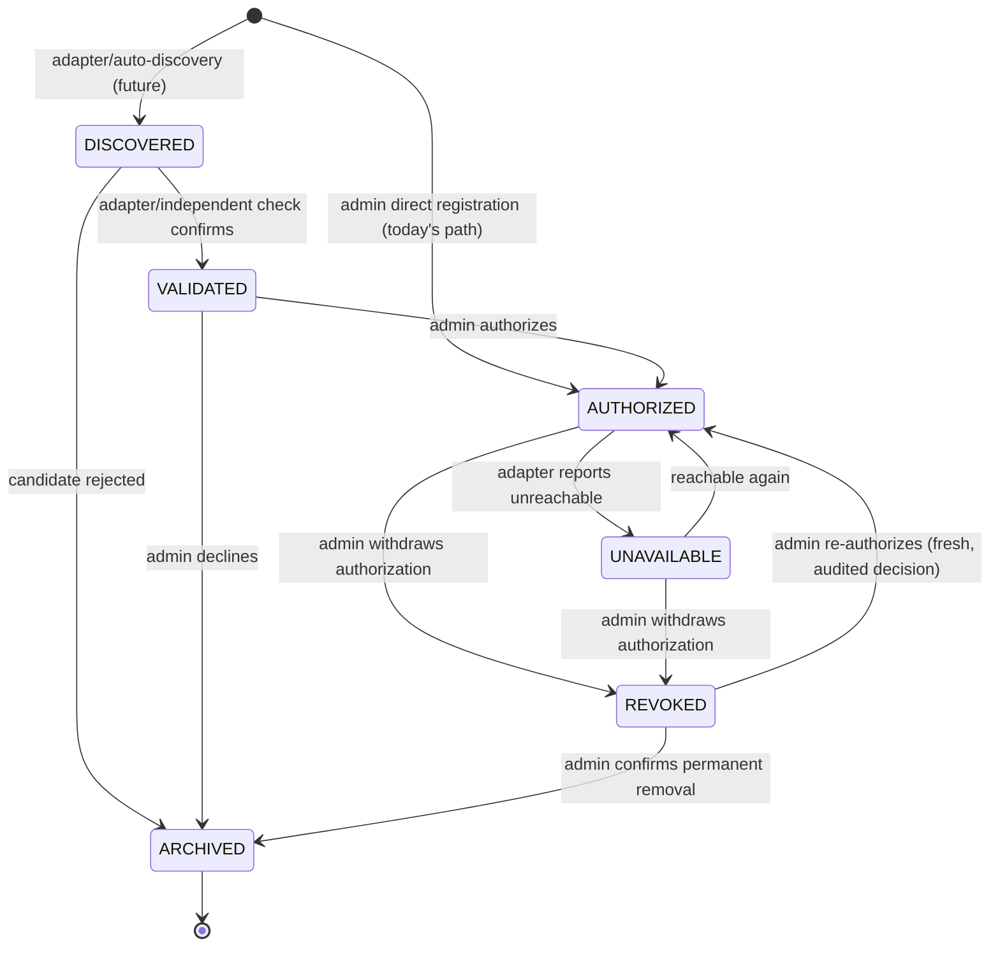
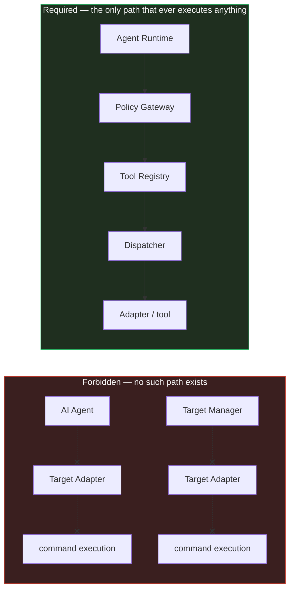
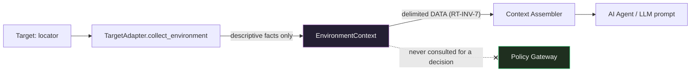
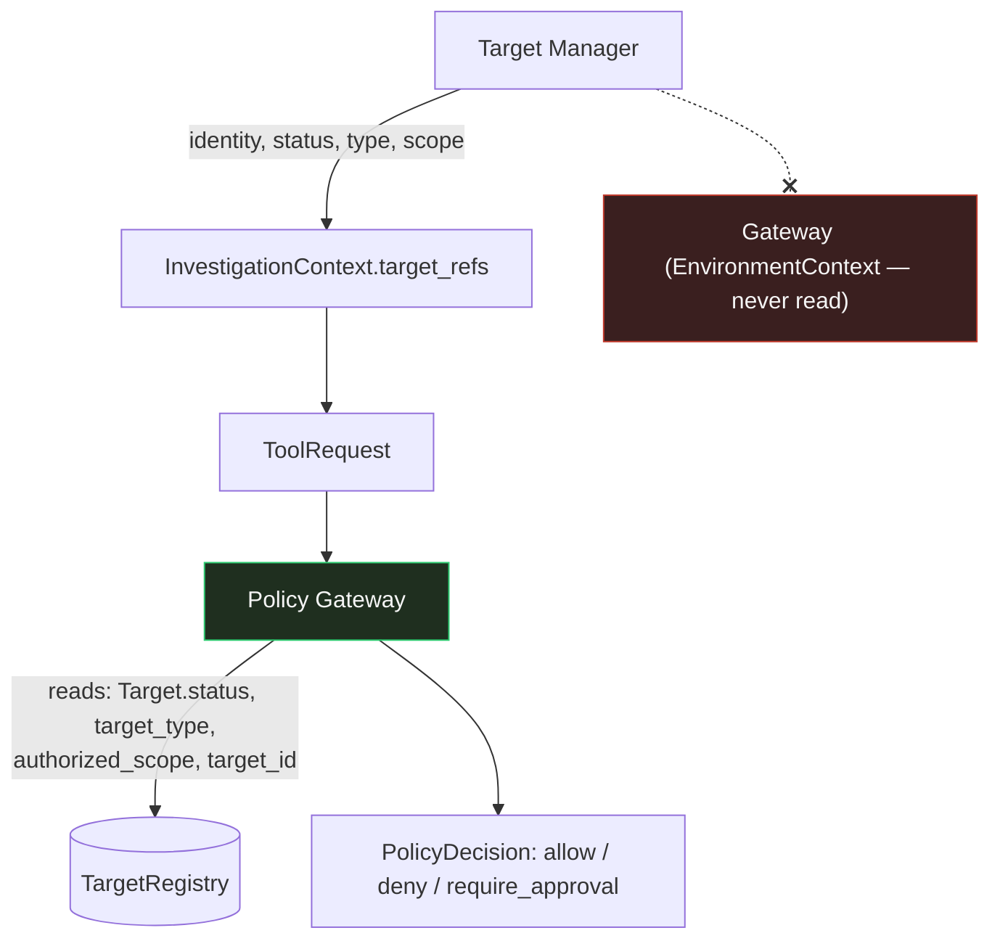
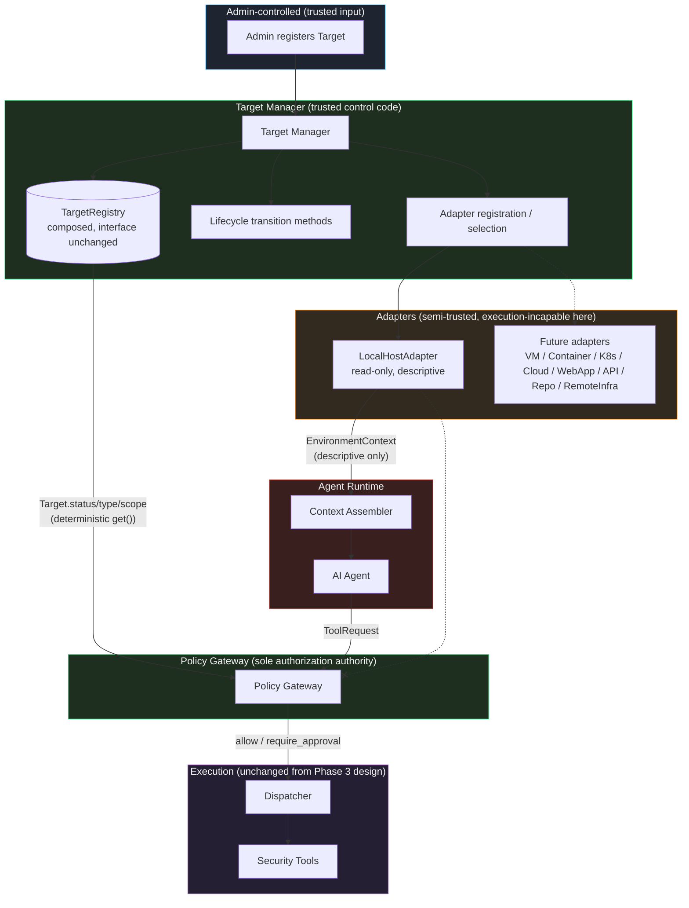

# Chanakya AI — Target Manager & Environment Intelligence Design (Phase 4)

This document is the Phase 4 design specification for the **Target
Manager** and **Target Adapters** defined in `ARCHITECTURE.md` §6–§7. It
builds on, and does not redesign, `ARCHITECTURE.md`, `docs/CONTRACTS.md`,
`docs/THREAT-MODEL.md`, `docs/AGENT-RUNTIME.md`, `docs/POLICY-GATEWAY.md`,
`docs/TOOL-REGISTRY.md`, and `docs/CAPABILITY-PERMISSION-MODEL.md`. It is
a peer document to `docs/POLICY-GATEWAY.md` and `docs/TOOL-REGISTRY.md` —
the Policy Gateway consumes target and environment information produced
here as a trusted-input, read-only dependency, exactly as it already
consumes the Security Tool Registry. No implementation code exists yet;
this is design only. *(v1.0.0: implemented in
`chanakya/targets/`; later sections carry per-phase status notes.)*

This document follows the Phase 4.1 repository inspection (reviewed and
approved) and does not redesign anything that inspection found already
correct: the `Target` contract remains metadata-only, `TargetRegistry`
remains a minimal lookup, `target_type` remains an open, registry-backed
string, and the Policy Gateway remains the sole authorization authority.
`TargetRegistry`'s current lack of dedicated tests is a Phase 4.4
implementation task, not a Phase 4.2 design concern.

## Design principle (non-negotiable)

> **Target Manager identifies and contextualizes. Agent Runtime
> orchestrates. Policy Gateway authorizes. Tool Registry defines
> capability. Dispatcher executes only what has been authorized.** The
> Target Manager holds no opinion of its own about whether an action
> against a target is permitted — that decision belongs entirely to the
> Policy Gateway, using target and environment data as one more input, the
> same way it already uses Security Tool Registry data, never as a second
> source of authority. Nothing this document introduces may produce, or
> be read by anything as if it had produced, an `allow` / `deny` /
> `require_approval` verdict.

This restates `ARCHITECTURE.md` §6/§17, `docs/THREAT-MODEL.md` SR-5,
SR-9, SR-16 as applied to a new component, and `docs/AGENT-RUNTIME.md`'s
own non-negotiable principle ("the Runtime executes; it never decides")
extended to Target Manager: **Target Manager identifies; it never
decides.**

---

## 1. Target Manager responsibilities

| Responsibility | Input | Output | Trust level | Security boundary |
|---|---|---|---|---|
| **Target registration** | An admin-constructed `Target` record (identity, type, locator, scope) | A registered `Target`, keyed by `target_id` | Trusted control code; caller is admin-only, same trust model as today's `TargetRegistry.register()` | TB-1 analogue — human/admin input, validated before acceptance |
| **Target lookup** | `target_id` | `Optional[Target]` — the current record, or `None` | Trusted control code | TB-8 analogue — read-only, deterministic |
| **Target normalization** | Raw registration input (identity, type, locator shape) | A `Target` conforming to the (additively extended, §4) contract shape | Trusted control code | Structural validation only, mirrors `Target.__post_init__` |
| **Investigation-scoped target management** | `InvestigationRequest.requested_targets` | Confirms every entry resolves to a registered `Target`; raises `UnknownTargetError` otherwise (unchanged from today's `InvestigationManager.create_investigation`) | Trusted control code | TB-1 — reused, unchanged, from `docs/AGENT-RUNTIME.md` §1 |
| **Target lifecycle management** | A transition request (e.g. `authorize`, `revoke`) + admin/system actor identity | Updated `Target.status`, per the state machine in §7 | Trusted control code; transitions requiring human judgment are human-triggered, mirroring `ApprovalDecision`'s trust anchor | Internal — enforces TM-INV-5 |
| **Adapter registration** | An admin-registered `TargetAdapter` implementation + the `target_type`(s) it serves | An internal adapter lookup table (`target_type -> TargetAdapter`) | Trusted control code; adapter code itself is semi-trusted (§9) | Admission-time review, mirrors Registry's `provenance`/`trust_level` posture (SR-23 analogue) |
| **Adapter selection** | `target_type` | The registered `TargetAdapter` for that type, or a typed "no adapter" error | Trusted control code | Internal — enforces TM-INV-6 |
| **Environment-context collection** | `Target` (incl. locator), the selected `TargetAdapter` | An `EnvironmentContext` (§11), or a recorded failure | Trusted control code; **consumes semi-trusted adapter output** | TB-6 inbound analogue — treated as untrusted descriptive data (TM-INV-8) |
| **Target metadata management** | Admin updates to `display_name`, `metadata`, `owner_contact` | An updated `Target` revision | Trusted control code, admin-only | Same trust model as registration |
| **Provenance handling** | Registration/discovery source, actor, timestamp | Populated `Target.provenance` / `EnvironmentContext.observations[].provenance` | Trusted control code; **records**, does not itself validate, trust | Internal — feeds TM-INV-8/§13 |
| **Target availability/status** | Adapter-reported reachability signal, or admin action | `Target.status` transition to/from `UNAVAILABLE` (§7) | Trusted control code | Internal — enforces TM-INV-1 (a status change is never a decision) |

None of these eleven responsibilities produces, consumes, or forwards a
`PolicyDecision`, an `ApprovalRequest`/`ApprovalDecision`, or a
`DispatchInstruction`. Target Manager's entire output surface is: `Target`
records (read/write, admin-gated), and `EnvironmentContext` records
(descriptive, adapter-sourced). Everything downstream of that — whether
either is *allowed to matter* for a given `ToolRequest` — remains the
Policy Gateway's job (§14).

---

## 2. Target Manager MUST NOT

| # | Prohibition | Structural mechanism | Invariant | Threats addressed |
|---|---|---|---|---|
| 1 | Make ALLOW/DENY/REQUIRE_APPROVAL decisions | No Target Manager method returns or constructs a `PolicyDecision`; the module has no import of `chanakya.policy` or `Verdict` | TM-INV-1 | T-15, T-19 |
| 2 | Approve actions | No `ApprovalRequest`/`ApprovalDecision`-producing code path exists anywhere in `chanakya.targets` | TM-INV-1 | T-16 |
| 3 | Execute arbitrary commands | No shell/subprocess/`eval`/`exec` call anywhere in `chanakya.targets`, including inside any adapter; adapters use only typed, read-only introspection APIs (§9, §10) | TM-INV-7 | T-11 |
| 4 | Bypass the Policy Gateway | Target Manager has no reference to the Dispatcher and no execution-capable call path; any execution-capable operation must be a Registry capability, Gateway-evaluated, Dispatcher-executed (§9) | TM-INV-3 | T-15 |
| 5 | Directly invoke unrestricted subprocess/shell execution | Same mechanism as #3 — no such call exists to invoke, restricted or otherwise | TM-INV-7 | T-11 |
| 6 | Contain LLM reasoning | Target Manager and every `TargetAdapter` import nothing LLM-related; environment facts reach the Agent only via the existing Context Assembler, which Target Manager has no reference to constructing prompts for | TM-INV-1, TM-INV-8 | T-02, T-06 |
| 7 | Contain security-tool execution logic | `TargetAdapter`'s only outputs are descriptive (`EnvironmentContext`) or lifecycle-input signals (§9); a "tool" in this system's terminology is exclusively a Registry-registered capability, and Target Manager registers no capabilities | TM-INV-3 | T-04, T-10 |
| 8 | Become an alternate authorization mechanism | `Target.status`/`authorized_scope`/`target_type` are the only fields the Gateway reads (§14); no other Target Manager output is Gateway-consulted, and nothing Target-Manager-produced can substitute for a `PolicyDecision` anywhere in the Runtime's dispatch precondition (`docs/AGENT-RUNTIME.md` RT-INV-1/RT-INV-2, unchanged) | TM-INV-2, TM-INV-5 | T-15, T-19 |
| 9 | Store raw credentials | No field on `Target`, `TargetLocator`, `EnvironmentContext`, or `TargetObservation` is a credential carrier (§4, §6, §11) — structural, mirroring `docs/CONTRACTS.md`'s existing "Sensitive data rules" | TM-INV-4 | T-20 |
| 10 | Silently expand authorized scope | `authorized_scope`/`target_type`/`status` change only via explicit, audited admin/system action (§7); no adapter output writes to any of these three fields | TM-INV-2, TM-INV-5 | T-08, T-15 |
| 11 | Convert discovered environment facts into authorization | `EnvironmentContext`/`TargetObservation` are never read by `PolicyGateway.evaluate()` — not filtered out afterward, never passed in the first place (mirrors `docs/POLICY-GATEWAY.md` §15 point 1's treatment of `ToolRequest.rationale`) | TM-INV-2, TM-INV-8 | T-03, T-12, T-04-analogue |

---

## 3. Target model

The existing `Target` contract (`docs/CONTRACTS.md` §6,
`chanakya/contracts/target.py`) is extended **additively** — every new
field is optional or has a safe, backward-compatible default; no existing
field's name, type, or meaning changes. This follows the exact pattern
`docs/AGENT-RUNTIME.md` used for `StepRecord`/`DispatchInstruction`: a
Phase-4-scoped extension, not an edit to `docs/CONTRACTS.md` §6 itself
(see §17, Contract impact).

| Proposed field | Add now? | Belongs in `Target`? | Why |
|---|---|---|---|
| `status` | **Yes** | Yes | Directly required by §7's lifecycle model, and the task's own ownership rule ("Target object: stores lifecycle state"). Optional at the type level with a default of `AUTHORIZED` for backward compatibility with every `Target` constructed the way `TargetRegistry.register()` already builds them today (a direct admin registration is, and remains, an implicit authorization act — see §7's transition table). No behavior change for existing callers who never set it. |
| `locator` | **Yes** | Yes | Identity is incomplete without "where" (§5); keeping it out of `metadata` closes the exact gap Phase 4.1 flagged ("`metadata` is free-form... should not be a place to stash connection details"). Optional — a target may exist with identity known but locator not yet resolved (e.g. a future `DISCOVERED`-state candidate). Structured, not free text (§6). |
| `provenance` | **Yes, lightweight** | Yes, but narrow | Needed for §13's trust model, but only to answer "how was *this Target record* created" (`user_declared` vs. `adapter_discovered`) — not to carry adapter-observed facts, which belong on `EnvironmentContext`/`TargetObservation` instead (§11), never duplicated onto `Target`. Optional, defaults to `source: user_declared` for existing records. |
| `last_verified_at` | **Yes** | Yes | Directly supports staleness detection (§12) and the `VALIDATED`/`UNAVAILABLE` lifecycle transitions (§7) — a genuinely new capability, not redundant with `registered_at` (which never changes after creation). Optional, absent until a validation/availability check actually occurs. |
| `confidence` | **No** | — | Rejected as a `Target`-level field. A single scalar confidence for an entire identity record conflates two different things: "how sure are we this record is legitimate" (already expressed by `status` — `DISCOVERED` vs. `VALIDATED` vs. `AUTHORIZED` *is* a confidence ladder) and "how sure are we about a specific observed fact" (which belongs on `TargetObservation`, §11, where it is actually actionable per-fact rather than a vague aggregate). Adding it to `Target` would create two competing confidence signals with no defined relationship. |
| `discovered_at` | **No, folded in** | — | Not added as a top-level field — redundant with, and better expressed inside, the lightweight `provenance` envelope above (`provenance.observed_at`). A separate top-level `discovered_at` alongside `registered_at` and `last_verified_at` would be a third, easily-confused timestamp for no added clarity. |

**Resulting additive shape** (new fields only; all seven original fields
are unchanged):

```
Target additions (Phase 4, additive):
  status: TargetStatus              # optional, default AUTHORIZED — see §7
  locator: Optional[TargetLocator]  # optional, default None — see §6
  provenance: TargetProvenance      # optional, default source=user_declared — see §13
  last_verified_at: Optional[str]   # optional, default None — see §12
```

**Security implications**: none of the four additions is a credential
carrier (TM-INV-4); `status` and `provenance` are exactly as
admin-gated as every existing `Target` field (no adapter writes them
directly — only Target Manager's controlled lifecycle-transition methods
do, per §7's ownership model); `locator` is documented as opaque and
never itself authorization-bearing (§6). All four are optional and
non-breaking — every `Target` constructible today (including every
existing test fixture, e.g. `tests/conftest.py`'s `local_host_target`)
remains valid with zero changes.

---

## 4. Target identity, location, and description

Three distinct concepts, deliberately not collapsed into one field or
one object:

- **Target identity** — `target_id` (stable, immutable, assigned once),
  `target_type` (open string), `display_name`, `authorized_scope`,
  `owner_contact`, `provenance` (§3). This is *who/what this target is
  and who is accountable for it*, and it does not change just because
  descriptive facts about the target change.
- **Target location** — `locator` (§6). This is *how to reach it*. A
  locator can change over time (a DHCP-leased IP, a rotated hostname, a
  moved repository URL) without the target's identity changing —
  `target_id` never moves with the locator.
- **Target description** — `metadata` (free-form, admin-authored,
  unchanged from today) plus, at investigation time, adapter-produced
  `EnvironmentContext`/`TargetObservation` (§11). This is *what we
  currently believe about it*, is explicitly time-sensitive and
  untrusted-until-consistent (§13), and — critically — is never
  authoritative for identity or authorization.

**No second Target-shaped object is introduced.** `EnvironmentContext`
and `TargetObservation` reference `target_id` by id only; neither
re-declares `target_type`, `authorized_scope`, `display_name`, or any
other identity field. This mirrors `docs/CONTRACTS.md` §2's existing
design discipline for `InvestigationContext` ("references other contracts
by id... never embeds large payloads").

---

## 5. Locator model

A structured, adapter-interpreted object is used instead of free-form
`metadata`, because (per Phase 4.1's finding) an open text field is both
an easy place to accidentally stash connection details and an
unstructured field the Gateway or a future policy rule cannot reason
about at all.

```
TargetLocator:
  locator_type: string   # open, adapter-interpreted — e.g. "local",
                          # "hostname", "ip_address", "url",
                          # "repository_uri", "cloud_resource_id",
                          # "kubernetes_context" — NOT a hard-coded enum,
                          # same open-string philosophy as target_type
  value: string           # opaque outside the matching adapter
```

**Hard rules:**
- A `TargetLocator` is meaningful only to the `TargetAdapter` registered
  for the owning `Target.target_type` (§9) — nothing else in the system
  (Gateway, Runtime, Agent) ever parses or interprets `value`.
- **A locator never itself grants authorization.** Knowing how to reach
  something is not permission to reach it — `authorized_scope`,
  `target_type` membership in a capability's `supported_target_types`,
  and Policy Gateway rules remain the *only* authorization surface,
  unchanged. This is the direct mitigation for SSRF-like target abuse
  (§16): even a maliciously crafted `locator.value` can only ever be
  interpreted by the one adapter registered for that specific
  `target_type`, within whatever narrower contract that adapter's own
  design imposes (§9's read-only/descriptive-only constraint for
  `LocalHostAdapter`, §10) — it can never cause a capability meant for
  one target type to reach an arbitrary attacker-chosen endpoint, because
  the locator is never consulted anywhere execution-capable outside that
  one adapter boundary.
- `value` must never itself be, or embed, a credential (TM-INV-4) — a
  locator identifies a reachable address/resource, not a means of
  authenticating to it.
- Optional at the `Target` level (§3) — a target may exist with no
  locator yet (identity known, location not yet resolved).

---

## 6. Target lifecycle

**Chosen states** (six of the seven candidates — `ACTIVE` is deliberately
**not** adopted as stored state; see below):

`DISCOVERED`, `VALIDATED`, `AUTHORIZED`, `UNAVAILABLE`, `REVOKED`,
`ARCHIVED`.

**Why `ACTIVE` is excluded**: "currently in use by a running
investigation" is a fact about *investigations*, not about the target
record — `InvestigationContext.target_refs` already answers "which
targets is this investigation using" (unchanged, §1/§17), and a target
can legitimately be referenced by several investigations, or none, at
once. Storing a derived, query-time fact as mutable `Target` state would
create a second source of truth that must be kept in sync with every
`InvestigationContext` in existence — exactly the kind of duplication
`docs/CONTRACTS.md` §2 and `docs/AGENT-RUNTIME.md` §2 already forbid for
`InvestigationContext` itself, applied here in the opposite direction.
"Is this target currently referenced by a running investigation" remains
a derived query over existing `InvestigationContext` records, never a
`Target` field.

**Transitions:**

| From | To | Trigger | Actor |
|---|---|---|---|
| *(none)* | `DISCOVERED` | Adapter/auto-discovery proposes a candidate target | System (adapter, future phase — not used by the admin-declaration path) |
| *(none)* | `AUTHORIZED` | Direct admin registration (today's `TargetRegistry.register()` path) | Admin — the human judgment `DISCOVERED → VALIDATED → AUTHORIZED` would otherwise require is already satisfied by a human directly constructing and registering the record |
| `DISCOVERED` | `VALIDATED` | An adapter or independent check confirms the target is real, reachable, and internally consistent | System (adapter) |
| `DISCOVERED` | `ARCHIVED` | Discovery candidate rejected or abandoned | Admin |
| `VALIDATED` | `AUTHORIZED` | Admin explicitly authorizes a validated target for use | Admin — human decision, never automatic, mirrors `ApprovalDecision`'s role |
| `VALIDATED` | `ARCHIVED` | Admin declines to authorize a validated candidate | Admin |
| `AUTHORIZED` | `UNAVAILABLE` | Adapter/connectivity signal indicates the target is currently unreachable | System (adapter) |
| `UNAVAILABLE` | `AUTHORIZED` | Target becomes reachable again | System (adapter) or admin confirmation |
| `AUTHORIZED` | `REVOKED` | Admin withdraws authorization | Admin |
| `UNAVAILABLE` | `REVOKED` | Admin withdraws authorization while unavailable | Admin |
| `REVOKED` | `AUTHORIZED` | Admin explicitly re-authorizes | Admin — a **separate, freshly-audited** decision, never an automatic bounce-back (distinct from the `UNAVAILABLE ⇄ AUTHORIZED` oscillation, which is connectivity-driven, not a trust decision) |
| `REVOKED` | `ARCHIVED` | Admin confirms permanent removal | Admin |

**Explicitly invalid transitions** (rejected, mirroring
`InvestigationContext.transition_status`'s
`InvalidInvestigationTransitionError` pattern):

- `DISCOVERED → AUTHORIZED` directly — an unvalidated discovery candidate
  can never become usable without passing through `VALIDATED` first; this
  is the structural rule that prevents a compromised or malfunctioning
  adapter from single-handedly authorizing a target it merely *proposed*
  (TM-INV-5).
- Any state `→ DISCOVERED` — discovery is only ever an entry state.
- `ARCHIVED → *` — terminal, no outbound transition, mirrors
  `RETIRED` in the Security Tool Registry's own lifecycle.

**Terminal state**: `ARCHIVED` only. `REVOKED` is not terminal but, like
`QUARANTINED` in the Tool Registry's lifecycle, can only be exited by an
explicit, separately-audited admin action — never an automatic recovery.

**Ownership** (per the task's required model, confirmed unchanged):

- **`Target`** stores `status` (§3) — the single source of truth other
  components read.
- **Target Manager** performs transitions, via controlled mutation
  methods that enforce the table above — mirrors
  `InvestigationContext.transition_status` being enforced by the object
  but driven by `InvestigationManager`.
- **Policy Gateway** reads `status` only, as one more scope-check
  condition (§14) — it never calls a transition method, never holds an
  opinion about which state a target *should* be in.
- **`InvestigationContext`** continues to reference targets only by
  `target_id` in `target_refs` (unchanged) — it never duplicates or
  caches `status`.



---

## 7. TargetRegistry vs. Target Manager

Target Manager **composes** `TargetRegistry` — it does not wrap it
thinly, extend it by subclassing, or replace it.

**Why composition, and why not the alternatives:**

- **Not replacement.** `PolicyGateway.__init__(registry, target_registry,
  policy_set, ...)` (`chanakya/policy/gateway.py`) already depends
  directly on `TargetRegistry` as a constructor argument, and its `.get()`
  call is the Gateway's sole, deterministic target lookup path (Phase 4.1
  §4). Replacing `TargetRegistry` outright — or making the Gateway depend
  on a heavier `TargetManager` instead — would force a change to
  `gateway.py`'s constructor signature now, entangle the Gateway with
  lifecycle/adapter machinery it has no business touching, and widen its
  trusted dependency surface for no authorization-relevant benefit.
- **Not subclassing/thin wrapping.** `TargetManager` needs
  responsibilities (§1) `TargetRegistry` was never designed to hold —
  lifecycle transitions, adapter registration/selection, environment
  collection. Bolting those onto `TargetRegistry` itself (by extension)
  would make the Gateway's one trusted dependency also carry
  adapter-execution-adjacent surface area, which is exactly the kind of
  scope creep §2's MUST-NOT table exists to prevent.
- **Composition** keeps `TargetRegistry`'s interface and role **exactly
  as they are today** — the Gateway's dependency, unchanged, continues to
  resolve `target_id → Target` deterministically, with zero changes to
  `gateway.py`'s constructor or call pattern through Phase 4.4 and 4.5.
  `TargetManager` owns a `TargetRegistry` instance internally and adds
  lifecycle/adapter/environment responsibilities on top of it, without
  the Gateway ever needing to know `TargetManager` exists.

**One additive change to `TargetRegistry` itself, required by §3/§7 and
scoped to Phase 4.4:** since `Target` is (and remains) a frozen
dataclass, a lifecycle transition cannot mutate a `Target` in place. The
established pattern elsewhere in this codebase for "a change requires a
new record, not an in-place mutation" is `PolicyDecision`'s and
`Evidence`'s immutability (`docs/CONTRACTS.md` §5, §7: "a changed mind
requires a new... record"). `TargetRegistry` should gain one narrow
method — a controlled *replace-by-id* operation used exclusively by
`TargetManager`'s lifecycle-transition methods, never called directly by
the Gateway or anything else — that swaps the current `Target` revision
for `target_id` with a new, otherwise-identical frozen `Target` carrying
the updated `status`/`last_verified_at`. `TargetRegistry.get()` keeps
returning the current revision with **no change to its return type or
call signature** — the Gateway sees the update automatically, the next
time it calls `.get()`, with no new dependency and no widened contract.
This is the one and only place `TargetRegistry`'s public surface grows in
this design, and it grows by exactly one admin/system-facing method, not
by anything Gateway-facing.

This satisfies the task's explicit constraint: **the Gateway's
deterministic target lookup path is not destroyed, and there is no reason
found in this analysis that would justify destroying it.**

---

## 8. Target Adapter model

`TargetAdapter` is a conceptual protocol/interface — no implementation
code is written in this phase, exactly mirroring how `docs/AGENT-RUNTIME.md`
§7 defined `DispatchInstruction`/`ToolExecutor` as a stable interface
before any Tool Layer existed to implement it.

```
TargetAdapter (protocol, conceptual):
  supported_target_types: Sequence[str]   # which target_type(s) this
                                            # adapter serves

  discover(config) -> DiscoveryResult      # future: proposes DISCOVERED
                                            # candidates (not used by
                                            # Phase 4.4's admin-declared
                                            # path)

  validate(target: Target) -> ValidationResult
                                            # confirms reachability/
                                            # consistency — feeds
                                            # DISCOVERED -> VALIDATED

  check_availability(target: Target) -> AvailabilityResult
                                            # feeds AUTHORIZED <-> UNAVAILABLE

  collect_environment(target: Target) -> EnvironmentContext
                                            # descriptive facts only — §11
```

**Inputs**: the `Target` record (including its `locator`), adapter-specific
configuration (trusted, admin-set — analogous to
`RuntimeExecutionLimits`), and — for a future phase, never this one — a
*secret reference* resolved by Configuration & Secrets Management, never
a raw secret passed through Target Manager (TM-INV-4; mirrors
`ARCHITECTURE.md` §15's existing rule that credentials are resolved only
inside the component that needs them at the moment of use).

**Outputs**: normalized `EnvironmentContext`/`TargetObservation`
(descriptive facts, §11); a discovery/validation result (feeding the
lifecycle transitions in §7); an availability signal (feeding
`AUTHORIZED ⇄ UNAVAILABLE`); and, **only in a future execution
architecture phase, never designed here**, a controlled access handle for
the Tool Layer to use — which is not an execution capability in itself,
only a resolved connection context a capability implementation might
need.

**Trust level**: semi-trusted, execution-**incapable** at the Target
Manager boundary. An adapter can propose facts and signals; it cannot
authorize anything, and — per the hard rule below — it cannot execute
anything on Target Manager's behalf either.

**Hard rule: a `TargetAdapter` MUST NOT create an independent execution
path.** If an adapter's target type ever needs an execution-capable
operation (beyond descriptive discovery), that operation must be
represented as a Registry-registered capability and dispatched through
the existing, unchanged pipeline:

```
Agent Runtime → Policy Gateway → Tool Registry → Dispatcher → Adapter/tool
```

At that point, the adapter is simply what the Dispatcher's
`ToolExecutor.execute(instruction: DispatchInstruction) -> ToolResult`
(`chanakya/runtime/dispatch.py`, unchanged) happens to delegate to for
target-specific mechanics — Target Manager has no relationship to that
call at all except that the *same* adapter code may, in a future Tool
Layer phase, be reused on both sides of a boundary it never itself
controls.

**Explicitly forbidden paths** (both structurally impossible today,
by construction — Target Manager and the Agent have no reference to
either the Dispatcher or any adapter's execution surface):

```
Agent → Adapter → command execution                    ✗ FORBIDDEN
Target Manager → Adapter → command execution            ✗ FORBIDDEN
```

**Required path for any execution-capable operation:**

```
Agent Runtime → Policy Gateway → Tool Registry → Dispatcher → Adapter/tool   ✓ REQUIRED
```



**Error behavior**: an adapter failure is captured the same shape as a
`ToolResult` failure (`docs/ARCHITECTURE.md` §16) — never silently
swallowed, never treated as "the target doesn't exist," never
auto-retried into a fabricated success (§19).

**Interaction with the Policy Gateway**: strictly one-directional.
Adapters feed descriptive facts *toward* the Gateway, via Target
Manager and the Context Assembler (§14) — they never receive a
`PolicyDecision`, never see a `ToolRequest`, and never interpret an
authorization outcome. An adapter that somehow needed to know "was this
allowed" would be a design defect, not a feature.

---

## 9. First adapter — `LocalHostAdapter`

Read-only, descriptive, non-destructive — the only adapter designed in
this phase, matching `ARCHITECTURE.md` §7's own Phase-1 scope.

**Permitted information** (all coarse, non-sensitive, sizing/identity
facts — never a scan, never a probe of anything beyond the local
machine's own reported characteristics):

- Operating system name and version
- Hostname
- Architecture (e.g. CPU architecture string)
- Network interface list — addresses only, never traffic capture or
  active probing
- Virtualization/container indicator — a coarse boolean-shaped signal
  from environment markers (e.g. "running inside a container: true/false"),
  not deep inspection of the hypervisor/runtime
- Basic environment characteristics — e.g. CPU count, total memory —
  coarse sizing facts only

**Explicitly out of scope for `LocalHostAdapter`, in this or any near
phase:**

- No scanning of other hosts (that is an investigation-time Registry
  capability like `list_listening_ports`, gated by the Gateway — not
  Target Manager's job)
- No arbitrary shell commands
- No privilege escalation
- No remote execution
- No process enumeration or credential discovery (existing/future
  Registry capabilities, not descriptive target intelligence)

`LocalHostAdapter`'s output feeds `EnvironmentContext` **only** — never
`Evidence` directly. `Evidence` remains exclusively a Runtime/Dispatcher
artifact produced from an actually-executed, Gateway-approved
`ToolRequest` (`docs/CONTRACTS.md` §7, unchanged). A `LocalHostAdapter`
discovery run is not an investigation step, carries no `tool_request_id`,
and is never confused with one.

**Future adapters — extension points only, none designed here** (named
in `ARCHITECTURE.md` §7, unchanged): `VMAdapter`, `ContainerAdapter`,
`KubernetesAdapter`, `CloudAdapter` (per-provider), `WebAppAdapter`,
`APIAdapter`, `RepoAdapter`, `RemoteInfraAdapter`. Each remains future
work per Phase 4.1 §9's "avoid overengineering" guidance — no target type
beyond `local_host` gains a real adapter in this document.

---

## 10. Environment context

A new object, distinct from `Target`, following the same "these are not
additions to `docs/CONTRACTS.md`'s 13 core contracts" pattern
`docs/POLICY-GATEWAY.md` used for `PolicyRule`/`PolicySet` and
`docs/TOOL-REGISTRY.md` used for `RegistryEntry`.

```
TargetObservation (the atomic unit — one discrete fact):
  key: string              # e.g. "os", "hostname", "container_indicator"
  value: Any                # the observed value
  confidence: Optional[enum(low, medium, high)]   # per-fact, optional
  notes: Optional[string]

EnvironmentContext (the aggregate — one collection run):
  environment_context_id: string (uuid)
  contract_version: string (semver)
  target_id: string                         # reference only, §4
  collected_by: string                      # adapter identifier
  collected_at: string (timestamp)
  observations: List[TargetObservation]
  source: enum(user_declared, local_adapter, cloud_api, kubernetes_api,
               repository_source, tool_result)    # §13
  overall_confidence: Optional[enum(low, medium, high)]   # derived, optional
```

**`Target` = stable identity/authorization descriptor.
`EnvironmentContext` = time-sensitive descriptive observations.** The
distinction is load-bearing, not stylistic: `Target` changes rarely and
under admin control; `EnvironmentContext` is expected to change every
time it is collected, and its content is adapter-sourced, not
admin-authored.

**`EnvironmentContext` must NOT become an authorization object.** It has
no `verdict`, no `scope`, no field resembling one, and — critically — it
is never read by `PolicyGateway.evaluate()` (§14). It is Agent-context and
human-display data only, flowing through the *same* delimited-data
discipline the Context Assembler already enforces for `Evidence`
(`docs/AGENT-RUNTIME.md` RT-INV-7) — this is an explicit new application
of an existing invariant, not a new mechanism.



---

## 11. Freshness

Resolving Phase 4.1's open question: **fetch per investigation; do not
persist beyond the investigation's own state; no dedicated caching layer
in this phase.**

This mirrors how the Runtime already treats `Evidence` — collected once,
tied to a step, never silently reused across investigations — rather than
introducing a new persistent cache with its own invalidation problem.
Concretely:

- `EnvironmentContext` is collected at most once per investigation (or
  on-demand per Agent turn), and is referenced from that investigation's
  own state only — an additive, optional `environment_context_refs`-style
  reference, the same id-only-reference pattern `InvestigationContext`
  already uses for `evidence_refs` (§17).
- Freshness is **investigation-scoped**: an `EnvironmentContext` record
  is only ever "fresh" relative to the investigation that requested it. A
  new investigation against the same target always re-collects rather
  than trusting a prior investigation's snapshot — environment
  intelligence exists to reflect *current*, not historical, state.
- **No cross-investigation cache, no TTL machinery, no invalidation logic
  is designed or needed in this phase.** "Always re-collect, never trust
  stale data across a decision boundary" trivially satisfies TM-INV-2/
  TM-INV-8, because stale data is never held across anything the Gateway
  touches in the first place.
- A longer-lived, Target-level cache (e.g. "we already know this host's
  OS from last week") would need real staleness/invalidation design and
  is explicitly deferred, non-blocking, until an actual performance or UX
  need demands it — per the task's "do not build persistence prematurely"
  instruction.
- `Target.last_verified_at` (§3) is updated **only** by an
  adapter-driven lifecycle check (`DISCOVERED → VALIDATED`, or an
  `UNAVAILABLE → AUTHORIZED` recovery check) — a coarse, infrequent
  lifecycle timestamp, entirely distinct from, and much less frequent
  than, per-investigation `EnvironmentContext` collection.

---

## 12. Provenance / trust

Every source except direct admin declaration of the `Target` record
itself is treated as **untrusted descriptive data until independently
validated** — this extends `docs/ARCHITECTURE.md` §18's existing
treatment of tool/target output to Target Manager's own discovered
information, since it is exactly the same trust category.

```
TargetProvenance (lightweight, on Target itself — §3):
  source: enum(user_declared, adapter_discovered)
  registered_by: string          # admin identity, or "system" for adapter-discovered
  observed_at: string (timestamp)

TargetObservation/EnvironmentContext provenance (§11):
  source: enum(user_declared, local_adapter, cloud_api, kubernetes_api,
               repository_source, tool_result)
  observed_at: string (timestamp)
  confidence: enum(low, medium, high)      # reuses the same three-value
                                             # pattern already established
                                             # for Finding.confidence /
                                             # RiskAssessment.confidence
  verified: bool                            # has an independent check
                                             # confirmed this fact
```

**The critical rule**: even a `Target` whose *record* was `user_declared`
(and is therefore `AUTHORIZED` by direct admin action, §7) has
*subsequently adapter-collected* `EnvironmentContext` that remains
adapter-sourced, and therefore still untrusted-until-consistent — a
trusted target record does not retroactively make everything an adapter
later reports about it trustworthy. This closes the exact loophole named
in Phase 4.1 §14 (discovered facts must never auto-populate or
auto-expand authorization) and directly addresses the Threat Model
traceability item on indirect prompt injection via environment metadata
(§16).

---

## 13. Policy Gateway integration

```
Target Manager
      ↓
Target information (identity, status, type, scope — never EnvironmentContext)
      ↓
Investigation Context (target_refs, unchanged)
      ↓
ToolRequest
      ↓
Policy Gateway
      ↓
target scope evaluation (unchanged three checks, plus one additive status check)
```

The Gateway remains responsible, unchanged, for: target registration
validity (via `TargetRegistry.get()`, still the same deterministic call,
§8), authorized target membership (`EvaluationContext.authorized_target_refs`,
unchanged), supported target types (`entry.supported_target_types`,
unchanged), authorization decisions, and policy rules. **Target Manager
duplicates none of this** — it has no method named or shaped like
`evaluate`/`decide`/`authorize`, and no `PolicyDecision`-producing code
path exists anywhere in `chanakya.targets`.

**What the Gateway may additionally, safely READ, without delegating any
authority:**

- `Target.status` — one more condition added to the existing three-way
  `AND` in `_evaluate()`'s step 4 (Phase 4.1 §4): `status == AUTHORIZED`,
  else deny with the same `out-of-scope-target` reason already used for
  an unregistered target. This is a **read**, not a delegation — the
  Gateway still makes the actual decision; it is simply now checking one
  more fact about the same `Target` record it already looks up.
- Optionally, in a later phase, `Target.locator.locator_type` — e.g. a
  future policy rule scoping by locator type ("deny anything with
  `locator_type: url` unless explicitly allowlisted"). Not built now;
  the field exists to support it later without a contract change.

**What the Gateway must never read for a decision**: `EnvironmentContext`
or any `TargetObservation` content, ever. This is the hard line drawn in
this design: descriptive facts about a target's *environment* are for the
Agent and the human, never for the Gateway's verdict logic. Only the
`Target` record's own identity/authorization fields are Gateway-readable.



---

## 14. Security invariants (TM-INV)

| # | Invariant | Structural mechanism | Threats addressed |
|---|---|---|---|
| TM-INV-1 | Target Manager never produces ALLOW/DENY/REQUIRE_APPROVAL. | No Target Manager method returns/constructs a `PolicyDecision`; `chanakya.targets` has no import of `chanakya.policy` or `Verdict`. | T-15, T-19 |
| TM-INV-2 | Environment observations cannot expand authorized scope. | `EnvironmentContext`/`TargetObservation` are never inputs to `PolicyGateway.evaluate()` — not filtered afterward, never received in the first place. | T-03, T-12, T-08 |
| TM-INV-3 | Target adapters cannot bypass Policy Gateway. | An adapter's outputs are descriptive/lifecycle-input only; any execution-capable operation is a Registry capability, dispatched only through the existing Dispatcher (§9). | T-15, T-11 |
| TM-INV-4 | Credentials never exist inside `Target` or `EnvironmentContext`. | No field on `Target`, `TargetLocator`, `EnvironmentContext`, or `TargetObservation` is a credential carrier — same structural rule as `docs/CONTRACTS.md`'s existing sensitive-data table, extended verbatim. | T-20 |
| TM-INV-5 | A target lifecycle change cannot silently authorize a tool request. | Lifecycle transitions are Target-Manager-only and audited (§7); the Gateway re-checks `status` on every single `ToolRequest` evaluation — never caches a prior result — so a transition only ever takes effect at the *next* evaluation, never retroactively. | T-15, T-19 |
| TM-INV-6 | Unknown target types cannot automatically gain execution capability. | `RegistryEntry.supported_target_types` remains the sole source of which target types a capability may run against (unchanged); a new `target_type` existing in Target Manager grants nothing until an admin updates some `RegistryEntry` to list it — mirrors REG-INV-1, applied to target types. | T-04-analogue, T-11 |
| TM-INV-7 | Target Manager cannot execute arbitrary shell/subprocess commands. | No shell/subprocess/`eval`/`exec` call anywhere in `chanakya.targets`, including `LocalHostAdapter`, which uses only read-only OS/platform introspection APIs. | T-11 |
| TM-INV-8 | Environment observations are treated as untrusted descriptive data. | `EnvironmentContext` reaches an LLM prompt only through the Context Assembler's existing delimited-data enforcement point (RT-INV-7) — no new prompt-construction path is introduced. | T-03, T-12 |
| TM-INV-9 | Target identity remains stable independently of changing observations. | `target_id` is immutable once assigned (unchanged); `EnvironmentContext`/`TargetObservation` reference `target_id` but never redefine it; lifecycle/locator/metadata changes replace fields via a new `Target` revision (§7), never reassign `target_id`. | Target substitution / ID confusion (candidate T-28/T-30, §16) |
| TM-INV-10 | `InvestigationContext` references targets by ID and does not duplicate mutable lifecycle state. | Unchanged `target_refs: Tuple[str, ...]` design; any future environment-context reference is likewise id-only (§11, §17). | Stale-data threats, audit consistency |
| TM-INV-11 | Introducing Target Manager never removes or alters the Policy Gateway's existing deterministic `TargetRegistry.get(target_id) -> Optional[Target]` lookup contract. | Target Manager composes `TargetRegistry` rather than replacing it (§8); the Gateway's constructor dependency and call pattern require zero changes through 4.4/4.5, and exactly one additive read (`target.status`) at 4.8. | T-15 (an altered/bypassable lookup path is itself a policy-bypass vector), availability regression |

All eleven are justified by a concrete mechanism and at least one traced
threat; none is speculative. TM-INV-11 is the one addition beyond the
task's proposed ten, justified by §8's compatibility analysis.

---

## 15. Threat model traceability

Mapping Phase 4 design to `docs/THREAT-MODEL.md`'s existing register,
without modifying that document:

| Concern | Existing threat-model anchor | How this design addresses it |
|---|---|---|
| Target impersonation / substitution | New concern; closest existing analogue T-04 (misleading self-description) | TM-INV-9: `target_id` stability + `provenance` (§13) make a substituted target detectable, not merely assumed away |
| Scope confusion | T-01, T-08 (cumulative/framing risk) | `authorized_scope` non-wildcard validation (unchanged, `Target.__post_init__`) plus the `status`/`target_type` triple-check (§14) — a locator alone can never widen reach beyond what these three already bound |
| Malicious target metadata | T-03/T-12 (indirect injection via tool/target output) | TM-INV-2/TM-INV-8: `EnvironmentContext` is delimited data at the Context Assembler, never Gateway input |
| Remote target abuse / SSRF-like redirection | T-26 (remote target risks — already flagged "not yet applicable, design prerequisite") | §6: locator is adapter-interpreted only, never itself authorization-bearing; no non-`local_host` adapter exists in this phase, so this risk stays gated exactly where T-26 already placed it |
| Adapter compromise | T-05/T-14 analogue (malicious MCP server / compromised tool) | §8's hard execution boundary (adapters cannot create an independent execution path) bounds blast radius the same way REG-INV-1/REG-INV-2 bound a compromised MCP server's self-description |
| Credential leakage | T-20 | TM-INV-4, structural, verbatim extension of `docs/CONTRACTS.md`'s existing rule |
| Stale target information | New concern | §7 (`UNAVAILABLE`/`REVOKED` states) + §11 (`last_verified_at`) + §12 (freshness model) together mean staleness is representable and checkable, not silently assumed away |
| Indirect prompt injection through environment metadata | T-03/T-12, extended | Same mechanism as malicious target metadata, above |
| Target ID collisions/confusion | New concern | TM-INV-9; `TargetRegistry.register()`'s existing duplicate-`target_id` rejection (unchanged) |
| Unauthorized target registration | T-15/T-19 analogue | Registration remains admin-only, unchanged; `AUTHORIZED` status requires either direct admin action or an explicit `VALIDATED → AUTHORIZED` admin decision (§7) — never automatic |

*(v1.0.0: T-28 to T-31 are adopted, with these definitions, into
`docs/THREAT-MODEL.md` §8, "Consolidated threat register (v1.0.0)".)*

**Candidate new Threat Model entries** (not written into
`docs/THREAT-MODEL.md` in this step — flagged for a future revision,
following the same non-blocking pattern every prior design document in
this project has used):

- **T-28 — Target impersonation/substitution**: a `target_id` resolving
  to materially different underlying infrastructure across time.
- **T-29 — Scope confusion via locator-based reach**: a locator crafted
  or misconfigured to reach beyond what `authorized_scope`/`target_type`
  intended, once any non-`local_host` adapter exists.
- **T-30 — Stale/unrevoked target information**: a target that should
  have transitioned to `UNAVAILABLE`/`REVOKED` continuing to be treated
  as `AUTHORIZED` due to a missed or delayed lifecycle update.
- **T-31 — Adapter compromise / SSRF-like target redirection**: a
  compromised or malicious adapter implementation attempting to reach an
  endpoint other than the one its `Target`/`locator` legitimately
  describes.

---

## 16. Contract impact

**Reused, unchanged**: `InvestigationRequest`, `InvestigationContext`
(gains only an optional, additive reference in a later revision — not
changed now), `ToolRequest`, `PolicyDecision`, `AuditEvent`. None require
modification for this design.

**Additively extended (Phase-4-scoped, not a `docs/CONTRACTS.md` §6
edit)**: `Target` — `status`, `locator`, `provenance`,
`last_verified_at` (§3). Following the same convention
`docs/AGENT-RUNTIME.md` used for `StepRecord`/`DispatchInstruction`: this
document defines the extended shape; folding it into `docs/CONTRACTS.md`
§6 formally is additive, non-breaking, future work.

**New, Phase-4-scoped** (not among `docs/CONTRACTS.md`'s 13 core
contracts — same status as `PolicyRule`/`RegistryEntry`/
`RuntimeExecutionLimits`):

| Contract | Purpose | Owner | Trust level | Lifecycle |
|---|---|---|---|---|
| `TargetLocator` | Structured, adapter-interpreted "how to reach this target" (§6) | Admin (registration) / adapter (future discovery) | Trusted input, opaque outside its adapter | Embedded sub-shape within `Target`, not independently versioned |
| `EnvironmentContext` | Aggregate, time-sensitive descriptive observations from one adapter collection run (§11) | Target Manager / `TargetAdapter` | Untrusted-until-consistent, descriptive only (§13) | Ephemeral, investigation-scoped (§12) — never persisted independently |
| `TargetObservation` | One discrete fact within an `EnvironmentContext` (§11) | `TargetAdapter` | Same as `EnvironmentContext` | Sub-shape within `EnvironmentContext` |
| `TargetAdapter` | Protocol/interface a future adapter implements against (§8) | Admin-registered implementation | Semi-trusted, execution-incapable at the Target Manager boundary | Not a data contract — a stable interface, mirroring `ToolExecutor` |

**No duplicate representation of `Target` is introduced.**
`EnvironmentContext`/`TargetObservation` reference `target_id` only, and
`TargetLocator` is embedded within `Target`, not a freestanding record.

---

## 17. Audit

Following the exact resolution `docs/TOOL-REGISTRY.md` §7 already applied
to Registry admission/lifecycle events: `docs/CONTRACTS.md` §13's
`AuditEvent.event_type` enum has no target-specific values today, and
this document does not invent an ad hoc string for it (per
`docs/CONTRACTS.md` §13's own explicit rule). Target registration and
lifecycle transitions are **admin/config-time events**, tracked the same
way as Registry admission — via a separate, versioned administrative log
— until a future `contract_version` bump adds dedicated `event_type`
values.

**Events that would need coverage, whenever the enum is next revisited**
(administrative log today, candidate `AuditEvent` values later):

- `target_registered`
- `target_validated`
- `target_lifecycle_transitioned` (from/to status, actor, reason)
- `adapter_selected`
- `environment_discovery_started`
- `environment_discovery_completed`
- `environment_discovery_failed`
- `target_revoked`

**Explicitly not audited**: routine `target_lookup` reads. A lookup is
not a security-relevant transition — it is exactly as unaudited today as
the Gateway's own internal Registry reads, and auditing every read would
add volume without adding signal (the task's own "do not add unnecessary
audit events" instruction).

**Investigation-time events** (`environment_discovery_*`) that occur
*during* a running investigation are the closest fit to the existing
`AuditEvent` infrastructure — a discovery **failure** can reasonably reuse
today's `event_type: "error"` (the same semantic match the Runtime
already uses for its own internal failures), but there is no clean
existing-enum fit for "discovery started/succeeded" either. Rather than
force one now, this is flagged as the same kind of non-blocking,
future-`CONTRACTS.md`-revision "Open item" the other two design documents
already carry (§ Open items, below) — consistent with keeping this
document from inventing enum values `docs/CONTRACTS.md` §13 explicitly
forbids.

---

## 18. Error handling

| Error class | Behavior | Rationale |
|---|---|---|
| Unknown target | `TargetRegistry.get()` returns `None`; Gateway's existing `out-of-scope-target` deny path fires, unchanged | No new error path needed — already fail-closed |
| Unknown target type | No `TargetAdapter` registered for `target_type`; Target Manager raises a typed error at adapter-selection time, never silently substitutes "any adapter will do" | Gateway-side, this still denies independently via `supported_target_types` mismatch (unchanged) regardless of adapter existence — descriptive intelligence and authorization never share a failure path |
| No adapter | Environment discovery unavailable for this target; the `Target` record and Gateway-side authorization continue to function on identity/scope data alone | A missing adapter is a descriptive gap, never an authorization gap — a target with no adapter can still be `AUTHORIZED` and used for any Registry capability whose `supported_target_types` includes it |
| Adapter failure | Treated as a failure-shaped result, mirroring `ToolResult(status=failure)`; recorded as a failed collection attempt, never fabricated success | Fail-closed on *information*, not on authorization — the correct outcome is "no fresh environment data available," never "therefore deny/allow everything" |
| Stale target / unavailable target | Lifecycle `status: UNAVAILABLE` (§7); Gateway reads `status` and can deny (or, via a future policy rule, `require_approval`) — never silently treated as `AUTHORIZED` | TM-INV-5 |
| Malformed locator | Rejected at `Target` construction/registration time, mirroring `Target.__post_init__`'s existing `authorized_scope` validation | A target with an invalid locator for its declared `target_type` is never registered in a broken state |
| Invalid lifecycle transition | Rejected with a typed error, mirroring `InvestigationContext.transition_status`'s `InvalidInvestigationTransitionError` | Never silently coerced to the nearest valid state |
| Environment discovery failure | Recorded; surfaced as *absence* of fresh `EnvironmentContext`; Agent/human informed data is unavailable | The system never invents placeholder facts to fill a gap |

**Overarching rule**: every failure mode above resolves to *less
information* or *no dispatch* — never to an implicit authorization. This
is SR-9/fail-closed, restated for the Target Manager surface, and is
exactly what TM-INV-1, TM-INV-2, and TM-INV-5 exist to guarantee holds in
every one of these cases, not just the common ones.

---

## 19. Implementation phases

### 4.3 — Design Review
**Scope**: human review of this document; confirmation of no
contradiction with `ARCHITECTURE.md`, `docs/CONTRACTS.md`,
`docs/THREAT-MODEL.md`, `docs/AGENT-RUNTIME.md`, `docs/POLICY-GATEWAY.md`,
`docs/TOOL-REGISTRY.md`. **Not included**: any code. **Expected tests**:
none — a review gate. **Security objective**: catch design-level
authorization-boundary mistakes before they become code, matching every
prior phase's discipline.

### 4.4 — Target Manager Foundation
**Scope**: implement `TargetManager` composing the existing
`TargetRegistry` with its interface unchanged (§8); add the regression
test coverage Phase 4.1 flagged as missing; no lifecycle/status beyond a
fixed default, no adapters. **Not included**: adapters, `EnvironmentContext`,
lifecycle transitions beyond construction-time default. **Expected
tests**: `TargetRegistry` baseline coverage (duplicate-id rejection,
lookup hit/miss), `TargetManager` delegation tests. **Security
objective**: close the existing test-coverage gap and prove
`TargetManager`'s read/compose-only relationship to `TargetRegistry`
before any new capability is added (TM-INV-11).

### 4.5 — Target Identity & Lifecycle
**Scope**: additive `Target` fields (§3), the lifecycle state machine and
transition methods (§7), the Gateway-side `status` read (§14 — the one
additive line in `gateway.py`'s step 4). **Not included**: adapters,
`EnvironmentContext`, discovery. **Expected tests**: lifecycle
transition validity/invalidity (mirrors `InvestigationContext`'s
transition tests), Gateway denial on non-`AUTHORIZED` status. **Security
objective**: prove TM-INV-2/5/9/10 hold before any adapter exists to
complicate the picture.

### 4.6 — Target Adapter Interface
**Scope**: `TargetAdapter` protocol definition only (§8), adapter
registration/selection in `TargetManager`. **Not included**: any concrete
adapter, no execution capability. **Expected tests**: adapter-selection
unit tests using a fake/test adapter, "no adapter registered for this
type" error-path tests. **Security objective**: prove TM-INV-3/6/7 hold
at the interface level before a real adapter exists to tempt a shortcut.

### 4.7 — LocalHostAdapter
**Scope**: the first concrete adapter, read-only/descriptive/
non-destructive local facts only (§10). **Not included**: any other
target type, any execution-capable operation, any offensive/scanning
capability. **Expected tests**: fact-shape validation, "adapter failure
never crashes Target Manager" tests, confirmation the adapter has no
reference to the Dispatcher or any execution path. **Security
objective**: prove the first real adapter respects the execution
boundary proven abstractly in 4.6.

### 4.8 — Policy Integration
**Scope**: `EnvironmentContext` plumbed into the Context Assembler as
delimited data (§11, RT-INV-7); the Gateway's `status` read wired
end-to-end (§14); `InvestigationContext` gains the optional
environment-context reference (§11/§17). **Not included**: any new
Gateway decision logic beyond the single `status` check. **Expected
tests**: an adversarial-`EnvironmentContext`-content-never-changes-a-
`PolicyDecision` test, mirroring Phase 2's
`test_rationale_never_influences_the_decision`; an end-to-end integration
test through a full investigation exercising target `status`. **Security
objective**: prove TM-INV-2/8 hold under adversarial environment content
— the direct Target-Manager analogue of Phase 2's rationale-immunity
test.

### 4.9 — Integration & Hardening
**Scope**: adversarial/integration test suite across the whole Target
Manager surface, mirroring Phase 3 Step 3.6's pattern (expect to find and
fix genuine gaps, not zero). **Not included**: new features. **Expected
tests**: adversarial locator/metadata injection attempts, lifecycle race
conditions, adapter-timeout handling, concurrent target registration.
**Security objective**: find what design review couldn't — the same role
Step 3.6 played for the Agent Runtime.

### 4.10 — Final Audit
**Scope**: full review against this document's invariants (TM-INV-1
through TM-INV-11) and the Threat Model traceability (§16), with a
written record of what was verified — matching `docs/PHASE-2-IMPLEMENTATION.md`'s
closing "known limitations" discipline. **Not included**: new code (fixes
only, if a genuine gap is found). **Expected tests**: full suite passing,
no regression against the 300 tests already passing on `main`. **Security
objective**: the same closing discipline every prior phase has applied
before being considered done.

---

## Target Manager architecture diagram



---

## Security controls summary

- **No authorization surface**: Target Manager has no method that
  produces, or is consulted for, an `allow`/`deny`/`require_approval`
  verdict (TM-INV-1).
- **Descriptive/authorization split enforced structurally**:
  `EnvironmentContext`/`TargetObservation` are never Gateway inputs
  (TM-INV-2, TM-INV-8) — only `Target.status`/`target_type`/
  `authorized_scope` are Gateway-readable (§14).
- **No independent execution path**: adapters cannot execute anything
  outside the existing Registry → Gateway → Dispatcher pipeline
  (TM-INV-3, TM-INV-7, §8).
- **No credential surface**: structurally verbatim extension of
  `docs/CONTRACTS.md`'s existing rule to every new Phase 4 shape
  (TM-INV-4).
- **Lifecycle changes never retroactively authorize**: the Gateway
  re-checks `status` on every evaluation, never caches a prior result
  (TM-INV-5).
- **Unknown target types gain nothing automatically**: capability-target
  compatibility remains exclusively Registry-owned (TM-INV-6).
- **Stable identity independent of mutable observations** (TM-INV-9).
- **No duplicated mutable state** in `InvestigationContext` (TM-INV-10).
- **The Gateway's deterministic lookup path is preserved, not replaced**
  (TM-INV-11, §8).
- **Fail-closed on every Target Manager error class** — every failure
  resolves to less information or no dispatch, never implicit
  authorization (§18).

---

## Open items (non-blocking, for a future `CONTRACTS.md`/`THREAT-MODEL.md` revision)

Following the same pattern `docs/THREAT-MODEL.md`, `docs/POLICY-GATEWAY.md`,
and `docs/TOOL-REGISTRY.md` already used — none of these block Phase 4
design or implementation from proceeding:

1. **Dedicated `AuditEvent.event_type` values** for target
   registration/lifecycle and environment discovery (§17) — currently
   tracked via a separate versioned administrative log, same resolution
   already applied to Registry admission events.
2. **`ACTIVE` as stored `Target` state**: deliberately excluded now as a
   derived, query-time fact (§7); revisit only if a real operational need
   (e.g. a dashboard needing this without re-querying every
   `InvestigationContext`) emerges.
3. **Formal `docs/CONTRACTS.md` §6 revision** to fold in `status`,
   `locator`, `provenance`, `last_verified_at` — this document defines
   the additive shape now; promoting it into `CONTRACTS.md` itself is
   additive, non-breaking, future work.
4. **Candidate new Threat Model entries T-28 through T-31** (§16) —
   target impersonation/substitution, locator-based scope confusion,
   stale/unrevoked target information, adapter compromise/SSRF-like
   redirection.
5. **Locator schema per `target_type`** is intentionally left generic
   (`{locator_type, value}`, §6) beyond this phase — a more formal,
   per-type locator schema may be worth defining once more than one
   non-`local_host` adapter actually exists; speculative schema for
   adapters that don't exist yet would be premature now.

None of these require touching `ARCHITECTURE.md`, `docs/CONTRACTS.md`,
`docs/THREAT-MODEL.md`, `docs/AGENT-RUNTIME.md`, `docs/POLICY-GATEWAY.md`,
or `docs/TOOL-REGISTRY.md` for Phase 4 to proceed; they are queued for
whenever those documents are next revisited.

---

## Final design principle

> **Target Manager identifies and contextualizes. Agent Runtime
> orchestrates. Policy Gateway authorizes. Tool Registry defines
> capability. Dispatcher executes only what has been authorized.**
