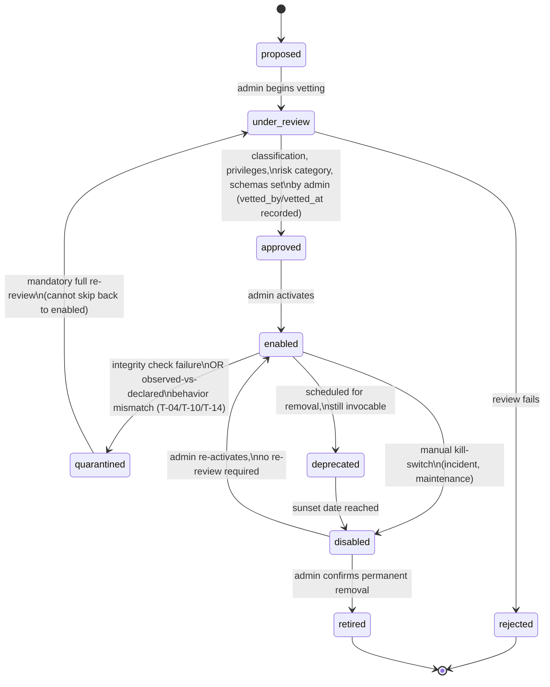
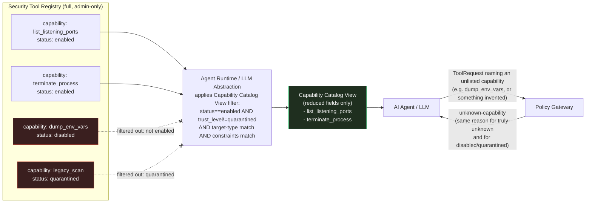

# Chanakya AI — Security Tool Registry Design (Phase 2)

This document is the Phase 2 design specification for the **Security
Tool Registry** defined in `ARCHITECTURE.md` §9. It builds on, and does
not redesign, `ARCHITECTURE.md`, `docs/CONTRACTS.md`, and
`docs/THREAT-MODEL.md`, and is a peer document to
`docs/POLICY-GATEWAY.md` (the Gateway consumes this Registry as a
trusted, read-only dependency — see `POLICY-GATEWAY.md` §3). No
implementation code exists yet; this is design only.

## Design principle (non-negotiable)

> **A tool can never grant itself additional permissions. Every field
> that determines authorization — classification, risk category,
> required privileges, supported targets, approval requirement — is set
> exclusively by human admin review at registration time. Whatever an
> MCP server or tool self-declares about itself is stored, but is never
> authoritative and is never consulted for an authorization decision.
> The LLM/Agent only ever sees the subset of the Registry the Runtime
> has decided it is permitted to expose.**

This restates `ARCHITECTURE.md` §9, `docs/THREAT-MODEL.md` SR-1, SR-3,
SR-23, T-04, and is the organizing constraint behind every section
below.

---

## Terminology note: capability vs. operations

Per `ARCHITECTURE.md`'s Terminology table, a **Tool** in this system is
"a single capability that performs a concrete operation" — the Registry
registers at that granularity, one entry per invocable capability. Two
related-but-distinct fields fall out of this:

- **`capability`** — the registrable unit itself: the exact string used
  in `ToolRequest.capability` (per `CONTRACTS.md` §3). One Registry
  entry = one capability = one thing the Agent can propose.
- **`operations`** — a declared, controlled-vocabulary list of the
  underlying primitive action(s) the implementation actually performs to
  fulfill that capability (e.g. `read_file`, `list_processes`,
  `network_scan`, `terminate_process`). This exists specifically as a
  **T-10 defense**: it gives admins and detective controls a concrete,
  checkable claim ("this capability only ever performs `read_file`
  operations") to compare against observed behavior, independent of the
  coarser `read_only`/`state_changing` binary.

---

## 1–20: Registry entry schema

`RegistryEntry` follows `CONTRACTS.md` conventions (semver
`contract_version`, opaque UUID ids, ISO timestamps). It is
Configuration data — admin-controlled, never Agent-writable
(`ARCHITECTURE.md` §15) — and is not one of the 13 cross-component
contracts in `CONTRACTS.md`, since it never crosses into Agent-visible
form except through the filtered projection in §4.

| # | Requested field | Schema field(s) | Type | Required | Description |
|---|---|---|---|---|---|
| 1 | Tool identity | `tool_id` | string (uuid) | required | Stable, immutable identity, independent of `capability` name — lets a capability be renamed/re-versioned without breaking historical `Evidence`/`AuditEvent` references that point at `tool_id` |
| 2 | Tool name | `display_name` | string | required | Human-readable name shown to admins and (via the projection in §4) to the Agent |
| 3 | Tool version | `tool_version` | string (semver) | required | Version of the underlying implementation/binary/MCP tool this entry represents |
| 4 | Description | `description` | string | required | **Admin-authored or admin-approved** description — the operative one. Never auto-populated from a server's self-description without review (see `provenance.self_declared_metadata` below) |
| 5 | Capabilities | `capability` | string | required, unique among `enabled` entries | The exact key used in `ToolRequest.capability` |
| 6 | Operations | `operations` | array\<string\> (controlled vocabulary) | required, non-empty | Declared underlying primitive action(s); see terminology note above |
| — | Category | `category` | string (open taxonomy) | required | Investigative domain (e.g. `network_information`, `network_scanning`) — organizational only, never authorization-bearing on its own. Defined in `docs/CAPABILITY-PERMISSION-MODEL.md` §2 (CAP-INV-3) |
| — | Action type | `action_type` | enum(`observe`,`execute_readonly_probe`,`mutate`,`destructive`) | required | Coarse effect tier every operation in `operations` must share (CAP-INV-1/CAP-INV-2, `docs/CAPABILITY-PERMISSION-MODEL.md` §1); collapses to `classification` (`observe`/`execute_readonly_probe` → `read_only`, `mutate`/`destructive` → `state_changing`) |
| 7 | Input schema | `parameters_schema` | object (JSON Schema) | required | Admin-approved schema `ToolRequest.parameters` must validate against — the Registry's own copy is authoritative even if a live MCP server's declared schema later differs |
| 8 | Output schema | `output_schema` | object (JSON Schema) | required | Normalized shape `ToolResult.output` must conform to for this capability; also enables output-shape validation as a T-05 defense against malformed/oversized responses |
| 9 | Permission classification | `default_risk_category` | enum(`informational`,`low`,`medium`,`high`,`critical`) | required | The Registry-declared baseline risk tier, copied into `PolicyDecision.risk_category` (per `ARCHITECTURE.md` §9: "Default risk category used by the Gateway and Risk Engine") |
| 10 | Read-only/state-changing classification | `classification` | enum(`read_only`,`state_changing`) | required | **The single most security-critical field in this schema.** Admin-set, authoritative, never inferred from self-description (SR-1, SR-23, T-04) |
| 11 | Required privileges | `required_privileges` | object: `{os_privilege: enum(standard_user, elevated), target_access: enum(target_read, target_write)}` | required | Declares the *minimum* privilege the implementation needs; execution environment must be provisioned to exactly this, not more (SR-2) |
| 12 | Supported target types | `supported_target_types` | array\<string\> | required, non-empty | Must each correspond to a `target_type` with a registered Target Adapter (`ARCHITECTURE.md` §7) |
| 13 | Timeout | `default_timeout_seconds` | integer | required | Enforced by the Agent Runtime per step, capped by `RuntimeExecutionLimits.default_step_timeout_seconds` (Phase 11; post-hoc, not preemptive — T-36) (`ARCHITECTURE.md` §3, §16; T-27 defense) |
| 14 | Resource limits | `resource_limits` | object: `{max_output_bytes, max_cpu_seconds, max_memory_mb, max_concurrent_invocations}` | required | T-05/T-27 defense against oversized responses and resource exhaustion. Phase 11 enforces `max_output_bytes` only; the other three are declarative |
| 15 | Approval requirement | `approval_requirement` | enum(`none`,`required`) | required | A **Registry-declared floor**, independent of `POLICY-GATEWAY.md`'s rule-based tightening — see §3 below for how the two compose |
| 16 | Provenance | `provenance` | object — see §2 | required | Origin, integrity, and review trail |
| 17 | Tool trust level | `trust_level` | enum(`core`,`first_party_adapter`,`vetted_third_party`,`quarantined`) | required | Orthogonal to `classification`; drives baseline scrutiny (§5) |
| 18 | Registry version | `registry_version` | string (semver) | required | Version of the **whole catalog** this entry was last validated against — bumped on any addition/change/removal, analogous to `POLICY-GATEWAY.md`'s `policy_set_version` |
| 19 | Enable/disable state | `status` | enum — see Lifecycle (§6) | required | Full lifecycle state, not just a boolean; only `enabled` entries are invocable or Agent-visible |
| 20 | Audit requirements | *(process, not a field)* | — | — | See §7 |
| 21 | Model egress | `model_egress` | enum(`allowed`,`evidence_only`) | required (Phase 15; no default, missing or unknown fails closed) | Whether this capability's screened output may become model context (`allowed`) or only Evidence (`evidence_only`). Admin-declared, carried in the `CapabilityEnvelope`; never taken from the handler, the result, parameters or the model. A data-flow constraint, **not** an authorization input: the Gateway never reads it |

Additional bookkeeping fields required on every entry: `contract_version`
(RegistryEntry schema version), `created_at`, `updated_at`, `owner`
(admin identity accountable for this entry — mirrors
`ApprovalDecision.decided_by`'s accountability pattern).

---

## 2. Provenance object

```
provenance:
  source_type: enum(core, first_party_adapter, mcp_server)
  source_identifier: string        # e.g. MCP server URL/name, package name
  source_version: string           # version reported by the source at vetting time
  implementation_hash: string      # sha256 of the vetted binary/package (T-14/T-23 integrity check)
  vetted_by: string                # admin identity who performed the review
  vetted_at: timestamp
  self_declared_metadata: object   # VERBATIM, UNTRUSTED copy of whatever the source
                                    # claims about itself (description, hints, schema).
                                    # Stored for audit/comparison ONLY. No field in this
                                    # object is ever read by the Policy Gateway, the Tool
                                    # Layer's authorization logic, or copied automatically
                                    # into any authoritative field above.
  review_notes: string             # optional, admin's reasoning for the assigned
                                    # classification/privileges — the human record of *why*
```

`implementation_hash` is re-verified whenever the tool is actually
invoked (or at minimum on a periodic integrity sweep); a mismatch is
treated as a supply-chain integrity failure — the entry is
auto-transitioned to `quarantined` (§6) and the invocation is blocked,
never allowed through with a warning.

---

## 3. How Registry fields compose with the Policy Gateway

`approval_requirement` (§1, item 15) and `classification` (item 10) are
both **floors**, not the final verdict — the actual `PolicyDecision`
comes from `POLICY-GATEWAY.md`'s evaluation flow. The composition rule
is **most-restrictive-wins**:

- `classification: state_changing` → Gateway floor is `require_approval`
  (never `allow`) — this is `POLICY-GATEWAY.md` INV-1, unchanged here.
- `approval_requirement: required` on an otherwise `read_only`
  capability → Gateway must still resolve to at least `require_approval`
  even with no explicit `PolicyRule` present, i.e. the classification
  default for `read_only` (`allow`) is pre-empted by this Registry field.
  This gives admins two independent places to mandate approval for a
  sensitive read-only capability — at registration time (this field) or
  later via a `PolicyRule` (`POLICY-GATEWAY.md` §2's
  `restrict-env-dump-to-approval` example does the latter; either is
  valid, and both may exist redundantly without conflict) — but **no
  field, in either document, can loosen a floor the other document
  imposes.**

---

## 4. The LLM only sees what the Runtime permits — the Capability Catalog View

When the LLM Abstraction assembles context for the Agent (`ARCHITECTURE.md`
§4), it does not hand the Agent the Registry. It hands it a **filtered,
reduced projection** built by the Runtime, called the **Capability
Catalog View**:

**Filter (all must hold for an entry to appear):**
1. `status == "enabled"` (REG-INV-3, below — no other lifecycle state is
   ever visible, not even indirectly).
2. `trust_level != "quarantined"`.
3. The current investigation's authorized target types intersect
   `supported_target_types`.
4. If `InvestigationRequest.constraints` includes something like
   `"read-only only"`, entries with `classification: state_changing` are
   also excluded from the view (an efficiency/UX optimization — the
   Policy Gateway would deny them anyway, but there's no reason to let
   the Agent spend a turn proposing something structurally unreachable).

**Field reduction (only this subset reaches the Agent, per entry):**
```
{ capability, display_name, description, parameters_schema,
  classification, supported_target_types }
```
Everything else — `required_privileges`, `resource_limits`, `provenance`,
`trust_level`, `owner`, `default_risk_category`, `approval_requirement`,
`operations` — stays server-side. The Agent can reason about *what* a
capability does and *what parameters it needs*, and can anticipate that
a `state_changing` capability will likely need approval, but it never
sees privilege requirements, resource ceilings, or admin/provenance
metadata — none of which it needs to plan, and all of which would be
pure information disclosure if leaked into an LLM context that a
target's adversarial output might later be reflected back into (T-03).

This view-construction logic lives entirely in the LLM Abstraction/
Runtime layer, consuming the Registry as a read-only dependency — the
Registry itself never talks to the LLM (mirrors `POLICY-GATEWAY.md`'s
rule that the Gateway never does either).

---

## 5. Tool trust level

`trust_level` is orthogonal to `classification` — it describes how much
scrutiny the *source* of a capability has earned, not what the
capability does:

| Level | Meaning | Baseline posture |
|---|---|---|
| `core` | Implemented and maintained by the Chanakya project itself | Standard review; highest ambient trust, but still subject to the same classification rules — `core` grants no shortcut past SR-1/INV-1 |
| `first_party_adapter` | A Target Adapter or capability maintained by the Chanakya team but target-type-specific | Standard review |
| `vetted_third_party` | An external MCP server/tool that has completed admin review (SR-23) | Full review required before `enabled`; admins may additionally choose to hold newly-vetted third-party capabilities at `approval_requirement: required` for a probation period even if `read_only`, independent of classification — a deployment choice, not a structural rule |
| `quarantined` | Automatically or manually entered on a detected anomaly (see §6) | Never invocable, never Agent-visible, regardless of any other field |

---

## 6. Lifecycle



**Key rules:**
- Only `enabled` is invocable and Agent-visible (REG-INV-3).
- `quarantined` can only be reached automatically (by a detective
  control) or manually (admin suspicion); it can **only** be exited by
  returning to `under_review` — there is no direct `quarantined →
  enabled` transition, unlike the softer `disabled → enabled` path. This
  distinguishes "we paused it" from "we caught it lying about itself,"
  and matches `THREAT-MODEL.md` Diagram 3's abuse case, where a mismatch
  between declared and observed behavior is the detective backstop for
  SR-23.
- `retired` entries are never deleted and never reused for a new
  `capability` string binding — `tool_id` stays resolvable forever so
  historical `Evidence`/`AuditEvent` records that reference it remain
  meaningful, even though the entry can never be invoked again.
- Every transition is admin-attributed (`owner`, and for
  `approved`/re-`approved` transitions specifically, `vetted_by`/
  `vetted_at`) — there is no system- or Agent-triggered transition
  except the automatic `enabled → quarantined` detective trip, which is
  itself logged with the specific anomaly that caused it.

---

## 7. Audit requirements

Registry admission and lifecycle changes are **admin/config-time
events**, not investigation-time events, but they are exactly as
security-relevant as anything in `docs/THREAT-MODEL.md`'s Top 10 risks
(T-04, T-10, T-14 all hinge on registration-time review actually
happening and being recorded). Required trail, for every entry:

- Every state transition in §6 is recorded with: `tool_id`, `from_status`,
  `to_status`, `actor` (admin identity, or `"system"` for the automatic
  quarantine trip), `occurred_at`, and — for the `quarantined` trip
  specifically — the concrete evidence of the mismatch (e.g. which
  `Evidence` record showed an unexpected write from a capability
  declared `read_only`).
- Every field change to an already-`approved`/`enabled` entry's
  authoritative fields (`classification`, `default_risk_category`,
  `required_privileges`, `supported_target_types`,
  `approval_requirement`, `parameters_schema`, `output_schema`) is
  itself a re-review event, not a silent edit — it forces
  `under_review` per §6, and the prior values remain visible in history,
  never overwritten in place (mirrors `CONTRACTS.md`'s append-only
  philosophy for `Evidence`/`AuditEvent`).
- Every invocation still produces the usual `AuditEvent` trail via the
  Policy Gateway/Runtime (`policy_evaluated`, `dispatch_started`, etc.,
  per `POLICY-GATEWAY.md` §12) — the Registry doesn't duplicate that; it
  only owns the admission/lifecycle trail above.

**Open item (non-blocking, same pattern as `THREAT-MODEL.md`'s and
`POLICY-GATEWAY.md`'s own suggestions):** `AuditEvent`'s `event_type`
enum (`CONTRACTS.md` §13) has no value for Registry admission/lifecycle
changes today. Until a future `contract_version` bump adds something
like `capability_registered` / `capability_status_changed`, this trail
should be kept as a separate, version-controlled administrative log
(consistent with Registry entries themselves living in versioned
Configuration, `ARCHITECTURE.md` §15) rather than forced into the
existing enum or inventing an ad hoc string, per `CONTRACTS.md` §13's
explicit rule against that.

---

## Security model

### REG-INV-1 — No self-granted permissions
No field that determines authorization (`classification`,
`default_risk_category`, `required_privileges`, `supported_target_types`,
`approval_requirement`, `parameters_schema`, `output_schema`) may ever be
populated, directly or by any automatic sync, from
`provenance.self_declared_metadata`. Every one of those fields is set by
an explicit admin action recorded via `vetted_by`/`vetted_at`, at
`under_review → approved` or at any later forced re-review. There is no
code path — none — that lets a tool's own declared metadata write to an
authoritative field.

### REG-INV-2 — Registry overrides self-description, always
Wherever the Policy Gateway, Tool Layer, or Risk Engine need to know a
capability's classification, risk category, or required privilege, they
read it from the Registry's authoritative fields — never from an MCP
server's live response, its tool-definition metadata, or anything the
Agent claims about a capability. This is the same rule stated from the
Gateway's side in `POLICY-GATEWAY.md` §3 and §15, point 3; here it is
the Registry's obligation to make that the *only* value available to
read.

### REG-INV-3 — Visibility is a strict subset, never inferred
The Agent (and, transitively, the LLM) can only ever learn about
`enabled`, non-`quarantined` capabilities, via the reduced Capability
Catalog View (§4). No error message, denial reason, or any other
Runtime-to-Agent communication ever confirms or denies the existence of
a capability outside that view. A `ToolRequest` naming a `disabled`,
`quarantined`, `under_review`, or `retired` capability is rejected with
the **same** `unknown-capability` reason (`POLICY-GATEWAY.md` §11) as a
capability that was never registered at all — the Agent cannot
distinguish "doesn't exist" from "exists but you're not allowed to know
that," which forecloses using the Agent as a probe to enumerate
Registry contents beyond what it's meant to see.

### Supply-chain integrity (T-14/T-23)
`provenance.implementation_hash`, checked at invocation time (or via
periodic sweep), is the concrete mechanism that turns "we vetted this
once" into a standing guarantee rather than a point-in-time snapshot. A
mismatch is not a warning — it blocks dispatch and forces
`enabled → quarantined` (§6).

### Least privilege (SR-2)
`required_privileges` is a declared *ceiling* the execution environment
must be provisioned to exactly, not a suggestion — a capability
implementation that needs more than it declared is a defect to catch in
review (T-10), and the Tool Layer's execution context for that
capability should be incapable of exceeding the declared privilege
regardless of what the implementation attempts (defense in depth,
mirroring `POLICY-GATEWAY.md`'s "runtime assertion in addition to
load-time check" pattern for INV-1).

---

## Production capabilities (implemented)

The design examples below predate the implementation. What is actually
registered is built by `chanakya.registry.bootstrap.production_registry_entries()`,
and the matching handlers by `chanakya.tools.bootstrap.build_tool_executor`.
A test asserts that the two sets are identical.

| Capability | Phase | Level | Parameters | Targets | Handler |
|---|---|---|---|---|---|
| `observe_local_host_environment` | 5.1 | P1, read-only, no approval by default | none (closed schema) | `local_host` | `LocalHostEnvironmentHandler` |
| `list_listening_ports` | 8 | P1, read-only, no approval by default | none (closed schema) | `local_host` | `ListeningPortsHandler` |

`list_listening_ports` follows the example entry below, with these
differences:

- **Output.** `ports[]` items are `{protocol, port, local_address,
  pid?, process?}`, with `additionalProperties: false` and optional
  fields omitted rather than set to null.
- **Size limit.** `max_output_bytes` is **60,000**, not 262,144, so a
  successful result always fits the Evidence Store's 65,536-byte payload
  limit. The handler enforces it: over-limit output is an error result,
  never a truncated success.
- **Data sources.**
  - Linux reads only `/proc/net/{tcp,tcp6,udp,udp6}`, `/proc/<pid>/fd`
    links and `/proc/<pid>/comm`.
  - Windows uses `GetExtendedTcpTable`/`GetExtendedUdpTable` through
    `ctypes`, plus the image name reduced to its base name.
  - Other platforms return an explicit unsupported-platform error.
- **Never collected.** No process arguments, no environment, no
  subprocess, no shell. Strict parsers reject malformed rows instead of
  skipping them.

### Model egress (Phase 15)

Both production capabilities declare `model_egress: allowed`. They are
unchanged otherwise: same permission level, target scope, action type and
parameters. `envelope_from_registry_entry` copies the value into
`CapabilityEnvelope.model_egress`, and the Runtime shows a result to the
model only when the authorizing envelope says `allowed`. See
`docs/AGENT-RUNTIME.md` "Tool-output screening and model egress (Phase 15)".

### Capability execution envelope (Phase 11)

`output_schema`, `resource_limits.max_output_bytes` and
`default_timeout_seconds` are enforced at run time through a
`CapabilityEnvelope` (`chanakya/capability/envelope.py`):

- **One source.**
  - The Policy Gateway builds the envelope with
    `envelope_from_registry_entry` from the same enabled `RegistryEntry`
    it used for the decision, and attaches it to the `PolicyDecision`.
  - Disabled, unregistered and reserved capabilities have no envelope.
  - An entry whose `output_schema` uses an unsupported construct makes the
    Gateway fail closed (`fail-closed-error` deny).
- **Timeout.** The Runtime dispatches with
  `min(default_timeout_seconds, RuntimeExecutionLimits.default_step_timeout_seconds)`.
  The Runtime ceiling can tighten the Registry value, never loosen it.
  The timeout is still **post-hoc**: a late result is discarded, but the
  handler is not interrupted (T-36).
- **Output.** After a handler returns, the Tool Layer checks, in order:
  1. JSON compatibility (string keys, finite numbers, bounded depth);
  2. canonical UTF-8 size (`chanakya.evidence.hashing.canonical_bytes`,
     the bytes Evidence hashes) against `max_output_bytes`;
  3. the declared `output_schema`.

  Any failure is a `ToolResult(status=error)` with the fixed message
  `capability_envelope_violation: <CODE>`. The output is never echoed,
  truncated, repaired or stripped. It never becomes Evidence, and the
  Runtime does not retry it.
- **Closed production schemas (D-2).** `production_registry_entries()`
  and `build_tool_executor(..., capability_registry=...)` refuse a
  production capability whose output schema is not closed: every object
  needs `properties`, `required` and `additionalProperties: false`, and
  every array needs `items`.
- **Supported keywords.** The validator (`chanakya/capability/schema.py`)
  supports `type` (one name or a list, including `null`), `properties`,
  `required`, `additionalProperties` (boolean), `items`, `enum`,
  `minimum`, `description` and `title`. Output schemas may use nothing
  else.
- **Not enforced.** `max_cpu_seconds`, `max_memory_mb` and
  `max_concurrent_invocations` remain **declarative only**. Enforcing
  them honestly needs process isolation, which Chanakya does not have.

## Example registry entries

**Read-only, core, fully enabled** — consistent with the `ToolRequest`/
`PolicyDecision` examples already used in `CONTRACTS.md` and
`POLICY-GATEWAY.md`:

```json
{
  "tool_id": "reg-3c1f0a9e-...",
  "contract_version": "1.0.0",
  "registry_version": "1.0.0",
  "capability": "list_listening_ports",
  "display_name": "List Listening Ports",
  "tool_version": "1.2.0",
  "description": "Enumerates TCP/UDP ports in a listening state on the target, with the owning process where resolvable.",
  "category": "network_information",
  "action_type": "observe",
  "operations": ["list_processes", "read_network_state"],
  "parameters_schema": { "type": "object", "properties": {}, "additionalProperties": false },
  "output_schema": {
    "type": "object",
    "properties": {
      "ports": {
        "type": "array",
        "items": {
          "type": "object",
          "properties": {
            "port": {"type": "integer"},
            "protocol": {"type": "string", "enum": ["tcp", "udp"]},
            "process": {"type": "string"}
          },
          "required": ["port", "protocol"]
        }
      }
    },
    "required": ["ports"]
  },
  "default_risk_category": "informational",
  "classification": "read_only",
  "required_privileges": {"os_privilege": "standard_user", "target_access": "target_read"},
  "supported_target_types": ["local_host"],
  "default_timeout_seconds": 15,
  "resource_limits": {
    "max_output_bytes": 262144,
    "max_cpu_seconds": 5,
    "max_memory_mb": 128,
    "max_concurrent_invocations": 4
  },
  "approval_requirement": "none",
  "provenance": {
    "source_type": "core",
    "source_identifier": "chanakya.tools.network.list_listening_ports",
    "source_version": "1.2.0",
    "implementation_hash": "sha256:6f2c9a1d8b...",
    "vetted_by": "krish",
    "vetted_at": "2026-09-14T10:00:00Z",
    "self_declared_metadata": {},
    "review_notes": "Standard read-only enumeration via OS network APIs; no write path exists in the implementation."
  },
  "trust_level": "core",
  "status": "enabled",
  "created_at": "2026-09-14T10:00:00Z",
  "updated_at": "2026-09-14T10:00:00Z",
  "owner": "krish"
}
```

**State-changing, vetted third-party, via MCP** — contrasts the
self-declared-vs-authoritative split:

```json
{
  "tool_id": "reg-7e4b21aa-...",
  "contract_version": "1.0.0",
  "registry_version": "1.0.0",
  "capability": "terminate_process",
  "display_name": "Terminate Process",
  "tool_version": "0.9.4",
  "description": "Terminates a target process by PID. State-changing: use requires explicit human approval.",
  "category": "process_information",
  "action_type": "mutate",
  "operations": ["terminate_process"],
  "parameters_schema": {
    "type": "object",
    "properties": { "pid": {"type": "integer", "minimum": 1} },
    "required": ["pid"],
    "additionalProperties": false
  },
  "output_schema": {
    "type": "object",
    "properties": { "terminated": {"type": "boolean"}, "pid": {"type": "integer"} },
    "required": ["terminated", "pid"]
  },
  "default_risk_category": "high",
  "classification": "state_changing",
  "required_privileges": {"os_privilege": "elevated", "target_access": "target_write"},
  "supported_target_types": ["local_host"],
  "default_timeout_seconds": 10,
  "resource_limits": {
    "max_output_bytes": 4096,
    "max_cpu_seconds": 3,
    "max_memory_mb": 64,
    "max_concurrent_invocations": 1
  },
  "approval_requirement": "required",
  "provenance": {
    "source_type": "mcp_server",
    "source_identifier": "mcp://process-tools.example/terminate_process",
    "source_version": "0.9.4",
    "implementation_hash": "sha256:a19e0c77f4...",
    "vetted_by": "krish",
    "vetted_at": "2026-09-15T09:30:00Z",
    "self_declared_metadata": {
      "server_claimed_classification": "read_only",
      "server_description": "Safely inspects and manages a process."
    },
    "review_notes": "Server's own metadata claimed 'read_only' — REJECTED at review; implementation clearly terminates a process (a write against target state). classification set to state_changing regardless of server claim, per REG-INV-2/SR-23."
  },
  "trust_level": "vetted_third_party",
  "status": "enabled",
  "created_at": "2026-09-15T09:30:00Z",
  "updated_at": "2026-09-15T09:30:00Z",
  "owner": "krish"
}
```

The second example's `review_notes` deliberately documents a real
instance of the exact attack `THREAT-MODEL.md` T-04 and Diagram 3
describe — a server misclassifying itself as read-only — being caught
at admission and overridden, which is precisely what REG-INV-1/REG-INV-2
exist to guarantee happens every time, not just when review is careful.

**What the Agent actually receives for the first example** (Capability
Catalog View, §4):
```json
{
  "capability": "list_listening_ports",
  "display_name": "List Listening Ports",
  "description": "Enumerates TCP/UDP ports in a listening state on the target, with the owning process where resolvable.",
  "parameters_schema": { "type": "object", "properties": {}, "additionalProperties": false },
  "classification": "read_only",
  "supported_target_types": ["local_host"]
}
```
No `required_privileges`, `resource_limits`, `provenance`, `trust_level`,
`owner`, `default_risk_category`, `approval_requirement`, or `operations`
— none of it reaches the LLM context.

---

## Registration / admission flow

```mermaid
flowchart TD
    A[New capability proposed\n(core code, adapter, or MCP server)] --> B[status: proposed]
    B --> C[Admin begins review: status: under_review]
    C --> D[Self-declared metadata captured\nverbatim into provenance.self_declared_metadata\n- UNTRUSTED, reference only]
    D --> E[Admin independently determines:\nclassification, default_risk_category,\nrequired_privileges, supported_target_types,\napproval_requirement, parameter/output schemas]
    E --> F{Admin approves?}
    F -- no --> G[status: rejected]
    F -- yes --> H[vetted_by / vetted_at recorded\nimplementation_hash captured\nstatus: approved]
    H --> I[Admin activates: status: enabled]
    I --> J[Entry now invocable AND\nvisible in Capability Catalog View]

    K[Later: invocation-time or periodic\nintegrity check] -.-> L{implementation_hash\nstill matches?}
    J -.-> K
    L -- no --> M[status: quarantined\ndispatch blocked, Agent visibility removed]
    L -- yes --> N[Continues normal operation]

    O[Detective control: observed behavior\ncontradicts declared classification\n(T-04/T-10)] -.-> M
    M --> C

    style D fill:#3a1f1f,stroke:#c0392b,color:#f5f5f5
    style E fill:#1f2f1f,stroke:#2ecc71,color:#f5f5f5
    style M fill:#241f33,stroke:#9b59b6,color:#f5f5f5
```

## Agent-visibility flow — from full Registry to what the LLM sees



---

## Security controls summary

- **No self-grant path**: every authorization-relevant field is
  admin-set only; self-declared metadata is stored but structurally
  inert (REG-INV-1).
- **Registry overrides self-description everywhere it's consulted**
  (REG-INV-2; consistent with `POLICY-GATEWAY.md` §3/§15).
- **Strict Agent visibility**: only `enabled`, non-`quarantined`
  capabilities are ever exposed to the LLM, via a field-reduced
  projection that withholds privilege/resource/provenance data
  (REG-INV-3, §4).
- **Indistinguishable denial**: unknown, disabled, quarantined, and
  retired capabilities all produce the same `unknown-capability` denial
  — no enumeration signal leaks through Gateway responses.
- **Supply-chain integrity is continuously checked**, not just at
  vetting time — a hash mismatch forces `quarantined` and blocks
  dispatch (T-14/T-23).
- **Detective-control-driven quarantine**: an observed
  declared-vs-actual behavior mismatch (T-04/T-10) automatically removes
  a capability from service and forces a full re-review before it can
  ever be re-enabled — it cannot be waved back in via the lighter
  `disabled → enabled` path.
- **Immutable history**: no authoritative field is edited in place on an
  `approved`/`enabled` entry; a change is a new review cycle, and prior
  values remain part of the record (mirrors `CONTRACTS.md`'s append-only
  philosophy).
- **Least privilege as a declared, enforced ceiling** (`required_privileges`,
  SR-2), checked independently of whatever the implementation attempts.

---

## Open items (non-blocking, for a future `CONTRACTS.md` revision)

Consistent with the pattern already used in `THREAT-MODEL.md` and
`POLICY-GATEWAY.md`:

1. **Dedicated `AuditEvent.event_type` values** for Registry admission
   and lifecycle transitions (§7) — currently tracked via a separate
   versioned administrative log rather than the fixed `AuditEvent` enum.
2. **A first-class field for probationary third-party approval**
   (§5's "hold at `approval_requirement: required` for a probation
   period") is currently a deployment-level admin choice using existing
   fields, not a schema-level state; a dedicated `probation_until`
   field would make it self-documenting.

Neither blocks Phase 2 implementation; both are additive candidates for
whenever `CONTRACTS.md` is next revisited.
